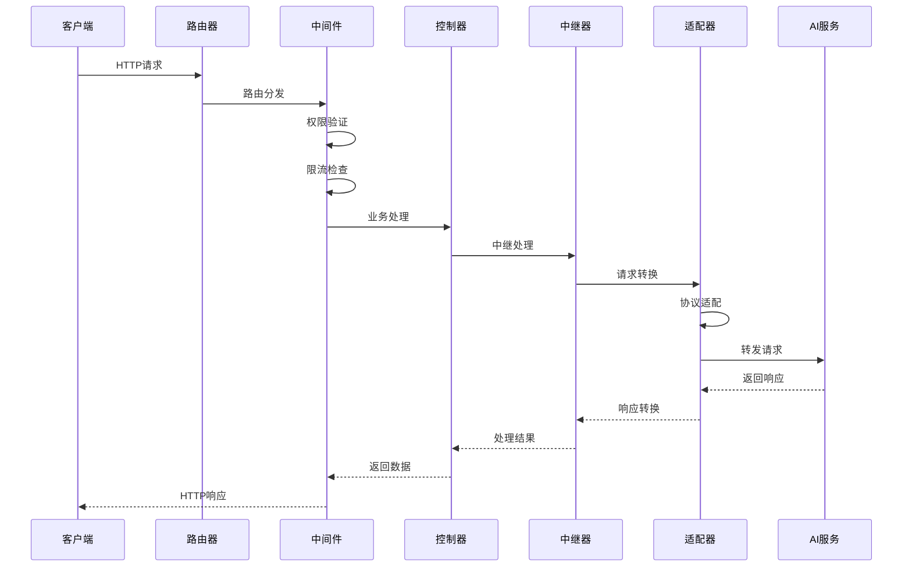

# NewAPI AI模型核心接口架构详细分析

## 1. 总体架构概览

### 1.1 系统架构层次

NewAPI采用经典的分层架构设计，将AI模型接口处理分解为多个层次：

```
┌─────────────────┐
│   前端界面      │ ← Web界面、API客户端
└─────────────────┘
         │
┌─────────────────┐
│   路由分发层    │ ← Gin路由、请求分发
└─────────────────┘
         │
┌─────────────────┐
│   控制器层      │ ← 业务逻辑控制、参数验证
└─────────────────┘
         │
┌─────────────────┐
│   中间件层      │ ← 权限验证、限流、日志
└─────────────────┘
         │
┌─────────────────┐
│   中继处理层    │ ← AI模型适配、请求转发
└─────────────────┘
         │
┌─────────────────┐
│   适配器层      │ ← 各AI平台专用适配器
└─────────────────┘
         │
┌─────────────────┐
│   外部AI服务    │ ← OpenAI、Claude、Gemini等
└─────────────────┘
```

### 1.2 核心设计原则

#### 1.2.1 统一接口设计
- **适配器模式**: 为所有AI平台提供统一的接口抽象
- **协议转换**: 自动转换不同平台的API协议
- **格式统一**: 统一输入输出格式，屏蔽底层差异

#### 1.2.2 可扩展性设计
- **插件化架构**: 新增AI平台只需实现适配器接口
- **配置驱动**: 通过配置动态调整行为
- **模块化设计**: 各功能模块独立，可插拔

#### 1.2.3 高可用性设计
- **负载均衡**: 支持多渠道自动切换
- **故障转移**: 单个渠道故障不影响整体服务
- **限流熔断**: 防止过载和级联故障

## 2. 核心接口定义

### 2.1 适配器接口 (Adaptor Interface)

适配器接口是整个AI模型处理的核心抽象，定义了所有AI平台必须实现的统一接口：

```go
// relay/channel/adapter.go
type Adaptor interface {
    // 初始化适配器
    Init(info *relaycommon.RelayInfo)
    
    // 获取请求URL
    GetRequestURL(info *relaycommon.RelayInfo) (string, error)
    
    // 设置请求头
    SetupRequestHeader(c *gin.Context, req *http.Header, info *relaycommon.RelayInfo) error
    
    // 转换OpenAI请求格式
    ConvertOpenAIRequest(c *gin.Context, info *relaycommon.RelayInfo, request *dto.GeneralOpenAIRequest) (any, error)
    
    // 转换重排序请求
    ConvertRerankRequest(c *gin.Context, info *relaycommon.RelayInfo, request dto.RerankRequest) (any, error)
    
    // 转换嵌入请求
    ConvertEmbeddingRequest(c *gin.Context, info *relaycommon.RelayInfo, request dto.EmbeddingRequest) (any, error)
    
    // 转换音频请求
    ConvertAudioRequest(c *gin.Context, info *relaycommon.RelayInfo, request dto.AudioRequest) (io.Reader, error)
    
    // 转换图像请求
    ConvertImageRequest(c *gin.Context, info *relaycommon.RelayInfo, request dto.ImageRequest) (any, error)
    
    // 执行HTTP请求
    DoRequest(c *gin.Context, info *relaycommon.RelayInfo, requestBody io.Reader) (any, error)
    
    // 处理响应
    DoResponse(c *gin.Context, resp *http.Response, info *relaycommon.RelayInfo) (usage any, err *types.NewAPIError)
    
    // 获取支持的模型列表
    GetModelList() []string
    
    // 获取渠道名称
    GetChannelName() string
    
    // 转换Claude请求
    ConvertClaudeRequest(c *gin.Context, info *relaycommon.RelayInfo, request *dto.ClaudeRequest) (any, error)
    
    // 转换Gemini请求
    ConvertGeminiRequest(c *gin.Context, info *relaycommon.RelayInfo, request *dto.GeminiChatRequest) (any, error)
}
```

#### 接口设计要点：
1. **职责分离**: 每个方法负责特定的转换或处理逻辑
2. **错误处理**: 统一的错误返回机制
3. **类型安全**: 使用interface{}实现多态性
4. **上下文传递**: 通过RelayInfo传递上下文信息

### 2.2 任务适配器接口 (TaskAdaptor Interface)

专门处理异步任务型AI服务的接口：

```go
type TaskAdaptor interface {
    Init(info *relaycommon.RelayInfo)
    
    // 验证请求并设置动作
    ValidateRequestAndSetAction(c *gin.Context, info *relaycommon.RelayInfo) *dto.TaskError
    
    // 构建请求URL
    BuildRequestURL(info *relaycommon.RelayInfo) (string, error)
    
    // 构建请求头
    BuildRequestHeader(c *gin.Context, req *http.Request, info *relaycommon.RelayInfo) error
    
    // 构建请求体
    BuildRequestBody(c *gin.Context, info *relaycommon.RelayInfo) (io.Reader, error)
    
    // 执行请求
    DoRequest(c *gin.Context, info *relaycommon.RelayInfo, requestBody io.Reader) (*http.Response, error)
    
    // 处理响应
    DoResponse(c *gin.Context, resp *http.Response, info *relaycommon.RelayInfo) (taskID string, taskData []byte, err *dto.TaskError)
    
    GetModelList() []string
    GetChannelName() string
    
    // 获取任务结果
    FetchTask(baseUrl, key string, body map[string]any, proxy string) (*http.Response, error)
    
    // 解析任务结果
    ParseTaskResult(respBody []byte) (*relaycommon.TaskInfo, error)
}
```

### 2.3 中继信息 (RelayInfo)

中继信息是整个处理流程的核心数据结构：

```go
// relay/common/relay_info.go
type RelayInfo struct {
    // 用户和令牌信息
    TokenId           int
    TokenKey          string
    TokenGroup        string
    UserId            int
    UsingGroup        string
    UserGroup         string
    
    // 请求处理信息
    StartTime         time.Time
    FirstResponseTime time.Time
    IsStream          bool
    RelayMode         int
    OriginModelName   string
    RequestURLPath    string
    
    // 响应控制
    ShouldIncludeUsage bool
    SendResponseCount  int
    FinalPreConsumedQuota int
    
    // 特殊功能支持
    IsPlayground      bool
    UsePrice          bool
    AudioUsage        bool
    ReasoningEffort   string
    
    // 上下文信息
    UserSetting       dto.UserSetting
    UserEmail         string
    UserQuota         int
    
    // 价格数据
    PriceData         types.PriceData
    
    // 请求对象
    Request           dto.Request
    
    // 扩展信息
    *ChannelMeta
    *TaskRelayInfo
}
```

#### RelayInfo设计要点：
1. **信息聚合**: 整合所有处理过程中需要的信息
2. **状态跟踪**: 记录请求处理的各个阶段
3. **性能监控**: 包含时间戳和计费信息
4. **扩展性**: 支持不同类型的AI服务

## 3. 适配器架构分析

### 3.1 适配器注册机制

```go
// relay/relay_adaptor.go
func GetAdaptor(apiType int) channel.Adaptor {
    switch apiType {
    case constant.APITypeAli:
        return &ali.Adaptor{}
    case constant.APITypeAnthropic:
        return &claude.Adaptor{}
    case constant.APITypeBaidu:
        return &baidu.Adaptor{}
    // ... 更多适配器
    }
}
```

#### 注册机制特点：
1. **类型映射**: API类型到适配器的映射
2. **动态加载**: 运行时根据配置选择适配器
3. **扩展友好**: 新增平台只需添加case分支

### 3.2 适配器实现模式

以OpenAI适配器为例：

```go
// relay/channel/openai/adaptor.go
type Adaptor struct{}

func (a *Adaptor) Init(info *relaycommon.RelayInfo) {
    // 初始化逻辑
}

func (a *Adaptor) GetRequestURL(info *relaycommon.RelayInfo) (string, error) {
    // 根据模型类型构建URL
    switch info.RelayMode {
    case relayconstant.RelayModeChatCompletions:
        return fmt.Sprintf("%s/chat/completions", info.ChannelMeta.ChannelBaseUrl), nil
    case relayconstant.RelayModeCompletions:
        return fmt.Sprintf("%s/completions", info.ChannelMeta.ChannelBaseUrl), nil
    // ... 其他模式
    }
}

func (a *Adaptor) ConvertOpenAIRequest(c *gin.Context, info *relaycommon.RelayInfo, request *dto.GeneralOpenAIRequest) (any, error) {
    // 请求转换逻辑
    return request, nil // OpenAI格式无需转换
}
```

### 3.3 适配器设计模式

#### 3.3.1 模板方法模式
适配器接口定义了处理流程的模板，各平台适配器实现具体步骤：

```
Init() → GetRequestURL() → SetupRequestHeader() → ConvertXXXRequest() → DoRequest() → DoResponse()
```

#### 3.3.2 策略模式
根据不同的AI平台选择不同的处理策略：

```go
// 根据API类型选择适配器策略
adaptor := GetAdaptor(apiType)
adaptor.Init(info)
```

#### 3.3.3 工厂模式
适配器工厂根据配置创建对应的适配器实例：

```go
func GetAdaptor(apiType int) channel.Adaptor {
    // 工厂方法创建适配器实例
    return &PlatformSpecificAdaptor{}
}
```

## 4. 请求处理流程

### 4.1 HTTP请求处理流程



### 4.2 核心处理逻辑

#### 4.2.1 请求初始化
```go
func Relay(c *gin.Context, relayFormat types.RelayFormat) {
    // 1. 生成中继信息
    info, err := relaycommon.GenRelayInfo(c, relayFormat, nil, nil)
    
    // 2. 初始化渠道元数据
    info.InitChannelMeta(c)
    
    // 3. 获取适配器
    adaptor := relay.GetAdaptor(info.ChannelMeta.ApiType)
    
    // 4. 初始化适配器
    adaptor.Init(info)
    
    // 5. 路由到具体处理器
    relay.PostRelay(c, info)
}
```

#### 4.2.2 请求转换与转发
```go
func TextHelper(c *gin.Context, info *relaycommon.RelayInfo) error {
    // 1. 获取适配器
    adaptor := relay.GetAdaptor(info.ChannelMeta.ApiType)
    
    // 2. 构建请求URL
    url, err := adaptor.GetRequestURL(info)
    
    // 3. 转换请求格式
    requestBody, err := adaptor.ConvertOpenAIRequest(c, info, textReq)
    
    // 4. 设置请求头
    adaptor.SetupRequestHeader(c, &req.Header, info)
    
    // 5. 执行请求
    resp, err := adaptor.DoRequest(c, info, requestBody)
    
    // 6. 处理响应
    usage, err := adaptor.DoResponse(c, resp, info)
    
    return nil
}
```

## 5. 多平台AI模型支持

### 5.1 支持的AI平台矩阵

| 平台类型 | 支持的平台 | 适配器位置 | 主要特性 |
|----------|------------|------------|----------|
| 大型云服务商 | AWS, Google Vertex, Azure, 腾讯云, 阿里云 | relay/channel/aws/, vertex/, tencent/, ali/ | 企业级SLA, 高可用性 |
| 主流AI厂商 | OpenAI, Claude, Gemini | relay/channel/openai/, claude/, gemini/ | 原生API支持, 最新模型 |
| 国内AI厂商 | 百度, 智谱, MiniMax, Moonshot, DeepSeek | relay/channel/baidu/, zhipu/, minimax/, moonshot/, deepseek/ | 合规支持, 本地化优化 |
| 开源平台 | Ollama, Xinference | relay/channel/ollama/, xinference/ | 本地部署, 私有化 |

### 5.2 平台适配器架构

#### 5.2.1 标准化接口
每个平台适配器都实现统一的Adaptor接口，确保：
- 一致的调用方式
- 统一的错误处理
- 标准化的配置管理

#### 5.2.2 平台特定处理
```go
// 示例：Claude适配器的特殊处理
func (a *Adaptor) ConvertClaudeRequest(c *gin.Context, info *relaycommon.RelayInfo, request *dto.ClaudeRequest) (any, error) {
    // Claude特定的请求格式转换
    // 处理anthropic-version头
    // 处理beta功能
    return convertedRequest, nil
}
```

### 5.3 模型映射机制

#### 5.3.1 模型名称映射
```go
// relay/helper/model_mapped.go
func ModelMappedHelper(c *gin.Context, info *relaycommon.RelayInfo, request *dto.GeneralOpenAIRequest) error {
    // 1. 检查是否启用模型映射
    if !info.ChannelMeta.IsModelMapped {
        return nil
    }
    
    // 2. 获取映射配置
    mapping := GetModelMapping(info.ChannelMeta.ChannelId)
    
    // 3. 执行模型名称映射
    if mappedName, exists := mapping[request.Model]; exists {
        request.Model = mappedName
        info.UpstreamModelName = mappedName
    }
    
    return nil
}
```

#### 5.3.2 动态模型支持
- 支持运行时添加新模型
- 支持模型别名配置
- 支持版本兼容性处理

## 6. 高级功能支持

### 6.1 流式响应处理

#### 6.1.1 流式响应架构
```go
type StreamHandler struct {
    // 流式响应处理器
}

func (h *StreamHandler) HandleStream(c *gin.Context, resp *http.Response, info *relaycommon.RelayInfo) {
    // 1. 设置流式响应头
    c.Header("Content-Type", "text/plain")
    c.Header("Cache-Control", "no-cache")
    
    // 2. 创建流式扫描器
    scanner := helper.NewStreamScanner(c, info)
    
    // 3. 处理流式数据
    for scanner.Scan() {
        data := scanner.Data()
        // 处理SSE格式数据
        c.SSEvent("data", data)
    }
}
```

#### 6.1.2 流式数据转换
- 支持OpenAI SSE格式
- 支持Claude流式格式
- 支持Gemini流式格式
- 自动格式转换和兼容性处理

### 6.2 异步任务处理

#### 6.2.1 任务处理架构
```go
// relay/relay_task.go
func PostTaskRelay(c *gin.Context, info *relaycommon.RelayInfo) {
    // 1. 获取任务适配器
    adaptor := relay.GetTaskAdaptor(info.ChannelMeta.ApiType)
    
    // 2. 验证请求
    err := adaptor.ValidateRequestAndSetAction(c, info)
    
    // 3. 构建请求
    url, _ := adaptor.BuildRequestURL(info)
    header, _ := adaptor.BuildRequestHeader(c, nil, info)
    body, _ := adaptor.BuildRequestBody(c, info)
    
    // 4. 执行请求
    resp, err := adaptor.DoRequest(c, info, body)
    
    // 5. 处理响应
    taskID, taskData, err := adaptor.DoResponse(c, resp, info)
    
    // 6. 返回任务ID
    c.JSON(200, gin.H{
        "task_id": taskID,
        "data": taskData,
    })
}
```

#### 6.2.2 支持的任务类型
- 图像生成任务 (DALL-E, Midjourney, Stable Diffusion)
- 视频生成任务 (Sora, Kling, Runway)
- 音频处理任务 (语音合成, 语音识别)
- 批量处理任务 (批量嵌入, 批量重排序)

### 6.3 实时通信支持

#### 6.3.1 WebSocket处理
```go
// relay/websocket.go
func HandleWebSocket(c *gin.Context, info *relaycommon.RelayInfo) {
    // 1. 升级HTTP连接为WebSocket
    ws, err := upgrader.Upgrade(c.Writer, c.Request, nil)
    
    // 2. 创建双向代理
    clientConn := info.ClientWs
    targetConn := info.TargetWs
    
    // 3. 启动数据转发
    go func() {
        for {
            // 客户端 -> AI服务
            messageType, data, err := clientConn.ReadMessage()
            targetConn.WriteMessage(messageType, data)
        }
    }()
    
    go func() {
        for {
            // AI服务 -> 客户端
            messageType, data, err := targetConn.ReadMessage()
            clientConn.WriteMessage(messageType, data)
        }
    }()
}
```

#### 6.3.2 实时音频处理
- 支持OpenAI Realtime API
- 音频流式传输
- 实时语音交互
- 多模态数据处理

## 7. 性能优化与监控

### 7.1 性能优化策略

#### 7.1.1 连接池管理
- HTTP连接复用
- WebSocket连接池
- 超时和重试机制

#### 7.1.2 缓存机制
- 模型信息缓存
- 用户权限缓存
- 配置数据缓存

#### 7.1.3 并发处理
- Goroutine池管理
- 请求队列控制
- 资源限制保护

### 7.2 监控和告警

#### 7.2.1 指标收集
```go
type MetricsCollector struct {
    // 请求计数
    requestCount *prometheus.CounterVec
    
    // 响应时间
    responseTime *prometheus.HistogramVec
    
    // 错误率
    errorRate *prometheus.GaugeVec
    
    // Token使用量
    tokenUsage *prometheus.CounterVec
}
```

#### 7.2.2 健康检查
- 渠道可用性检查
- API响应时间监控
- 错误率统计
- 资源使用监控

## 8. 安全与合规

### 8.1 请求安全处理

#### 8.1.1 输入验证
- 请求参数格式验证
- 模型名称安全检查
- 内容过滤和审核

#### 8.1.2 访问控制
- API密钥验证
- 权限级别检查
- 请求频率限制

#### 8.1.3 数据保护
- 敏感信息加密
- HTTPS传输
- 日志脱敏处理

### 8.2 平台特定安全

#### 8.2.1 多租户隔离
- 用户数据隔离
- 渠道访问隔离
- 配置安全隔离

#### 8.2.2 审计追踪
- 完整的操作日志
- 安全事件记录
- 异常行为检测

## 9. 扩展性设计

### 9.1 新平台接入流程

#### 9.1.1 适配器开发
1. 实现Adaptor接口
2. 添加平台常量定义
3. 注册到适配器工厂
4. 配置平台特定参数
5. 测试集成和兼容性

#### 9.1.2 配置管理
- 添加平台配置项
- 设置默认参数
- 配置模型映射
- 设置限流规则

### 9.2 功能模块扩展

#### 9.2.1 新功能类型
- 支持新的AI能力类型
- 扩展RelayMode定义
- 添加新的数据传输对象
- 实现对应的处理逻辑

#### 9.2.2 API扩展
- 版本化API设计
- 向后兼容性保证
- 渐进式功能发布
- 文档自动化生成

## 10. 总结

NewAPI的AI模型核心接口架构展现了以下优秀设计特点：

### 架构优势

1. **统一抽象**: 通过适配器模式屏蔽了不同AI平台的差异
2. **高度扩展**: 支持40+ AI平台，易于添加新的平台支持
3. **强健性能**: 支持流式响应、异步任务、实时通信等多种模式
4. **安全可靠**: 完整的权限控制、监控告警、安全防护体系

### 核心设计原则

1. **接口一致性**: 所有AI平台使用统一的调用接口
2. **协议透明性**: 自动处理不同平台的协议转换
3. **配置驱动**: 通过配置灵活调整行为和参数
4. **监控全面**: 完整的性能监控和错误处理机制

### 技术亮点

1. **多范式支持**: 同步请求、流式响应、异步任务、实时通信
2. **智能路由**: 基于负载均衡和故障转移的智能路由
3. **动态配置**: 支持运行时配置调整和热更新
4. **高可用性**: 多渠道冗余和自动故障恢复

该架构为AI模型服务提供了完整的技术解决方案，支持从简单文本对话到复杂多模态交互的各种AI应用场景。