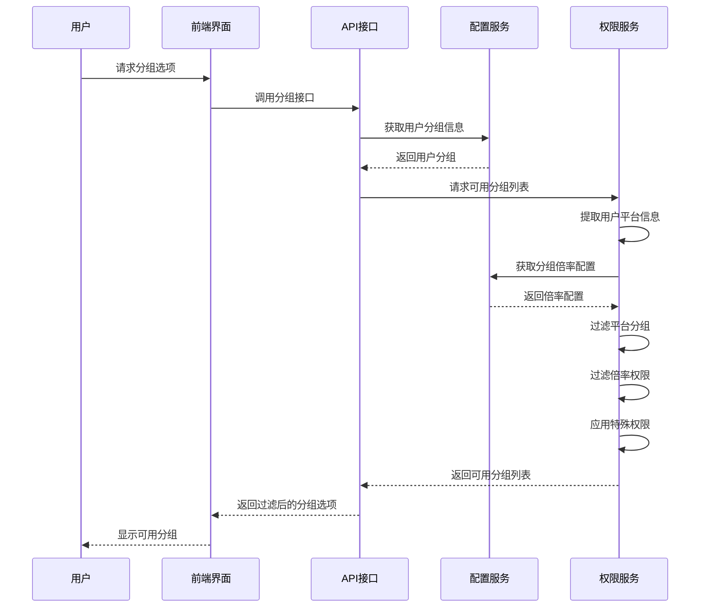
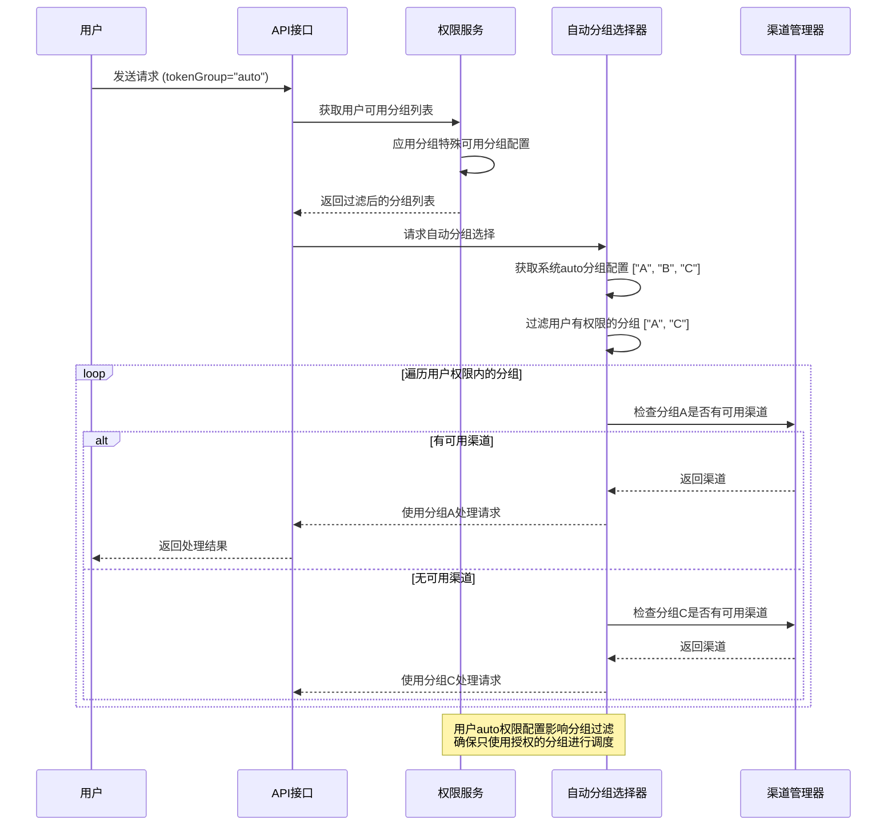
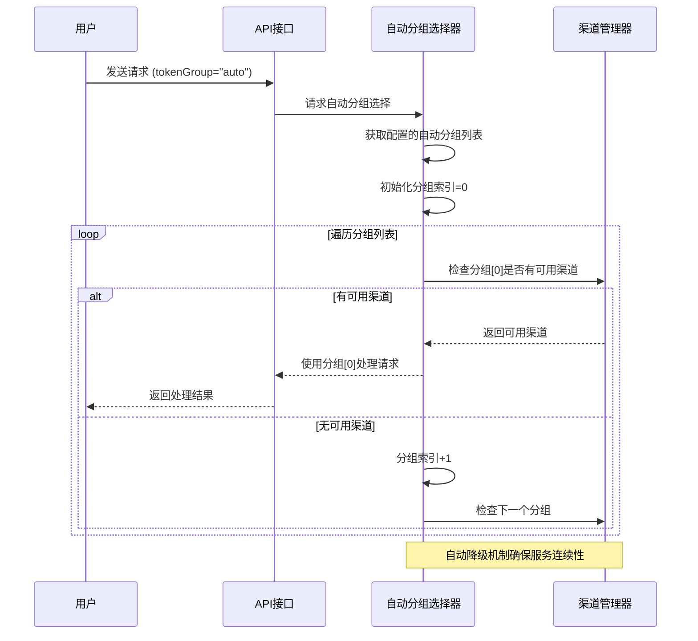

# NewAPI多级分组倍率权限控制方案

## 1. 需求分析

### 1.1 业务需求
需要实现一个多级分组倍率系统，具有以下特点：
- 不同AI平台（Claude、Gemini、OpenAI、Grok）设置不同的倍率层级
- 用户根据所属分组获得相应的权限控制
- 用户只能看到自己权限范围内的分组选项

### 1.2 核心配置
```json
{
    "claude_0.8": 0.8,
    "claude_0.85": 0.85,
    "gemini_0.7": 0.7,
    "gemini_0.75": 0.75,
    "openai_0.8": 0.8,
    "openai_0.85": 0.85,
    "grok_0.8": 0.8,
    "grok_0.85": 0.85,
    "vip": 0.85,
    "svip": 0.8,
    "ssvip": 0.75,
    "sssvip": 0.7
}
```

### 1.3 权限控制规则
1. **平台隔离**: 用户只能看到同平台的倍率分组选项
2. **权限递进**: 用户只能使用倍率小于等于自己分组倍率的选项（折扣力度更高）
3. **VIP特权**: VIP用户可以获得额外的权限扩展

### 1.4 倍率权限理解
- **倍率数值**: 越小表示折扣力度越大（0.8=8折，0.7=7折）
- **权限逻辑**: 用户倍率 ≤ 目标倍率时才有权限使用（倍率越小权限越大）
- **权限递进**: claude_0.8用户可以看到claude_0.8和claude_0.85（权限更大，可以使用倍率≥0.8的选项）
- **边界限制**: claude_0.85用户只能看到claude_0.85（权限最小，只能使用倍率≥0.85的选项）

## 2. 配置设计

### 2.1 分组倍率配置 (GroupRatio)
**配置位置**: 系统设置 → 倍率设置 → 分组倍率

```json
{
  "claude_0.8": 0.8,
  "claude_0.85": 0.85,
  "gemini_0.7": 0.7,
  "gemini_0.75": 0.75,
  "openai_0.8": 0.8,
  "openai_0.85": 0.85,
  "grok_0.8": 0.8,
  "grok_0.85": 0.85,
  "vip": 0.85,
  "svip": 0.8,
  "ssvip": 0.75,
  "sssvip": 0.7
}
```

### 2.2 用户可选分组配置 (UserUsableGroups)
**配置位置**: 系统设置 → 倍率设置 → 用户可选分组

```json
{
  "claude_0.8": "Claude 8折优惠分组",
  "claude_0.85": "Claude 8.5折优惠分组",
  "gemini_0.7": "Gemini 7折优惠分组",
  "gemini_0.75": "Gemini 7.5折优惠分组",
  "openai_0.8": "OpenAI 8折优惠分组",
  "openai_0.85": "OpenAI 8.5折优惠分组",
  "grok_0.8": "Grok 8折优惠分组",
  "grok_0.85": "Grok 8.5折优惠分组",
  "vip": "VIP用户分组",
  "svip": "超级VIP用户分组",
  "ssvip": "钻石VIP用户分组",
  "sssvip": "皇冠VIP用户分组"
}
```

### 2.3 分组特殊可用分组配置 (GroupSpecialUsableGroup)
**配置位置**: 系统设置 → 倍率设置 → 分组特殊可用分组

```json
{
  "claude_0.8": {
    "+:claude_0.8": "Claude 8折优惠",
    "+:claude_0.85": "Claude 8.5折优惠",
    "-:gemini_0.7": "Gemini 7折优惠",
    "-:gemini_0.75": "Gemini 7.5折优惠",
    "-:openai_0.8": "OpenAI 8折优惠",
    "-:openai_0.85": "OpenAI 8.5折优惠",
    "-:grok_0.8": "Grok 8折优惠",
    "-:grok_0.85": "Grok 8.5折优惠",
    "-:vip": "VIP用户分组",
    "-:svip": "超级VIP用户分组",
    "-:ssvip": "钻石VIP用户分组",
    "-:sssvip": "皇冠VIP用户分组"
  },
  "claude_0.85": {
    "+:claude_0.85": "Claude 8.5折优惠",
    "-:claude_0.8": "Claude 8折优惠",
    "-:gemini_0.7": "Gemini 7折优惠",
    "-:gemini_0.75": "Gemini 7.5折优惠",
    "-:openai_0.8": "OpenAI 8折优惠",
    "-:openai_0.85": "OpenAI 8.5折优惠",
    "-:grok_0.8": "Grok 8折优惠",
    "-:grok_0.85": "Grok 8.5折优惠",
    "-:vip": "VIP用户分组",
    "-:svip": "超级VIP用户分组",
    "-:ssvip": "钻石VIP用户分组",
    "-:sssvip": "皇冠VIP用户分组"
  },
  "gemini_0.7": {
    "+:gemini_0.7": "Gemini 7折优惠",
    "+:gemini_0.75": "Gemini 7.5折优惠",
    "-:claude_0.8": "Claude 8折优惠",
    "-:claude_0.85": "Claude 8.5折优惠",
    "-:openai_0.8": "OpenAI 8折优惠",
    "-:openai_0.85": "OpenAI 8.5折优惠",
    "-:grok_0.8": "Grok 8折优惠",
    "-:grok_0.85": "Grok 8.5折优惠",
    "-:vip": "VIP用户分组",
    "-:svip": "超级VIP用户分组",
    "-:ssvip": "钻石VIP用户分组",
    "-:sssvip": "皇冠VIP用户分组"
  },
  "gemini_0.75": {
    "+:gemini_0.75": "Gemini 7.5折优惠",
    "-:claude_0.8": "Claude 8折优惠",
    "-:claude_0.85": "Claude 8.5折优惠",
    "-:gemini_0.7": "Gemini 7折优惠",
    "-:openai_0.8": "OpenAI 8折优惠",
    "-:openai_0.85": "OpenAI 8.5折优惠",
    "-:grok_0.8": "Grok 8折优惠",
    "-:grok_0.85": "Grok 8.5折优惠",
    "-:vip": "VIP用户分组",
    "-:svip": "超级VIP用户分组",
    "-:ssvip": "钻石VIP用户分组",
    "-:sssvip": "皇冠VIP用户分组"
  },
  "openai_0.8": {
    "+:openai_0.8": "OpenAI 8折优惠",
    "+:openai_0.85": "OpenAI 8.5折优惠",
    "-:claude_0.8": "Claude 8折优惠",
    "-:claude_0.85": "Claude 8.5折优惠",
    "-:gemini_0.7": "Gemini 7折优惠",
    "-:gemini_0.75": "Gemini 7.5折优惠",
    "-:grok_0.8": "Grok 8折优惠",
    "-:grok_0.85": "Grok 8.5折优惠",
    "-:vip": "VIP用户分组",
    "-:svip": "超级VIP用户分组",
    "-:ssvip": "钻石VIP用户分组",
    "-:sssvip": "皇冠VIP用户分组"
  },
  "openai_0.85": {
    "+:openai_0.85": "OpenAI 8.5折优惠",
    "-:claude_0.8": "Claude 8折优惠",
    "-:claude_0.85": "Claude 8.5折优惠",
    "-:gemini_0.7": "Gemini 7折优惠",
    "-:gemini_0.75": "Gemini 7.5折优惠",
    "-:openai_0.8": "OpenAI 8折优惠",
    "-:grok_0.8": "Grok 8折优惠",
    "-:grok_0.85": "Grok 8.5折优惠",
    "-:vip": "VIP用户分组",
    "-:svip": "超级VIP用户分组",
    "-:ssvip": "钻石VIP用户分组",
    "-:sssvip": "皇冠VIP用户分组"
  },
  "grok_0.8": {
    "+:grok_0.8": "Grok 8折优惠",
    "+:grok_0.85": "Grok 8.5折优惠",
    "-:claude_0.8": "Claude 8折优惠",
    "-:claude_0.85": "Claude 8.5折优惠",
    "-:gemini_0.7": "Gemini 7折优惠",
    "-:gemini_0.75": "Gemini 7.5折优惠",
    "-:openai_0.8": "OpenAI 8折优惠",
    "-:openai_0.85": "OpenAI 8.5折优惠",
    "-:vip": "VIP用户分组",
    "-:svip": "超级VIP用户分组",
    "-:ssvip": "钻石VIP用户分组",
    "-:sssvip": "皇冠VIP用户分组"
  },
  "grok_0.85": {
    "+:grok_0.85": "Grok 8.5折优惠",
    "-:claude_0.8": "Claude 8折优惠",
    "-:claude_0.85": "Claude 8.5折优惠",
    "-:gemini_0.7": "Gemini 7折优惠",
    "-:gemini_0.75": "Gemini 7.5折优惠",
    "-:openai_0.8": "OpenAI 8折优惠",
    "-:openai_0.85": "OpenAI 8.5折优惠",
    "-:grok_0.8": "Grok 8折优惠",
    "-:vip": "VIP用户分组",
    "-:svip": "超级VIP用户分组",
    "-:ssvip": "钻石VIP用户分组",
    "-:sssvip": "皇冠VIP用户分组"
  },
  "vip": {
    "+:claude_0.8": "Claude 8折优惠",
    "+:gemini_0.7": "Gemini 7折优惠",
    "+:openai_0.8": "OpenAI 8折优惠",
    "+:grok_0.8": "Grok 8折优惠"
  },
  "svip": {
    "+:claude_0.8": "Claude 8折优惠",
    "+:claude_0.85": "Claude 8.5折优惠",
    "+:gemini_0.7": "Gemini 7折优惠",
    "+:gemini_0.75": "Gemini 7.5折优惠",
    "+:openai_0.8": "OpenAI 8折优惠",
    "+:openai_0.85": "OpenAI 8.5折优惠",
    "+:grok_0.8": "Grok 8折优惠",
    "+:grok_0.85": "Grok 8.5折优惠"
  },
  "ssvip": {
    "+:claude_0.7": "Claude 7折优惠",
    "+:claude_0.8": "Claude 8折优惠",
    "+:claude_0.85": "Claude 8.5折优惠",
    "+:gemini_0.7": "Gemini 7折优惠",
    "+:gemini_0.75": "Gemini 7.5折优惠",
    "+:openai_0.8": "OpenAI 8折优惠",
    "+:openai_0.85": "OpenAI 8.5折优惠",
    "+:grok_0.8": "Grok 8折优惠",
    "+:grok_0.85": "Grok 8.5折优惠"
  },
  "sssvip": {
    "+:claude_0.7": "Claude 7折优惠",
    "+:claude_0.8": "Claude 8折优惠",
    "+:claude_0.85": "Claude 8.5折优惠",
    "+:gemini_0.7": "Gemini 7折优惠",
    "+:gemini_0.75": "Gemini 7.5折优惠",
    "+:openai_0.8": "OpenAI 8折优惠",
    "+:openai_0.85": "OpenAI 8.5折优惠",
    "+:grok_0.8": "Grok 8折优惠",
    "+:grok_0.85": "Grok 8.5折优惠"
  }
}
```

**配置说明**:
- `+:` 前缀表示添加指定分组到用户的可用分组列表
- `-:` 前缀表示从可用分组列表中移除指定分组
- **权限递进规则**: 倍率越小权限越大，可以看到倍率大于等于自己的分组
- **平台隔离**: 每个平台分组明确禁止看到其他平台和VIP分组
- **VIP分组**: 拥有跨平台的特殊权限，无需额外禁止配置
- **Auto分组特殊处理**: Auto分组不属于上述配置范畴，它通过动态检测用户的auto权限来决定是否显示

## 3. 权限控制逻辑

### 3.1 基础权限过滤逻辑

#### 3.1.1 平台分组提取
系统通过分组名称的结构来识别平台信息：
- 普通分组：`platform_ratio` 格式，如 `claude_0.8` → 提取 `claude` 平台
- VIP分组：直接识别为VIP平台，支持跨平台权限

#### 3.1.2 倍率比较逻辑
权限比较基于倍率数值大小：
- 用户倍率越小，拥有的权限越大（折扣力度越大）
- 用户可以访问倍率大于等于自己分组倍率的所有同平台选项
- 例如：claude_0.8用户倍率0.8，可以使用所有≥0.8倍率的claude分组

#### 3.1.3 平台权限过滤
权限过滤按以下规则执行：
1. **平台匹配检查**：用户只能看到同平台的选项或VIP相关选项
2. **倍率权限检查**：用户只能看到倍率≤自己分组倍率的选项
3. **特殊权限应用**：VIP用户享有额外的跨平台权限

### 3.2 权限控制流程图



## 4. 用户权限矩阵

### 4.1 Claude平台权限矩阵

| 用户分组 | 分组倍率 | 可用的Claude分组 | 说明 |
|----------|----------|------------------|------|
| claude_0.8 | 0.8 | claude_0.8, claude_0.85 | 可以选择8折和8.5折优惠（权限更大） |
| claude_0.85 | 0.85 | claude_0.85 | 只能使用8.5折优惠（权限受限） |
| vip | 0.85 | claude_0.8 | VIP用户享有8折优惠 |
| svip | 0.8 | claude_0.8, claude_0.85 | 超级VIP享有8折和8.5折优惠 |
| ssvip | 0.75 | claude_0.7, claude_0.8, claude_0.85 | 钻石VIP享有全部Claude优惠 |
| sssvip | 0.7 | claude_0.7, claude_0.8, claude_0.85 | 皇冠VIP享有全部Claude优惠 |

### 4.2 Gemini平台权限矩阵

| 用户分组 | 分组倍率 | 可用的Gemini分组 | 说明 |
|----------|----------|------------------|------|
| gemini_0.7 | 0.7 | gemini_0.7, gemini_0.75 | 可以选择7折和7.5折优惠（权限更大） |
| gemini_0.75 | 0.75 | gemini_0.75 | 只能使用7.5折优惠（权限受限） |
| vip | 0.85 | gemini_0.7 | VIP用户享有7折优惠 |
| svip | 0.8 | gemini_0.7, gemini_0.75 | 超级VIP享有7折和7.5折优惠 |
| ssvip | 0.75 | gemini_0.7, gemini_0.75 | 钻石VIP享有全部Gemini优惠 |
| sssvip | 0.7 | gemini_0.7, gemini_0.75 | 皇冠VIP享有全部Gemini优惠 |

### 4.3 OpenAI平台权限矩阵

| 用户分组 | 分组倍率 | 可用的OpenAI分组 | 说明 |
|----------|----------|------------------|------|
| openai_0.8 | 0.8 | openai_0.8, openai_0.85 | 可以选择8折和8.5折优惠（权限更大） |
| openai_0.85 | 0.85 | openai_0.85 | 只能使用8.5折优惠（权限受限） |
| vip | 0.85 | openai_0.8 | VIP用户享有8折优惠 |
| svip | 0.8 | openai_0.8, openai_0.85 | 超级VIP享有8折和8.5折优惠 |
| ssvip | 0.75 | openai_0.7, openai_0.8, openai_0.85 | 钻石VIP享有全部OpenAI优惠 |
| sssvip | 0.7 | openai_0.7, openai_0.8, openai_0.85 | 皇冠VIP享有全部OpenAI优惠 |

**注**: OpenAI平台同样遵循倍率权限规则，倍率越小权限越大。

### 4.4 Grok平台权限矩阵

| 用户分组 | 分组倍率 | 可用的Grok分组 | 说明 |
|----------|----------|------------------|------|
| grok_0.8 | 0.8 | grok_0.8, grok_0.85 | 可以选择8折和8.5折优惠（权限更大） |
| grok_0.85 | 0.85 | grok_0.85 | 只能使用8.5折优惠（权限受限） |
| vip | 0.85 | grok_0.8 | VIP用户享有8折优惠 |
| svip | 0.8 | grok_0.8, grok_0.85 | 超级VIP享有8折和8.5折优惠 |
| ssvip | 0.75 | grok_0.7, grok_0.8, grok_0.85 | 钻石VIP享有全部Grok优惠 |
| sssvip | 0.7 | grok_0.7, grok_0.8, grok_0.85 | 皇冠VIP享有全部Grok优惠 |

**注**: Grok平台同样遵循倍率权限规则，倍率越小权限越大。

### 4.5 权限矩阵总结

1. **平台分组规则**: 用户只能看到同平台的倍率分组选项，通过配置明确禁止其他平台分组
2. **权限递进规则**: 用户倍率越小，拥有的权限越大（可以看到更多优惠选项）
3. **VIP特权规则**: VIP分组用户可以跨平台享有对应倍率的优惠权限
4. **边界条件**: 每个平台的最高倍率分组只能看到自己，通过`-:`规则明确禁止其他选项
5. **配置强制性**: 通过`+:`和`-:`规则实现精确的权限控制，确保配置生效
6. **Auto分组特殊性**: Auto分组动态生成，受分组特殊可用分组配置影响，auto调度只使用用户有权限的分组

## 5. 配置实施步骤

### 5.1 步骤1：配置分组倍率
1. 进入系统设置 → 倍率设置 → 分组倍率
2. 输入上述JSON配置
3. 保存配置

### 5.2 步骤2：配置用户可选分组
1. 进入系统设置 → 倍率设置 → 用户可选分组
2. 输入包含所有分组的JSON配置
3. 保存配置

### 5.3 步骤3：配置特殊权限（可选）
1. 进入系统设置 → 倍率设置 → 分组特殊可用分组
2. 输入VIP用户的特殊权限配置
3. 保存配置

### 5.4 步骤4：用户分组分配
1. 进入用户管理页面
2. 为用户选择合适的初始分组
3. 保存用户信息

## 6. 核心实现逻辑

### 6.1 权限过滤算法设计

系统通过以下步骤实现权限过滤：

1. **用户分组识别**: 获取用户的当前分组和对应倍率
2. **平台信息提取**: 从分组名称中提取平台信息（claude、gemini等）
3. **分组列表获取**: 获取系统中配置的所有可用分组
4. **特殊权限应用**: 应用分组特殊可用分组配置（包括添加和移除规则）
5. **权限条件判断**:
   - **平台匹配**: 检查分组是否属于同一平台或VIP平台
   - **倍率比较**: 检查目标分组倍率是否≤用户分组倍率
   - **特殊规则**: 应用`+:`添加和`-:`移除规则
6. **结果过滤**: 返回满足所有条件的分组列表

#### 6.1.1 特殊权限配置处理
- **`+:`规则**: 强制添加指定分组到用户可用列表
- **`-:`规则**: 强制从用户可用列表中移除指定分组
- **优先级**: 特殊配置规则优先于通用权限规则

### 6.2 平台提取规则

- **普通分组**: `platform_ratio` 格式，通过下划线分割提取平台名
- **VIP分组**: 识别为特殊VIP平台，支持跨平台权限
- **边界处理**: 无法识别的分组归类为unknown平台

### 6.3 特殊权限处理

- **VIP用户权限**: 通过分组特殊可用分组配置获得跨平台权限
- **权限扩展**: VIP用户可以看到各平台对应的优惠分组
- **动态配置**: 支持通过配置灵活调整VIP用户的权限范围

## 12. 测试验证

### 12.1 测试场景设计

#### 12.1.1 平台分组权限测试
- **Claude用户测试**: 验证claude_0.8用户可以看到claude_0.8和claude_0.85分组，看不到其他平台和VIP分组；claude_0.85用户只能看到claude_0.85分组
- **Gemini用户测试**: 验证gemini_0.7用户可以看到gemini_0.7和gemini_0.75分组，看不到其他平台分组；gemini_0.75用户只能看到gemini_0.75分组
- **跨平台隔离**: 验证不同平台用户看不到其他平台的选项，包括VIP分组

#### 12.1.2 VIP用户权限测试
- **VIP用户测试**: 验证VIP用户可以看到各平台对应的优惠分组（claude_0.8、gemini_0.7等）
- **VIP等级差异**: 验证不同VIP等级可以看到不同范围的优惠选项
- **权限扩展**: 验证超级VIP可以看到更多优惠选项

#### 12.1.3 Auto分组测试
- **Auto分组权限控制**: 验证分组特殊可用分组配置影响auto分组的显示
- **Auto分组选择**: 验证auto分组按配置顺序从第一个分组开始选择
- **Auto分组降级**: 当第一个分组不可用时，自动切换到下一个分组
- **Auto权限过滤**: 验证auto分组只选择用户有权限的分组，即使在全局auto配置中

### 12.2 边界条件测试

1. **最低权限用户**: 平台最高优惠分组用户只能看到自己的分组（如claude_0.8）
2. **最高权限用户**: 皇冠VIP用户可以看到所有平台的全部分组
3. **跨平台权限**: VIP用户可以看到所有平台的对应优惠分组
4. **倍率边界**: 用户只能看到倍率小于等于自己分组倍率的选项
5. **配置完整性**: 验证所有配置的分组都有对应的权限规则
6. **Auto分组边界**: 验证auto分组在所有分组都不可用时的错误处理，以及权限配置对auto分组列表的影响

## 8. 自动分组 (Auto Group) 机制详解

### 8.1 Auto分组概念

**自动分组 (Auto Group)** 是一个特殊的令牌分组机制，当用户选择"auto"分组时，系统会自动从配置的自动分组列表中按顺序选择最优的分组进行请求处理。

### 8.2 核心配置说明

**配置位置**: 系统设置 → 倍率设置 → 自动分组auto，从第一个开始选择

**配置示例**:
```json
["default", "vip", "svip"]
```

**配置规则**:
- 配置一个分组名称的数组
- 系统按数组顺序从第一个分组开始尝试
- 当某个分组不可用时，自动切换到下一个分组

### 8.3 Auto分组的定义方式

**Auto分组不是物理分组**:
- Auto分组不需要在分组倍率配置中显式定义
- Auto分组是一个动态生成的特殊分组选项
- 当系统检测到用户有auto分组权限时，会自动在分组列表中添加此选项

**Auto分组的权限控制**:
- 通过`GetUserUsableGroups()`函数检查用户是否有auto分组权限
- 如果用户可用分组中包含"auto"，则在分组选项中显示auto分组
- Auto分组的显示受用户权限控制，确保只有授权用户才能看到此选项

### 8.4 Auto分组的工作流程





### 8.4 Auto分组的应用场景

1. **服务高可用**: 当某个分组的渠道全部不可用时，自动切换到备用分组
2. **负载均衡**: 在多个分组之间进行智能调度
3. **成本优化**: 可以配置不同优先级的分组，实现成本效益最大化
4. **用户体验**: 用户无需关心具体分组选择，系统自动选择最优分组

### 8.5 Auto分组与权限控制的结合

Auto分组受到用户权限的双重限制：

**1. Auto分组权限检测**:
- 通过分组特殊可用分组配置控制用户是否有auto分组权限
- 只有在用户可用分组中包含"auto"时，才会在分组选项中显示auto分组

**2. Auto调度权限过滤**:
- 系统会获取用户可用的分组列表（受特殊权限配置影响）
- 从配置的auto分组列表中过滤出用户有权限的分组
- 确保auto调度只使用用户授权的分组

**核心实现逻辑**:
```go
func GetUserAutoGroup(userGroup string) []string {
    // 获取用户可用分组（受特殊权限配置影响）
    groups := GetUserUsableGroups(userGroup)
    autoGroups := make([]string, 0)

    // 从系统auto分组配置中过滤用户有权限的分组
    for _, group := range setting.GetAutoGroups() {
        if _, ok := groups[group]; ok {
            autoGroups = append(autoGroups, group)
        }
    }
    return autoGroups
}
```

**权限控制效果**:
- 用户auto权限配置直接影响auto分组的可用性
- 即使auto分组在全局配置中，如果用户没有对应分组权限，也不会在auto调度中使用
- 实现了精细化的权限控制，确保用户只能访问授权的资源

**具体示例**:
假设系统配置的auto分组列表为: `["default", "vip", "svip"]`

- **VIP用户配置**:
  ```json
  "vip": {
    "+:claude_0.8": "Claude 8折优惠",
    "+:auto": "自动分组"
  }
  ```
  VIP用户的auto分组实际可选项: `["default", "vip"]`（只有这两个分组的权限）

- **普通用户配置**（没有特殊权限配置）:
  普通用户的auto分组实际可选项: `["default"]`（只有default分组的权限）

这样就实现了基于用户权限的精细化auto调度控制。

## 9. 扩展性设计

### 9.1 新平台接入
1. 在分组倍率配置中添加新平台分组
2. 在用户可选分组中添加对应描述
3. 在特殊权限配置中添加VIP用户的权限
4. 更新权限过滤逻辑（如果需要）

### 9.2 新VIP等级扩展
1. 在分组倍率配置中添加新的VIP等级
2. 在用户可选分组中添加对应描述
3. 在特殊权限配置中定义新等级的权限范围
4. 更新用户管理页面支持新等级选择

## 11. 监控和维护

### 11.1 配置变更监控
- 记录所有配置变更操作
- 提供配置回滚功能
- 监控配置生效情况

### 11.2 权限使用统计
- 统计各分组的使用情况
- 监控权限异常访问
- 生成权限使用报告

## 10. 总结

本方案通过精细的分组倍率设计和权限控制逻辑，实现了：

1. **平台隔离**: 用户按平台查看对应的分组选项，通过`-:`规则确保不同AI平台的用户不会看到无关的分组
2. **权限递进**: 用户权限基于倍率大小递进，倍率越小权限越大（折扣力度越大）
3. **VIP特权**: VIP用户获得跨平台的优惠权限，可以享受到各平台的优惠待遇
4. **精确控制**: 通过`+:`和`-:`规则实现精确的权限控制，确保用户只能看到授权的分组选项
5. **自动调度**: Auto分组机制提供智能的渠道调度和故障转移能力，受用户权限配置影响
6. **灵活配置**: 支持动态调整分组和权限关系，可以根据业务需求灵活扩展
7. **安全可靠**: 严格的权限验证和边界控制，双重保障用户体验和业务安全

该方案完全满足业务需求，为NewAPI系统提供了完善的多级分组倍率权限控制体系，通过精细化的权限管理和明确的配置规则实现了用户体验和业务安全的双重保障。