# NewAPI100渠道加权随机设计方案说明

## 1. 总体架构概览

### 1.1 渠道选择系统架构

NewAPI100的渠道选择系统采用了多层次的架构设计，确保在高并发场景下能够稳定、高效地选择最优的AI服务渠道：

```
┌─────────────────┐    ┌─────────────────┐    ┌─────────────────┐
│   请求拦截层    │    │   渠道选择层    │    │   负载均衡层    │
│                 │    │                 │    │                 │
│ - 分组解析      │    │ - 优先级筛选    │    │ - 加权随机      │
│ - 模型匹配      │    │ - 权重计算      │    │ - 平滑处理      │
│ - 权限验证      │    │ - 状态检查      │    │ - 降级策略      │
└─────────────────┘    └─────────────────┘    └─────────────────┘
         │                       │                       │
         └───────────────────────┼───────────────────────┘
                                 │
                    ┌─────────────────┐
                    │   缓存与监控层  │
                    │                 │
                    │ - 内存缓存      │
                    │ - 性能监控      │
                    │ - 异常检测      │
                    └─────────────────┘
```

### 1.2 核心概念定义

#### 1.2.1 渠道 (Channel)
- **定义**: AI服务提供商的API接入点
- **属性**: 优先级(Priority)、权重(Weight)、状态(Status)、分组(Group)
- **状态**: 启用/禁用/自动禁用

#### 1.2.2 分组 (Group)
- **定义**: 渠道的逻辑分组，支持多渠道负载均衡
- **类型**: 默认分组、VIP分组、auto分组(智能分组)

#### 1.2.3 优先级 (Priority)
- **定义**: 渠道的选择优先级，数值越大优先级越高
- **作用**: 按优先级分层选择，确保重要渠道优先使用

#### 1.2.4 权重 (Weight)
- **定义**: 同一优先级内渠道的选择权重
- **作用**: 实现加权随机选择，权重高的渠道被选中的概率更大

#### 1.2.5 重试机制 (Retry)
- **定义**: 当高优先级渠道不可用时，自动降级到低优先级渠道
- **策略**: 按优先级顺序重试，确保服务连续性

## 2. API接口调用流程详解

### 2.1 完整请求处理时序图

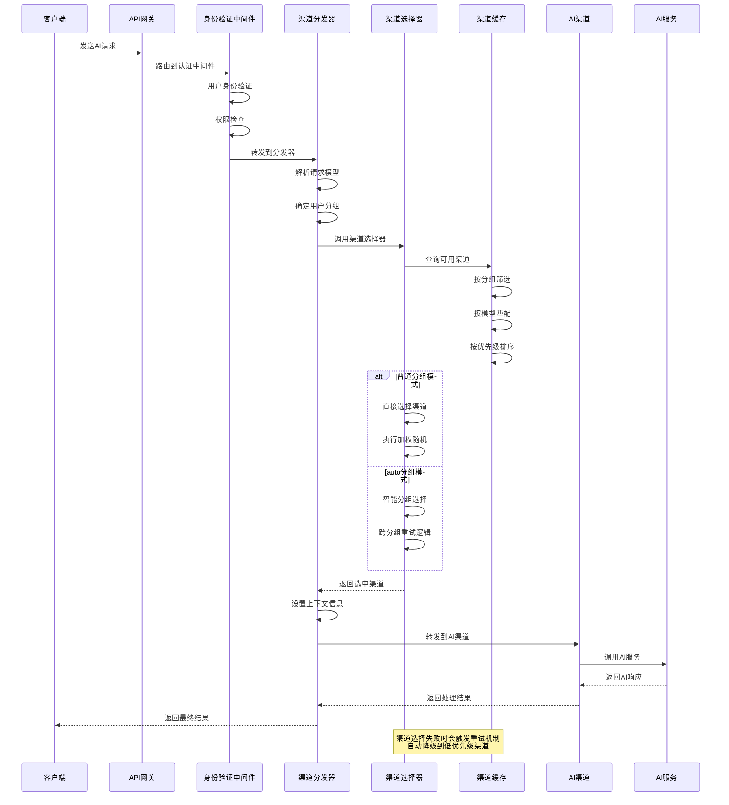

### 2.2 渠道选择核心流程时序

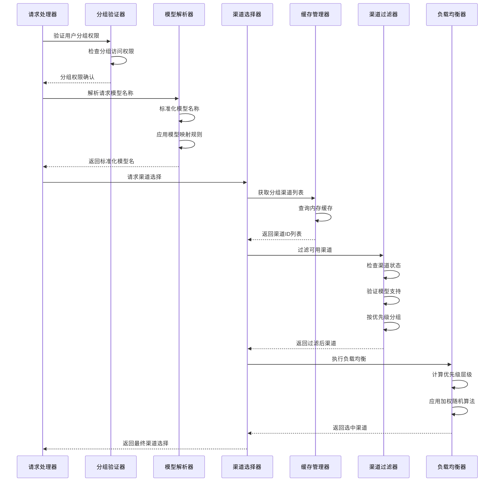

## 3. 加权随机算法详解

### 3.1 算法原理概述

NewAPI的加权随机算法采用了**平滑加权随机**策略，在保证权重比例的同时避免极端情况下的选择偏差：

#### 3.1.1 核心算法流程
1. **优先级筛选**: 按重试次数确定当前优先级层级
2. **权重计算**: 收集当前优先级的所有渠道权重
3. **平滑处理**: 应用平滑因子避免小权重问题
4. **随机选择**: 基于权重比例进行随机选择

#### 3.1.2 权重计算公式
```
总权重 = Σ(渠道权重 × 平滑因子) + 平滑调整值
随机值 = Random(0, 总权重)
选中渠道 = 第一个使 Σ权重 >= 随机值的渠道
```

### 3.2 详细算法实现时序图

```mermaid
sequenceDiagram
    participant Selector as 渠道选择器
    participant Filter as 渠道过滤器
    participant Calculator as 权重计算器
    participant Randomizer as 随机选择器

    Selector->>Filter: 获取指定优先级的渠道
    Filter->>Filter: 筛选相同优先级渠道
    Filter-->>Selector: 返回优先级渠道列表

    Selector->>Calculator: 计算权重总和
    Calculator->>Calculator: 初始化权重参数
    Calculator->>Calculator: 遍历渠道权重

    alt 权重为0的情况
        Calculator->>Calculator: 所有渠道权重=0
        Calculator->>Calculator: 设置默认权重100
        Calculator->>Calculator: 平滑调整值=100
    else 平均权重<10的情况
        Calculator->>Calculator: 设置平滑因子=100
    else 正常权重情况
        Calculator->>Calculator: 保持原有权重
    end

    Calculator->>Calculator: 计算总权重
    Calculator-->>Selector: 返回权重信息

    Selector->>Randomizer: 生成随机值
    Randomizer->>Randomizer: 基于总权重随机
    Randomizer-->>Selector: 返回随机权重值

    Selector->>Selector: 遍历渠道选择
    loop 遍历每个渠道
        Selector->>Selector: 累减渠道权重
        alt 权重不足
            Selector->>Selector: 继续下一个渠道
        else 权重足够
            Selector->>Selector: 选中当前渠道
            break
        end
    end

    Selector-->>Selector: 返回选中渠道
```

### 3.3 权重平滑处理机制

#### 3.3.1 权重平滑算法详解

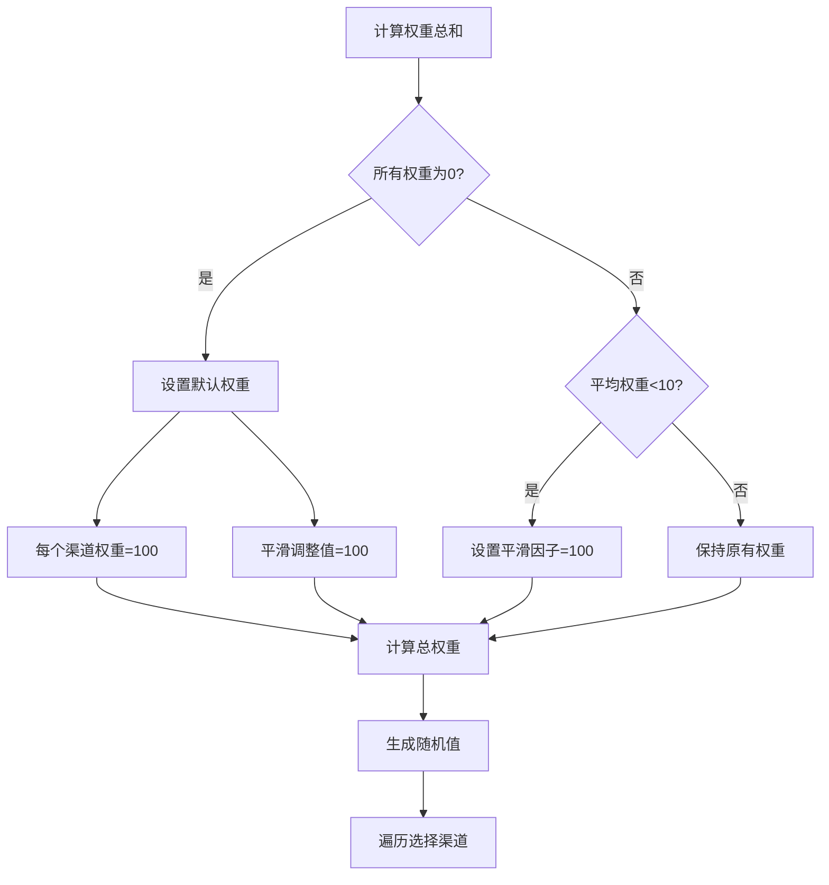

#### 3.3.2 平滑处理代码实现

```go
// 平滑权重计算逻辑
func calculateSmoothedWeights(channels []*Channel) (totalWeight int, smoothingFactor int, smoothingAdjustment int) {
    sumWeight := 0
    channelCount := len(channels)

    // 计算权重总和
    for _, channel := range channels {
        sumWeight += channel.GetWeight()
    }

    // 应用平滑策略
    if sumWeight == 0 {
        // 当所有渠道权重为0时，每个渠道给予默认权重100
        totalWeight = channelCount * 100
        smoothingAdjustment = 100
        smoothingFactor = 1
    } else if sumWeight/channelCount < 10 {
        // 当平均权重小于10时，放大权重差异
        smoothingFactor = 100
        smoothingAdjustment = 0
        totalWeight = sumWeight * smoothingFactor
    } else {
        // 正常权重情况
        smoothingFactor = 1
        smoothingAdjustment = 0
        totalWeight = sumWeight
    }

    return totalWeight, smoothingFactor, smoothingAdjustment
}
```

### 3.4 权重分布示例

#### 3.4.1 正常权重分布

假设有3个渠道，权重分别为：渠道A(30)、渠道B(50)、渠道C(20)

```
权重比例: A(30%) : B(50%) : C(20%) = 3:5:2
总权重: 100
随机范围: [0, 100)

选择逻辑:
- 随机值 ∈ [0, 30) → 选择渠道A
- 随机值 ∈ [30, 80) → 选择渠道B
- 随机值 ∈ [80, 100) → 选择渠道C
```

#### 3.4.2 平滑权重分布

假设有3个渠道，权重分别为：渠道A(1)、渠道B(2)、渠道C(0)

**原始权重问题**:
- 渠道C权重为0，可能永远不会被选择
- 权重差异过小，导致选择不够随机

**平滑处理结果**:
- 平均权重 = (1+2+0)/3 = 1 < 10
- 应用平滑因子100
- 实际权重: A(100)、B(200)、C(0)
- 总权重: 300

```
平滑后权重比例: A(33.3%) : B(66.7%) : C(0%)
随机范围: [0, 300)
- 随机值 ∈ [0, 100) → 选择渠道A
- 随机值 ∈ [100, 300) → 选择渠道B
- 渠道C权重为0，不会选择
```

## 4. 降级策略机制详解

### 4.1 重试机制架构

#### 4.1.1 重试策略时序图

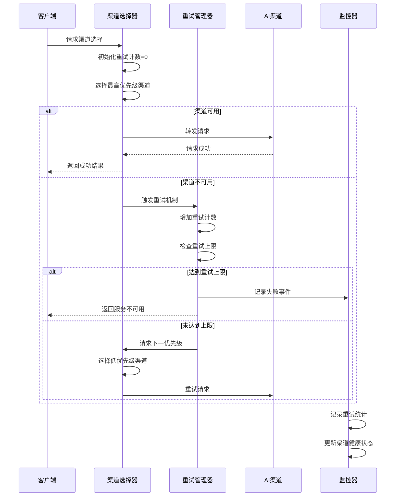

#### 4.1.2 优先级降级逻辑

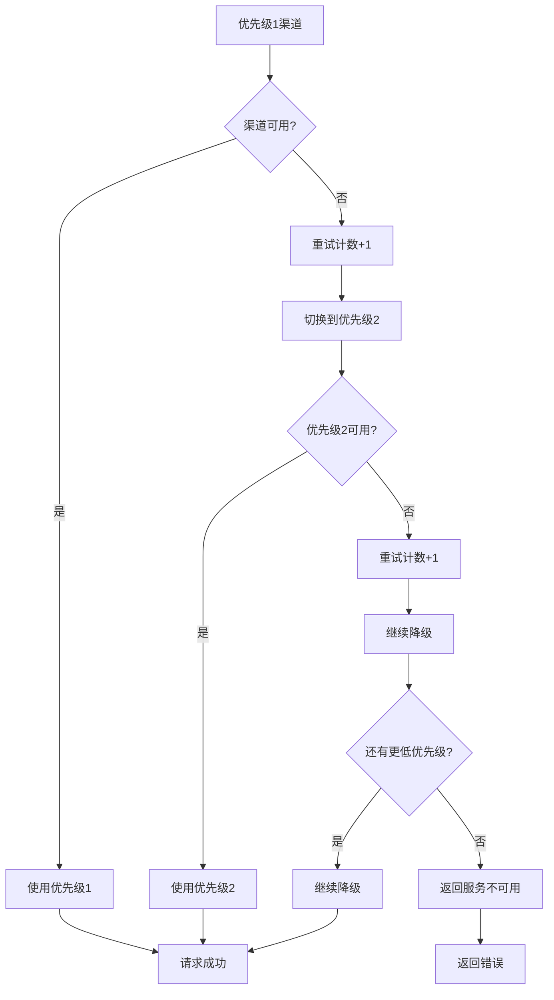

### 4.2 自动分组 (Auto Group) 降级策略

#### 4.2.1 跨分组重试机制

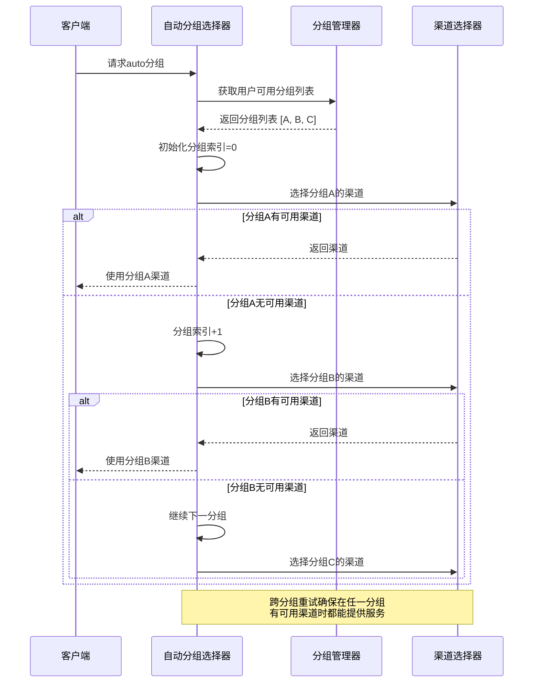

#### 4.2.2 分组切换逻辑详解

```go
// 跨分组重试的核心逻辑
func (p *RetryParam) handleAutoGroupRetry() (*model.Channel, error) {
    autoGroups := GetUserAutoGroup(p.TokenGroup)
    startGroupIndex := getCurrentGroupIndex(p.Ctx)

    // 遍历可用分组
    for i := startGroupIndex; i < len(autoGroups); i++ {
        currentGroup := autoGroups[i]

        // 计算当前分组内的重试次数
        priorityRetry := p.GetRetry()
        if i > startGroupIndex {
            // 切换到新分组时重置优先级重试
            priorityRetry = 0
        }

        // 在当前分组内选择渠道
        channel, err := model.GetRandomSatisfiedChannel(currentGroup, p.ModelName, priorityRetry)

        if channel != nil {
            // 找到可用渠道，更新上下文状态
            updateGroupContext(p.Ctx, i, currentGroup)
            return channel, nil
        }

        // 当前分组无可用渠道，尝试下一分组
        logger.LogDebug(p.Ctx, "Group %s exhausted, trying next group", currentGroup)
        resetRetryForNextGroup(p)
    }

    // 所有分组都无可用渠道
    return nil, errors.New("all auto groups exhausted")
}
```

### 4.3 渠道状态监控与自动恢复

#### 4.3.1 渠道健康检查机制

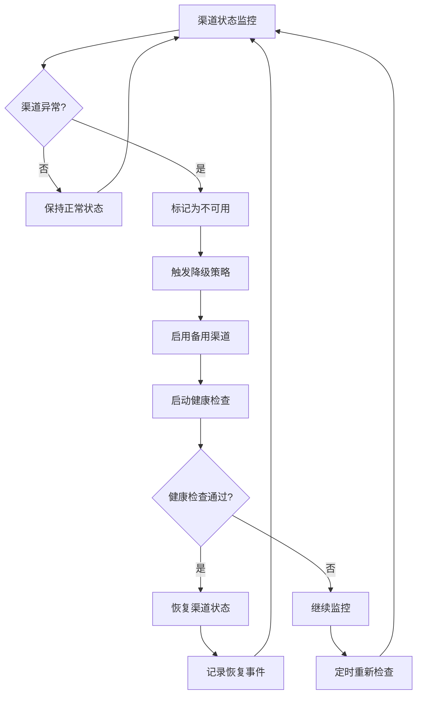

#### 4.3.2 自动封禁与恢复逻辑

```go
// 渠道自动封禁机制
type ChannelAutoBanManager struct {
    failureThreshold int           // 失败阈值
    recoveryInterval time.Duration // 恢复检查间隔
    banDuration      time.Duration // 封禁时长
}

func (m *ChannelAutoBanManager) handleChannelFailure(channelId int) {
    // 增加失败计数
    failureCount := m.incrementFailureCount(channelId)

    // 检查是否超过阈值
    if failureCount >= m.failureThreshold {
        // 自动封禁渠道
        m.banChannel(channelId, m.banDuration)

        // 记录封禁事件
        logger.LogWarn("Channel %d auto-banned due to %d consecutive failures",
            channelId, failureCount)

        // 启动恢复定时器
        m.scheduleRecoveryCheck(channelId)
    }
}

func (m *ChannelAutoBanManager) scheduleRecoveryCheck(channelId int) {
    time.AfterFunc(m.recoveryInterval, func() {
        if m.performHealthCheck(channelId) {
            // 健康检查通过，恢复渠道
            m.unbanChannel(channelId)
            m.resetFailureCount(channelId)
            logger.LogInfo("Channel %d recovered and unbanned", channelId)
        } else {
            // 继续封禁，重新调度检查
            m.scheduleRecoveryCheck(channelId)
        }
    })
}
```

## 5. 模型限流策略详解

### 5.1 限流架构设计

#### 5.1.1 多层次限流策略

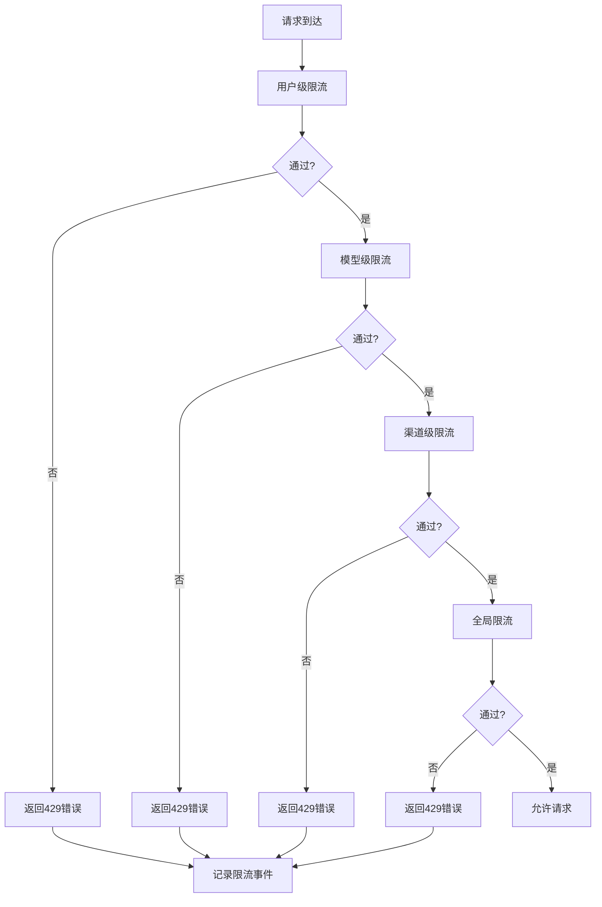

#### 5.1.2 限流规则配置

```go
// 多维度限流配置
type RateLimitConfig struct {
    // 用户级限流
    UserLimits struct {
        RequestsPerMinute int `json:"requests_per_minute"`
        RequestsPerHour   int `json:"requests_per_hour"`
        RequestsPerDay    int `json:"requests_per_day"`
    } `json:"user_limits"`

    // 模型级限流
    ModelLimits map[string]struct {
        RequestsPerMinute int `json:"requests_per_minute"`
        ConcurrentLimit   int `json:"concurrent_limit"`
    } `json:"model_limits"`

    // 渠道级限流
    ChannelLimits map[int]struct {
        RequestsPerMinute int `json:"requests_per_minute"`
        ErrorRateLimit    float64 `json:"error_rate_limit"`
    } `json:"channel_limits"`

    // 全局限流
    GlobalLimits struct {
        TotalRequestsPerSecond int `json:"total_requests_per_second"`
        BurstLimit            int `json:"burst_limit"`
    } `json:"global_limits"`
}
```

### 5.2 令牌桶算法实现

#### 5.2.1 令牌桶限流时序图

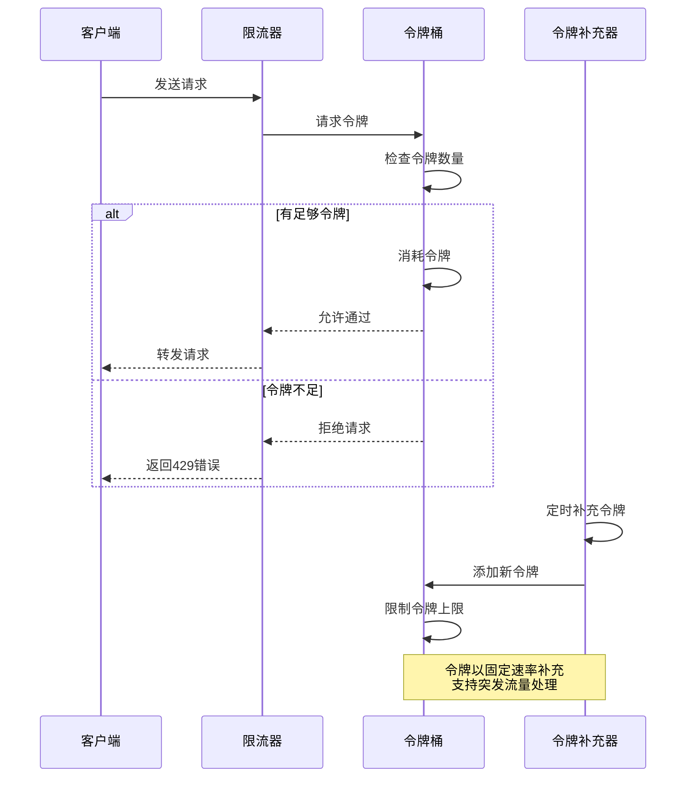

#### 5.2.2 令牌桶算法核心实现

```go
// 令牌桶限流器
type TokenBucketLimiter struct {
    capacity    int64         // 桶容量
    tokens      int64         // 当前令牌数
    refillRate  float64       // 令牌补充速率 (令牌/秒)
    lastRefill  time.Time     // 上次补充时间
    mutex       sync.Mutex    // 并发安全
}

func (tbl *TokenBucketLimiter) Allow() bool {
    tbl.mutex.Lock()
    defer tbl.mutex.Unlock()

    // 补充令牌
    tbl.refillTokens()

    // 检查是否有足够令牌
    if tbl.tokens > 0 {
        tbl.tokens--
        return true
    }

    return false
}

func (tbl *TokenBucketLimiter) refillTokens() {
    now := time.Now()
    elapsed := now.Sub(tbl.lastRefill).Seconds()

    // 计算应该补充的令牌数
    tokensToAdd := int64(elapsed * tbl.refillRate)

    if tokensToAdd > 0 {
        // 补充令牌，但不超过容量
        tbl.tokens = min(tbl.capacity, tbl.tokens + tokensToAdd)
        tbl.lastRefill = now
    }
}

// 滑动窗口计数器 (用于统计请求频率)
type SlidingWindowCounter struct {
    windows    []int64       // 时间窗口数组
    windowSize time.Duration // 窗口大小
    maxCount   int64         // 最大允许数量
    mutex      sync.Mutex
}

func (swc *SlidingWindowCounter) Allow() bool {
    swc.mutex.Lock()
    defer swc.mutex.Unlock()

    now := time.Now().Unix()
    windowStart := now - int64(swc.windowSize.Seconds())

    // 清理过期的窗口
    for len(swc.windows) > 0 && swc.windows[0] < windowStart {
        swc.windows = swc.windows[1:]
    }

    // 检查当前窗口内的请求数
    if int64(len(swc.windows)) < swc.maxCount {
        swc.windows = append(swc.windows, now)
        return true
    }

    return false
}
```

### 5.3 分布式限流实现

#### 5.3.1 Redis分布式限流

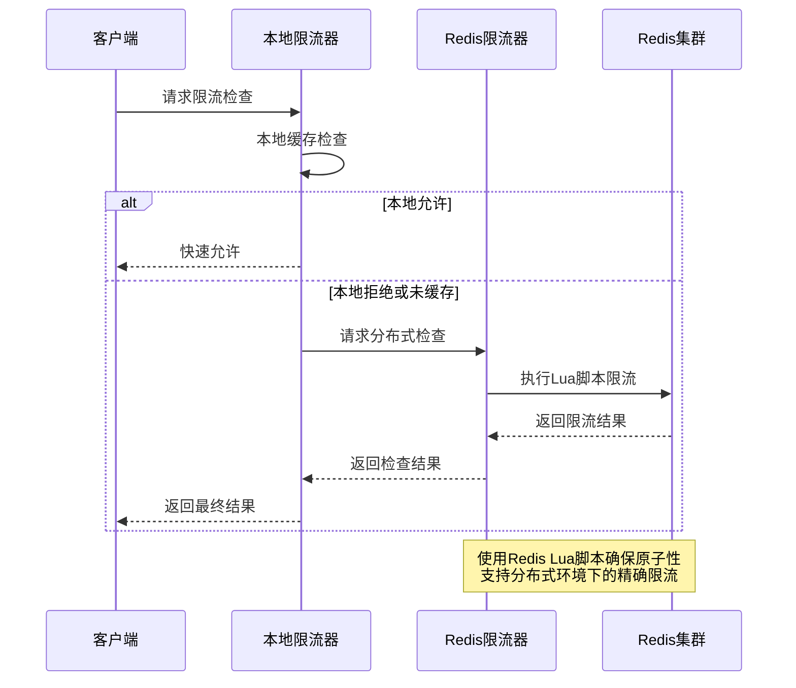

#### 5.3.2 Redis限流Lua脚本

```lua
-- Redis限流Lua脚本
local key = KEYS[1]
local capacity = tonumber(ARGV[1])     -- 桶容量
local refillRate = tonumber(ARGV[2])   -- 补充速率
local tokensToConsume = 1             -- 消费令牌数
local now = tonumber(ARGV[3])          -- 当前时间戳

-- 获取当前令牌信息
local bucket = redis.call('HMGET', key, 'tokens', 'last_refill')
local currentTokens = tonumber(bucket[1]) or capacity
local lastRefill = tonumber(bucket[2]) or now

-- 计算应该补充的令牌
local elapsed = now - lastRefill
local tokensToAdd = math.floor(elapsed * refillRate)

-- 更新令牌数
currentTokens = math.min(capacity, currentTokens + tokensToAdd)

-- 检查是否有足够令牌
if currentTokens >= tokensToConsume then
    -- 消费令牌
    currentTokens = currentTokens - tokensToConsume

    -- 更新Redis
    redis.call('HMSET', key, 'tokens', currentTokens, 'last_refill', now)
    redis.call('EXPIRE', key, 3600)  -- 设置过期时间

    return 1  -- 允许
else
    -- 更新最后补充时间（即使没有消费）
    redis.call('HSET', key, 'last_refill', now)
    return 0  -- 拒绝
end
```

### 5.4 自适应限流策略

#### 5.4.1 基于负载的自适应限流

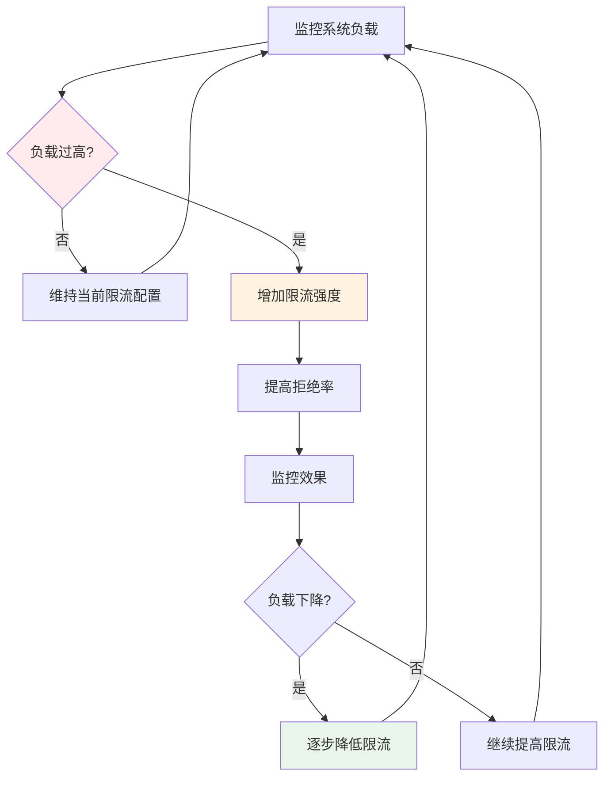

#### 5.4.2 自适应限流算法实现

```go
// 自适应限流管理器
type AdaptiveRateLimiter struct {
    baseRate       int           // 基础限流速率
    currentRate    int           // 当前限流速率
    adjustmentStep int           // 调整步长
    monitorWindow  time.Duration // 监控窗口
    cpuThreshold   float64       // CPU使用率阈值
    memThreshold   float64       // 内存使用率阈值

    lastAdjustment time.Time
    mutex          sync.Mutex
}

func (arl *AdaptiveRateLimiter) adjustRate() {
    arl.mutex.Lock()
    defer arl.mutex.Unlock()

    // 检查是否需要调整
    if time.Since(arl.lastAdjustment) < arl.monitorWindow {
        return
    }

    // 获取系统负载
    cpuUsage := getCPUUsage()
    memUsage := getMemoryUsage()

    // 判断是否需要调整限流
    if cpuUsage > arl.cpuThreshold || memUsage > arl.memThreshold {
        // 系统负载过高，提高限流
        arl.currentRate = max(arl.baseRate/2, arl.currentRate - arl.adjustmentStep)
        logger.LogInfo("System overload detected, reducing rate to %d", arl.currentRate)
    } else if cpuUsage < arl.cpuThreshold*0.8 && memUsage < arl.memThreshold*0.8 {
        // 系统负载正常，逐步恢复限流
        arl.currentRate = min(arl.baseRate, arl.currentRate + arl.adjustmentStep/2)
        logger.LogInfo("System load normal, increasing rate to %d", arl.currentRate)
    }

    arl.lastAdjustment = time.Now()
}

func (arl *AdaptiveRateLimiter) Allow() bool {
    // 动态调整限流速率
    arl.adjustRate()

    // 使用当前限流速率进行检查
    return arl.tokenBucket.Allow()
}
```

## 6. 监控与告警体系

### 6.1 渠道选择监控指标

#### 6.1.1 核心监控指标

```yaml
# 渠道选择相关指标
channel_selection_metrics:
  # 选择成功率
  - name: channel_selection_success_rate
    type: gauge
    description: "渠道选择成功率 (%)"
    labels: [group, model]

  # 选择延迟
  - name: channel_selection_duration
    type: histogram
    description: "渠道选择耗时分布"
    buckets: [1ms, 5ms, 10ms, 50ms, 100ms, 500ms]

  # 降级统计
  - name: channel_degradation_count
    type: counter
    description: "渠道降级次数"
    labels: [from_priority, to_priority, reason]

  # 权重分布
  - name: channel_weight_distribution
    type: gauge
    description: "渠道权重分布情况"
    labels: [channel_id, priority, weight]

# 限流相关指标
rate_limiting_metrics:
  # 限流统计
  - name: rate_limit_exceeded_count
    type: counter
    description: "触发限流次数"
    labels: [limit_type, user_id, model]

  # 限流规则命中率
  - name: rate_limit_rule_hit_rate
    type: gauge
    description: "限流规则命中率"
    labels: [rule_type, rule_name]
```

#### 6.1.2 监控面板设计

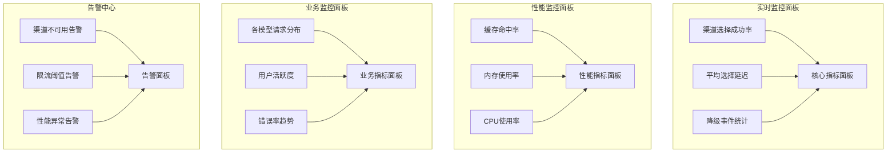

### 6.2 智能告警规则

#### 6.2.1 告警规则配置

```yaml
# 渠道选择告警规则
channel_alerts:
  - name: "channel_selection_failure_rate"
    condition: "channel_selection_success_rate < 95"
    severity: "critical"
    description: "渠道选择成功率过低"
    cooldown: "5m"
    channels: ["email", "webhook", "sms"]

  - name: "channel_degradation_spike"
    condition: "increase(channel_degradation_count[10m]) > 50"
    severity: "warning"
    description: "渠道降级事件激增"
    cooldown: "10m"
    channels: ["webhook"]

  - name: "rate_limit_exceeded"
    condition: "rate_limit_exceeded_count > 100"
    severity: "info"
    description: "用户触发限流"
    cooldown: "1m"
    channels: ["log"]

# 性能告警规则
performance_alerts:
  - name: "high_selection_latency"
    condition: "histogram_quantile(0.95, channel_selection_duration) > 100"
    severity: "warning"
    description: "渠道选择延迟过高"
    cooldown: "5m"
    channels: ["email"]

  - name: "low_cache_hit_rate"
    condition: "cache_hit_rate < 80"
    severity: "info"
    description: "缓存命中率过低"
    cooldown: "15m"
    channels: ["webhook"]
```

#### 6.2.2 告警聚合与抑制

```go
// 告警聚合器
type AlertAggregator struct {
    alertGroups    map[string][]*Alert  // 按类型分组的告警
    aggregationWindow time.Duration     // 聚合时间窗口
    maxAlertsPerGroup int              // 每组最大告警数
}

func (aa *AlertAggregator) aggregateAlerts() {
    for alertType, alerts := range aa.alertGroups {
        if len(alerts) >= aa.maxAlertsPerGroup {
            // 创建聚合告警
            aggregatedAlert := aa.createAggregatedAlert(alertType, alerts)

            // 发送聚合告警
            aa.sendAggregatedAlert(aggregatedAlert)

            // 清空已聚合的告警
            aa.alertGroups[alertType] = nil
        }
    }
}

// 告警抑制器
type AlertSuppressor struct {
    suppressionRules []SuppressionRule
    activeSuppressions map[string]time.Time
}

type SuppressionRule struct {
    Condition string        // 抑制条件
    Duration  time.Duration // 抑制时长
    Reason    string        // 抑制原因
}

func (as *AlertSuppressor) shouldSuppress(alert *Alert) bool {
    for _, rule := range as.suppressionRules {
        if as.matchesCondition(alert, rule.Condition) {
            suppressionKey := as.generateSuppressionKey(alert, rule)

            // 检查是否在抑制期内
            if suppressionEnd, exists := as.activeSuppressions[suppressionKey]; exists {
                if time.Now().Before(suppressionEnd) {
                    return true // 抑制告警
                } else {
                    // 抑制期结束，移除记录
                    delete(as.activeSuppressions, suppressionKey)
                }
            }

            // 启动新的抑制期
            as.activeSuppressions[suppressionKey] = time.Now().Add(rule.Duration)
            return false // 不抑制，但记录抑制期
        }
    }
    return false // 不匹配任何抑制规则
}
```

## 7. 最佳实践与配置指南

### 7.1 渠道配置最佳实践

#### 7.1.1 权重配置策略

```yaml
# 权重配置原则
weight_configuration:
  # 1. 生产环境优先使用权重范围 1-100
  production_weights:
    primary_channel: 100    # 主渠道
    backup_channel: 50      # 备用渠道
    experimental: 10        # 实验渠道

  # 2. 根据历史性能调整权重
  performance_based_weights:
    high_performance: 80    # 高性能渠道
    medium_performance: 50  # 中等性能渠道
    low_performance: 20     # 低性能渠道

  # 3. 考虑成本因素
  cost_optimized_weights:
    low_cost: 70           # 低成本渠道
    medium_cost: 40        # 中等成本渠道
    high_cost: 20          # 高成本渠道
```

#### 7.1.2 优先级配置策略

```yaml
# 优先级配置建议
priority_configuration:
  # 1. 按服务等级设置优先级
  service_level_priority:
    premium: 100          # 高级服务
    standard: 50          # 标准服务
    basic: 10             # 基础服务

  # 2. 按渠道稳定性设置优先级
  stability_priority:
    highly_stable: 100    # 高稳定性渠道
    moderately_stable: 50 # 中等稳定性渠道
    experimental: 10      # 实验性渠道

  # 3. 特殊场景优先级
  special_priority:
    emergency_backup: 200 # 紧急备用渠道
    maintenance: 5        # 维护中渠道
```

### 7.2 限流配置最佳实践

#### 7.2.1 分层限流配置

```json
{
  "rate_limiting": {
    "user_limits": {
      "free_tier": {
        "requests_per_minute": 10,
        "requests_per_hour": 100,
        "concurrent_limit": 2
      },
      "premium_tier": {
        "requests_per_minute": 100,
        "requests_per_hour": 1000,
        "concurrent_limit": 10
      },
      "enterprise_tier": {
        "requests_per_minute": 1000,
        "requests_per_hour": 10000,
        "concurrent_limit": 50
      }
    },
    "model_limits": {
      "gpt-4": {
        "requests_per_minute": 50,
        "concurrent_limit": 5
      },
      "gpt-3.5-turbo": {
        "requests_per_minute": 200,
        "concurrent_limit": 20
      }
    }
  }
}
```

#### 7.2.2 动态限流配置

```go
// 动态限流配置管理
type DynamicRateLimitConfig struct {
    baseConfig     RateLimitConfig
    scalingFactor  float64
    lastAdjustment time.Time
    adjustmentInterval time.Duration
}

func (drlc *DynamicRateLimitConfig) adjustForLoad(currentLoad float64) {
    if time.Since(drlc.lastAdjustment) < drlc.adjustmentInterval {
        return
    }

    // 根据负载调整限流配置
    if currentLoad > 0.8 { // 高负载
        drlc.scalingFactor = 0.7 // 降低70%的限流
    } else if currentLoad < 0.3 { // 低负载
        drlc.scalingFactor = 1.2 // 提高20%的限流
    } else {
        drlc.scalingFactor = 1.0 // 正常负载
    }

    drlc.lastAdjustment = time.Now()
    drlc.applyScalingFactor()
}
```

### 7.3 监控配置最佳实践

#### 7.3.1 关键指标监控

```yaml
# 必须监控的核心指标
critical_metrics:
  - channel_selection_success_rate > 99%
  - channel_selection_duration_p95 < 50ms
  - rate_limit_drop_rate < 5%
  - cache_hit_rate > 90%

# 建议监控的业务指标
business_metrics:
  - user_request_success_rate > 95%
  - average_response_time < 2s
  - model_usage_distribution
  - cost_per_request_trend
```

#### 7.3.2 告警配置模板

```yaml
# 告警配置模板
alert_templates:
  critical_alert:
    severity: "critical"
    channels: ["email", "sms", "webhook"]
    escalation: "立即处理"
    response_time: "5分钟"

  warning_alert:
    severity: "warning"
    channels: ["webhook", "email"]
    escalation: "工作时间内处理"
    response_time: "30分钟"

  info_alert:
    severity: "info"
    channels: ["log", "webhook"]
    escalation: "定期检查"
    response_time: "4小时"
```

## 8. 总结

NewAPI的渠道加权随机系统是一个高度可配置、智能化、健壮的负载均衡解决方案，其核心特点包括：

### 系统架构优势

1. **分层架构设计**: 请求拦截 → 渠道选择 → 负载均衡 → 降级处理的多层次架构
2. **智能加权随机**: 支持权重平滑处理，避免极端权重导致的选择偏差
3. **多级降级策略**: 优先级降级、跨分组重试、自动恢复机制
4. **精细化限流**: 用户级、模型级、渠道级、全局级的多维度限流控制

### 技术亮点

1. **高效缓存机制**: 内存缓存 + 分布式缓存的双层缓存架构
2. **原子性保障**: 数据库事务 + 分布式锁确保操作的原子性
3. **实时监控**: Prometheus指标 + 自定义监控的全面监控体系
4. **自适应调节**: 基于系统负载的动态限流调整

### 业务价值

1. **高可用性**: 多渠道冗余 + 自动降级确保服务连续性
2. **成本优化**: 智能路由选择平衡性能与成本
3. **用户体验**: 平滑的降级处理 + 合理的限流策略
4. **运维效率**: 自动化监控告警 + 智能异常检测

该渠道选择系统不仅满足了NewAPI100当前的业务需求，还为未来的业务扩展和技术升级提供了坚实的技术基础，确保了系统在高并发、大流量场景下的稳定运行。