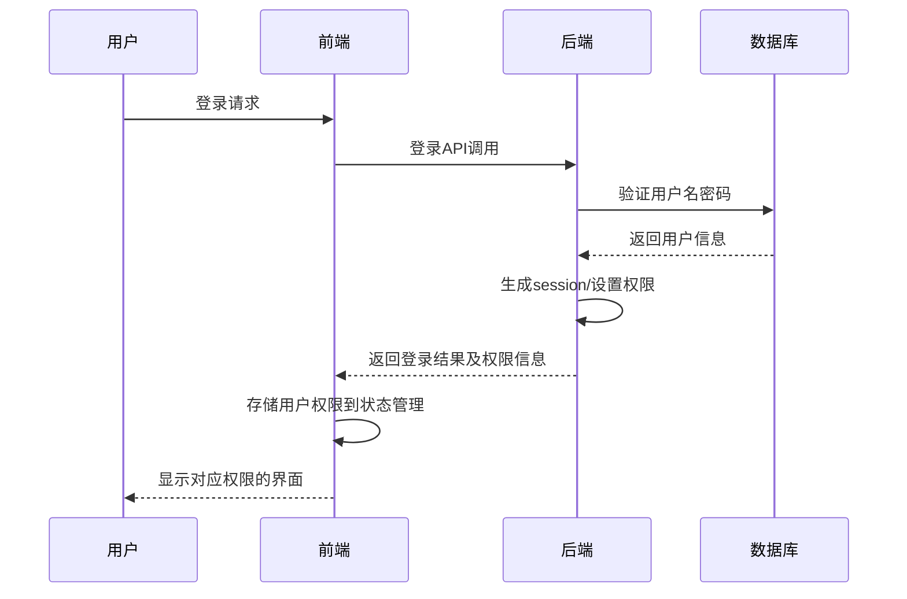
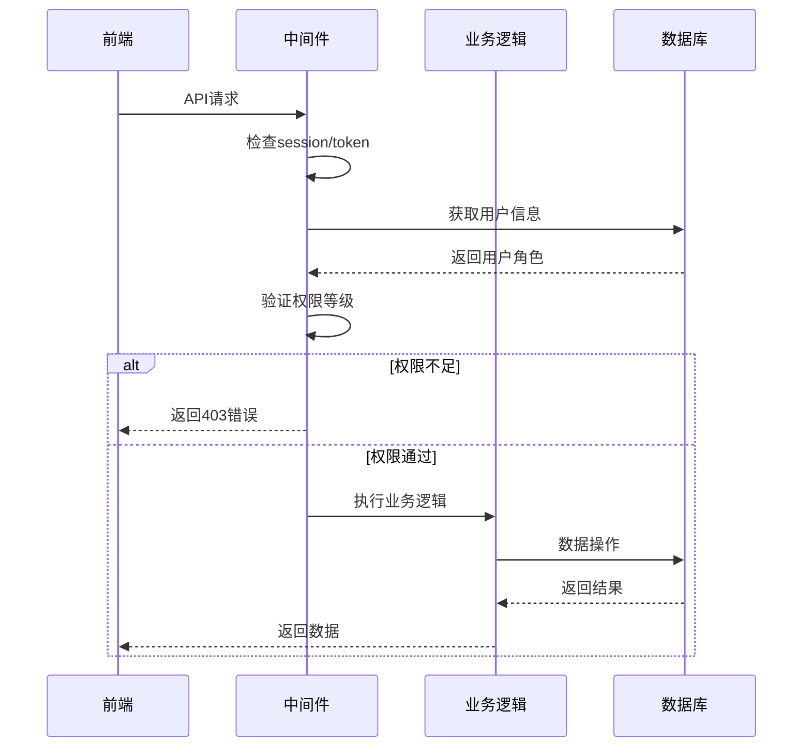
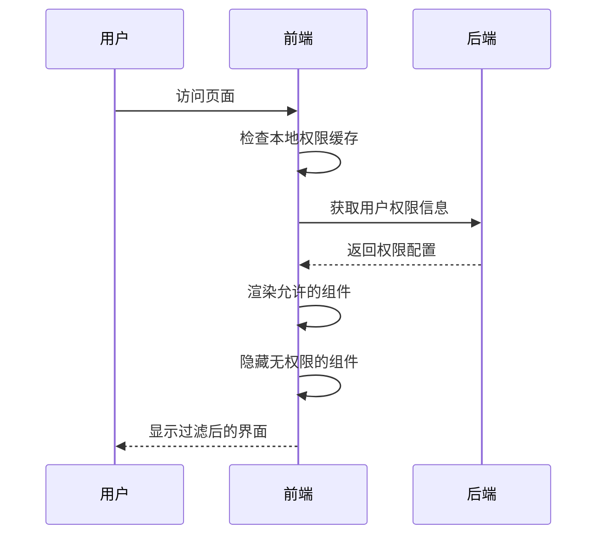

# NewAPI用户权限体系详细方案说明

## 1. 方案概述

### 1.1 权限体系背景
NewAPI系统需要一套完整的用户权限管理体系，支持不同角色的用户访问控制，确保系统安全性和功能隔离。权限体系涵盖用户角色定义、后端权限验证、前端权限控制、侧边栏模块权限等多个层面。

### 1.2 核心目标
- 实现基于角色的访问控制(RBAC)
- 确保后端权限验证的安全性
- 提供灵活的前端权限控制
- 支持用户级别的个性化配置
- 保证系统扩展性和维护性

### 1.3 权限体系架构
```
┌─────────────────┐    ┌─────────────────┐    ┌─────────────────┐
│   前端权限控制   │    │   后端权限验证   │    │   用户角色管理   │
│                 │    │                 │    │                 │
│ - 侧边栏显示    │    │ - API访问控制   │    │ - 角色定义      │
│ - 菜单过滤      │    │ - 数据权限      │    │ - 用户分组      │
│ - 功能隐藏      │    │ - 操作权限      │    │ - 权限分配      │
└─────────────────┘    └─────────────────┘    └─────────────────┘
         │                       │                       │
         └───────────────────────┼───────────────────────┘
                                 │
                    ┌─────────────────┐
                    │   权限数据存储   │
                    │                 │
                    │ - 用户角色信息  │
                    │ - 用户设置配置  │
                    │ - 系统权限配置  │
                    └─────────────────┘
```

## 2. 用户角色体系

### 2.1 角色定义

#### 2.1.1 角色常量定义
```go
// common/constants.go
const (
    RoleGuestUser  = 0  // 访客用户
    RoleCommonUser = 1  // 普通用户
    RoleAdminUser  = 10 // 管理员
    RoleRootUser   = 100 // 超级管理员
)
```

#### 2.1.2 角色权限等级
| 角色ID | 角色名称 | 权限等级 | 说明 |
|--------|----------|----------|------|
| 0 | 访客用户 | 最低 | 只能进行基本操作，无管理权限 |
| 1 | 普通用户 | 基础 | 可以创建令牌、使用API、管理个人设置 |
| 10 | 管理员 | 中等 | 可以管理用户、渠道、模型等，但不能修改系统设置 |
| 100 | 超级管理员 | 最高 | 拥有系统全部权限，包括系统设置、用户管理等 |

### 2.2 角色权限矩阵

#### 2.2.1 功能权限矩阵
| 功能模块 | 访客用户 | 普通用户 | 管理员 | 超级管理员 |
|----------|----------|----------|--------|------------|
| 基本聊天 | ✅ | ✅ | ✅ | ✅ |
| 创建令牌 | ❌ | ✅ | ✅ | ✅ |
| 查看日志 | ❌ | ✅ | ✅ | ✅ |
| 管理用户 | ❌ | ❌ | ✅ | ✅ |
| 管理渠道 | ❌ | ❌ | ✅ | ✅ |
| 管理模型 | ❌ | ❌ | ✅ | ✅ |
| 系统设置 | ❌ | ❌ | ❌ | ✅ |
| 兑换码管理 | ❌ | ❌ | ✅ | ✅ |

#### 2.2.2 数据权限矩阵
| 数据操作 | 访客用户 | 普通用户 | 管理员 | 超级管理员 |
|----------|----------|----------|--------|------------|
| 查看自己数据 | ❌ | ✅ | ✅ | ✅ |
| 查看所有用户数据 | ❌ | ❌ | ✅ | ✅ |
| 修改自己数据 | ❌ | ✅ | ✅ | ✅ |
| 修改其他用户数据 | ❌ | ❌ | ✅ | ✅ |
| 删除用户数据 | ❌ | ❌ | ❌ | ✅ |

## 3. 后端权限验证机制

### 3.1 权限验证中间件

#### 3.1.1 中间件架构
```go
// middleware/auth.go
func authHelper(c *gin.Context, minRole int) {
    // 1. 检查session中的用户信息
    // 2. 验证用户角色是否满足最低权限要求
    // 3. 检查用户状态是否正常
    // 4. 记录权限验证结果
}
```

#### 3.1.2 权限验证函数
```go
// 普通用户权限验证
func UserAuth() gin.HandlerFunc {
    return func(c *gin.Context) {
        authHelper(c, common.RoleCommonUser)
    }
}

// 管理员权限验证
func AdminAuth() gin.HandlerFunc {
    return func(c *gin.Context) {
        authHelper(c, common.RoleAdminUser)
    }
}

// 超级管理员权限验证
func RootAuth() gin.HandlerFunc {
    return func(c *gin.Context) {
        authHelper(c, common.RoleRootUser)
    }
}
```

### 3.2 权限验证逻辑

#### 3.2.1 角色权限比较
```go
// 权限比较逻辑：数字越大权限越高
// RoleRootUser(100) > RoleAdminUser(10) > RoleCommonUser(1) > RoleGuestUser(0)
if myRole <= targetUser.Role && myRole != common.RoleRootUser {
    // 无权限操作其他用户
    return errors.New("无权限操作")
}
```

#### 3.2.2 特殊权限规则
- **超级管理员特权**: 超级管理员可以操作所有用户，包括其他管理员
- **管理员权限**: 管理员可以管理普通用户，但不能管理其他管理员
- **自我管理**: 用户可以管理自己的数据和设置

### 3.3 API权限控制

#### 3.3.1 用户管理API权限
```go
// 获取用户列表 - 需要管理员权限
func GetAllUsers(c *gin.Context) {
    // 验证管理员权限
    // 根据用户角色过滤返回数据
}

// 编辑用户 - 需要相应权限
func UpdateUser(c *gin.Context) {
    // 验证权限：只能修改权限低于等于自己的用户
    // 超级管理员可以修改任何人
}
```

#### 3.3.2 系统设置API权限
```go
// 系统配置修改 - 仅超级管理员
func UpdateSystemConfig(c *gin.Context) {
    // 仅RoleRootUser可以访问
    // 记录操作日志
}
```

## 4. 前端权限控制机制

### 4.1 权限数据获取

#### 4.1.1 用户权限钩子
```javascript
// web/src/hooks/common/useUserPermissions.js
export const useUserPermissions = () => {
    const [permissions, setPermissions] = useState(null);
    const [loading, setLoading] = useState(true);

    // 从后端获取用户权限信息
    const loadPermissions = async () => {
        const res = await API.get('/api/user/self');
        if (res.data.success) {
            const userPermissions = res.data.data.permissions;
            setPermissions(userPermissions);
        }
    };

    // 权限检查函数
    const hasSidebarSettingsPermission = () => {
        return permissions?.sidebar_settings === true;
    };

    const isSidebarSectionAllowed = (sectionKey) => {
        if (!permissions?.sidebar_modules) return true;
        const sectionPerms = permissions.sidebar_modules[sectionKey];
        return sectionPerms !== false;
    };

    return {
        permissions,
        hasSidebarSettingsPermission,
        isSidebarSectionAllowed,
        // ... 其他权限检查函数
    };
};
```

### 4.2 侧边栏权限控制

#### 4.2.1 默认角色配置
```go
// model/user.go - 根据用户角色生成默认边栏配置
func generateDefaultSidebarConfigForRole(userRole int) string {
    defaultConfig := map[string]interface{}{}

    // 聊天区域 - 所有用户都可以访问
    defaultConfig["chat"] = map[string]interface{}{
        "enabled": true,
        "playground": true,
        "chat": true,
    }

    // 控制台区域 - 所有用户都可以访问
    defaultConfig["console"] = map[string]interface{}{
        "enabled": true,
        "detail": true,
        "token": true,
        "log": true,
        "midjourney": true,
        "task": true,
    }

    // 个人中心区域 - 所有用户都可以访问
    defaultConfig["personal"] = map[string]interface{}{
        "enabled": true,
        "topup": true,
        "personal": true,
    }

    // 管理员区域 - 根据角色决定
    if userRole == common.RoleAdminUser {
        // 管理员可以访问管理员区域，但不能访问系统设置
        defaultConfig["admin"] = map[string]interface{}{
            "enabled": true,
            "channel": true,
            "models": true,
            "redemption": true,
            "user": true,
            "setting": false, // 管理员不能访问系统设置
        }
    } else if userRole == common.RoleRootUser {
        // 超级管理员可以访问所有功能
        defaultConfig["admin"] = map[string]interface{}{
            "enabled": true,
            "channel": true,
            "models": true,
            "redemption": true,
            "user": true,
            "setting": true,
        }
    }

    return configString
}
```

#### 4.2.2 用户自定义配置
```javascript
// web/src/hooks/common/useSidebar.js
export const useSidebar = () => {
    // 获取管理员配置（系统级）
    const adminConfig = useMemo(() => {
        if (statusState?.status?.SidebarModulesAdmin) {
            const config = JSON.parse(statusState.status.SidebarModulesAdmin);
            return mergeAdminConfig(config);
        }
        return mergeAdminConfig(null);
    }, [statusState?.status?.SidebarModulesAdmin]);

    // 获取用户配置（用户级）
    const loadUserConfig = async () => {
        try {
            const res = await API.get('/api/user/self');
            if (res.data.success) {
                const userSetting = res.data.data.setting;
                if (userSetting?.SidebarModules) {
                    const config = JSON.parse(userSetting.SidebarModules);
                    setUserConfig(config);
                }
            }
        } catch (error) {
            console.error('加载用户侧边栏配置失败:', error);
        } finally {
            setLoading(false);
        }
    };

    // 合并配置：用户配置优先于管理员配置
    const mergedConfig = useMemo(() => {
        const result = { ...adminConfig };

        if (userConfig) {
            // 深度合并用户配置
            for (const [sectionKey, sectionConfig] of Object.entries(userConfig)) {
                if (!result[sectionKey]) {
                    result[sectionKey] = {};
                }
                result[sectionKey] = { ...result[sectionKey], ...sectionConfig };
            }
        }

        return result;
    }, [adminConfig, userConfig]);

    return {
        config: mergedConfig,
        loading,
        refreshConfig: loadUserConfig,
    };
};
```

### 4.3 组件级别权限控制

#### 4.3.1 权限控制组件
```javascript
// 权限控制的高阶组件
const withPermission = (WrappedComponent, requiredPermission) => {
    return (props) => {
        const { permissions, loading } = useUserPermissions();

        if (loading) {
            return <Spin />;
        }

        if (!hasPermission(permissions, requiredPermission)) {
            return <ForbiddenPage />;
        }

        return <WrappedComponent {...props} />;
    };
};

// 使用示例
const AdminPanel = withPermission(AdminPanelComponent, 'admin.panel');
```

#### 4.3.2 条件渲染
```javascript
const UserManagement = () => {
    const { isSidebarModuleAllowed } = useUserPermissions();

    return (
        <div>
            {isSidebarModuleAllowed('admin', 'user') && (
                <UserList />
            )}
            {isSidebarModuleAllowed('admin', 'setting') && (
                <SystemSettings />
            )}
        </div>
    );
};
```

## 5. 用户设置管理系统

### 5.1 用户设置数据结构

#### 5.1.1 UserSetting结构体
```go
// dto/user_settings.go
type UserSetting struct {
    NotifyType             string  `json:"notify_type,omitempty"`                    // 通知类型
    QuotaWarningThreshold  float64 `json:"quota_warning_threshold,omitempty"`        // 额度预警阈值
    WebhookUrl             string  `json:"webhook_url,omitempty"`                    // Webhook地址
    WebhookSecret          string  `json:"webhook_secret,omitempty"`                 // Webhook密钥
    NotificationEmail      string  `json:"notification_email,omitempty"`             // 通知邮箱
    BarkUrl                string  `json:"bark_url,omitempty"`                       // Bark推送URL
    GotifyUrl              string  `json:"gotify_url,omitempty"`                     // Gotify服务器地址
    GotifyToken            string  `json:"gotify_token,omitempty"`                   // Gotify应用令牌
    GotifyPriority         int     `json:"gotify_priority"`                          // Gotify消息优先级
    AcceptUnsetRatioModel  bool    `json:"accept_unset_model_ratio_model,omitempty"` // 是否接受未设置价格的模型
    RecordIpLog            bool    `json:"record_ip_log,omitempty"`                  // 是否记录IP日志
    SidebarModules         string  `json:"sidebar_modules,omitempty"`                // 侧边栏模块配置
}
```

### 5.2 设置存储机制

#### 5.2.1 设置序列化
```go
// model/user.go
func (user *User) SetSetting(setting dto.UserSetting) {
    settingBytes, err := json.Marshal(setting)
    if err != nil {
        common.SysLog("failed to marshal setting: " + err.Error())
        return
    }
    user.Setting = string(settingBytes)
}

func (user *User) GetSetting() dto.UserSetting {
    setting := dto.UserSetting{}
    if user.Setting != "" {
        err := json.Unmarshal([]byte(user.Setting), &setting)
        if err != nil {
            common.SysLog("failed to unmarshal setting: " + err.Error())
        }
    }
    return setting
}
```

### 5.3 设置管理API

#### 5.3.1 获取用户设置
```go
// controller/user.go
func GetUserSelf(c *gin.Context) {
    userId := c.GetInt("id")
    user, err := model.GetUserById(userId, false)
    if err != nil {
        c.JSON(200, gin.H{
            "success": false,
            "message": err.Error(),
        })
        return
    }

    // 构建权限信息
    permissions := buildUserPermissions(user)

    c.JSON(200, gin.H{
        "success": true,
        "data": gin.H{
            "id": user.Id,
            "username": user.Username,
            "email": user.Email,
            "role": user.Role,
            "status": user.Status,
            "setting": user.GetSetting(),
            "permissions": permissions,
        },
    })
}
```

#### 5.3.2 更新用户设置
```go
func UpdateUserSetting(c *gin.Context) {
    userId := c.GetInt("id")
    var request dto.UserSetting

    if err := c.ShouldBindJSON(&request); err != nil {
        c.JSON(200, gin.H{
            "success": false,
            "message": "无效的请求参数",
        })
        return
    }

    user, err := model.GetUserById(userId, true)
    if err != nil {
        c.JSON(200, gin.H{
            "success": false,
            "message": err.Error(),
        })
        return
    }

    // 验证设置权限
    if err := validateUserSettingPermissions(user, request); err != nil {
        c.JSON(200, gin.H{
            "success": false,
            "message": err.Error(),
        })
        return
    }

    user.SetSetting(request)
    if err := user.Update(false); err != nil {
        c.JSON(200, gin.H{
            "success": false,
            "message": "更新设置失败",
        })
        return
    }

    c.JSON(200, gin.H{
        "success": true,
        "message": "设置更新成功",
    })
}
```

## 6. 权限验证流程

### 6.1 用户登录权限验证



### 6.2 API访问权限验证



### 6.3 页面渲染权限控制



## 7. 安全考虑

### 7.1 权限验证安全

#### 7.1.1 后端安全验证
- **多重验证**: Session验证 + Token验证 + 角色验证
- **权限检查**: 每个敏感操作都有权限检查
- **数据隔离**: 用户只能访问自己权限范围内的数据

#### 7.1.2 前端安全措施
- **权限缓存**: 本地缓存用户权限信息
- **实时验证**: 重要操作前重新验证权限
- **UI隐藏**: 无权限功能在前端隐藏

### 7.2 权限数据保护

#### 7.2.1 数据加密
- 用户敏感设置信息加密存储
- 传输过程中使用HTTPS
- API密钥等敏感信息特殊处理

#### 7.2.2 审计日志
- 记录所有权限变更操作
- 记录敏感数据访问日志
- 提供权限使用统计

### 7.3 权限配置安全

#### 7.3.1 配置验证
- JSON格式验证
- 配置项范围检查
- 权限逻辑一致性验证

#### 7.3.2 配置隔离
- 用户配置与系统配置分离
- 管理员配置与超级管理员配置分离
- 防止越权配置修改

## 8. 权限配置管理

### 8.1 系统级权限配置

#### 8.1.1 管理员侧边栏配置
- **配置位置**: 系统设置 → 运营设置 → 侧边栏模块
- **配置格式**: JSON对象
- **作用**: 定义管理员用户的默认侧边栏配置

#### 8.1.2 权限模板管理
- **配置位置**: 系统设置 → 用户设置 → 权限模板
- **配置格式**: 预定义的权限模板
- **作用**: 为不同类型的用户提供权限模板

### 8.2 用户级权限配置

#### 8.2.1 个人设置页面
- **页面位置**: 个人中心 → 设置
- **功能**: 用户自定义侧边栏显示
- **权限**: 基于用户角色的权限范围

#### 8.2.2 用户权限查看
- **页面位置**: 个人中心 → 权限信息
- **功能**: 显示当前用户的权限详情
- **作用**: 帮助用户了解自己的权限范围

## 9. 扩展性设计

### 9.1 角色扩展

#### 9.1.1 自定义角色
```go
// 支持扩展新的角色定义
const (
    RoleGuestUser   = 0
    RoleCommonUser  = 1
    RoleVIPUser     = 5    // 新增VIP用户角色
    RoleAdminUser   = 10
    RoleSuperAdmin  = 50   // 新增超级管理员
    RoleRootUser    = 100
)
```

#### 9.1.2 角色权限配置
- 支持为新角色配置默认权限
- 支持角色间的权限继承关系
- 支持动态权限调整

### 9.2 权限模块扩展

#### 9.2.1 新功能模块权限
```javascript
// 新增AI绘画模块权限
const newPermissions = {
    sidebar_modules: {
        ai_paint: {
            enabled: true,
            create: true,
            gallery: true,
            settings: false
        }
    }
};
```

#### 9.2.2 细粒度权限控制
- 支持页面级权限控制
- 支持按钮级权限控制
- 支持字段级权限控制

### 9.3 权限策略扩展

#### 9.3.1 时间-based权限
- 支持特定时间段的权限控制
- 支持临时权限授予和回收

#### 9.3.2 条件-based权限
- 支持基于用户状态的权限控制
- 支持基于使用量的权限控制

## 10. 监控和维护

### 10.1 权限使用监控

#### 10.1.1 权限访问日志
- 记录所有权限验证操作
- 统计权限使用频率
- 监控异常权限访问

#### 10.1.2 权限配置变更日志
- 记录系统权限配置变更
- 记录用户权限配置变更
- 提供配置回滚功能

### 10.2 权限系统维护

#### 10.2.1 权限数据备份
- 定期备份用户权限配置
- 备份系统权限配置
- 提供权限数据恢复功能

#### 10.2.2 权限一致性检查
- 检查用户权限配置的一致性
- 验证角色权限定义的完整性
- 自动修复权限配置错误

## 11. 总结

NewAPI的用户权限体系采用了分层设计，确保了系统的安全性和灵活性：

### 核心特点

1. **基于角色的访问控制**: 通过角色等级实现权限管理
2. **前后端双重验证**: 确保权限控制的安全性
3. **灵活的配置系统**: 支持系统级和用户级的权限配置
4. **细粒度的权限控制**: 支持模块级、功能级、数据级的权限控制
5. **可扩展的架构**: 支持新角色、新权限模块的扩展

### 权限体系优势

- **安全性**: 后端严格验证，前端权限过滤
- **用户体验**: 无权限功能自动隐藏，界面简洁
- **管理便捷**: 支持批量权限配置和模板管理
- **审计完整**: 全面的权限操作日志记录
- **扩展灵活**: 支持新功能模块的权限集成

该权限体系为NewAPI系统提供了完整、可靠、安全的用户权限管理解决方案。