# NewAPI计量计费系统详细方案说明

## 1. 总体架构概览

### 1.1 计费系统架构

NewAPI的计量计费系统采用了多层次的架构设计，确保精确计量和灵活计费：

```
┌─────────────────┐    ┌─────────────────┐    ┌─────────────────┐
│   请求拦截层    │    │   计量计算层    │    │   扣费执行层    │
│                 │    │                 │    │                 │
│ - Token统计     │    │ - 倍率计算      │    │ - 配额扣除      │
│ - 用量记录      │    │ - 价格换算      │    │ - 账单生成      │
│ - 预消费检查    │    │ - 优惠应用      │    │ - 余额更新      │
└─────────────────┘    └─────────────────┘    └─────────────────┘
         │                       │                       │
         └───────────────────────┼───────────────────────┘
                                 │
                    ┌─────────────────┐
                    │   数据持久层    │
                    │                 │
                    │ - 用户配额      │
                    │ - 计费配置      │
                    │ - 使用日志      │
                    └─────────────────┘
```

### 1.2 核心计费时序图

#### 1.2.1 完整计费时序流程

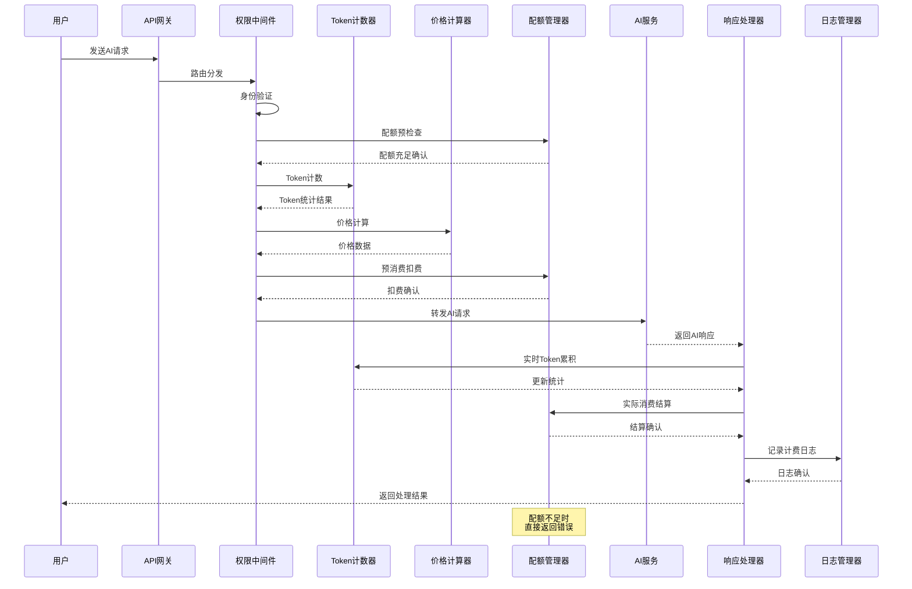
```mermaid
sequenceDiagram
    participant U as 用户
    participant GW as API网关
    participant AM as 权限中间件
    participant TC as Token计数器
    participant PC as 价格计算器
    participant QM as 配额管理器
    participant AI as AI服务
    participant RM as 响应处理器
    participant LM as 日志管理器

    U->>GW: 发送AI请求
    GW->>AM: 路由分发
    AM->>AM: 身份验证
    AM->>QM: 配额预检查
    QM-->>AM: 配额充足确认

    AM->>TC: Token计数
    TC-->>AM: Token统计结果

    AM->>PC: 价格计算
    PC-->>AM: 价格数据

    AM->>QM: 预消费扣费
    QM-->>AM: 扣费确认

    AM->>AI: 转发AI请求
    AI-->>RM: 返回AI响应

    RM->>TC: 实时Token累积
    TC-->>RM: 更新统计

    RM->>QM: 实际消费结算
    QM-->>RM: 结算确认

    RM->>LM: 记录计费日志
    LM-->>RM: 日志确认

    RM-->>U: 返回处理结果

    Note over QM: 配额不足时<br/>直接返回错误
```

#### 1.2.2 Token计数时序

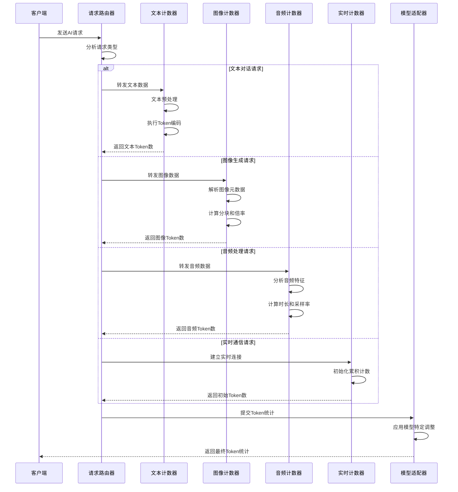
```mermaid
sequenceDiagram
    participant Client as 客户端
    participant Router as 请求路由器
    participant TextCounter as 文本计数器
    participant ImageCounter as 图像计数器
    participant AudioCounter as 音频计数器
    participant RealtimeCounter as 实时计数器
    participant ModelAdapter as 模型适配器

    Client->>Router: 发送AI请求
    Router->>Router: 分析请求类型

    alt 文本对话请求
        Router->>TextCounter: 转发文本数据
        TextCounter->>TextCounter: 文本预处理
        TextCounter->>TextCounter: 执行Token编码
        TextCounter-->>Router: 返回文本Token数
    else 图像生成请求
        Router->>ImageCounter: 转发图像数据
        ImageCounter->>ImageCounter: 解析图像元数据
        ImageCounter->>ImageCounter: 计算分块和倍率
        ImageCounter-->>Router: 返回图像Token数
    else 音频处理请求
        Router->>AudioCounter: 转发音频数据
        AudioCounter->>AudioCounter: 分析音频特征
        AudioCounter->>AudioCounter: 计算时长和采样率
        AudioCounter-->>Router: 返回音频Token数
    else 实时通信请求
        Router->>RealtimeCounter: 建立实时连接
        RealtimeCounter->>RealtimeCounter: 初始化累积计数
        RealtimeCounter-->>Router: 返回初始Token数
    end

    Router->>ModelAdapter: 提交Token统计
    ModelAdapter->>ModelAdapter: 应用模型特定调整
    ModelAdapter-->>Client: 返回最终Token统计
```

#### 1.2.3 配额扣费时序

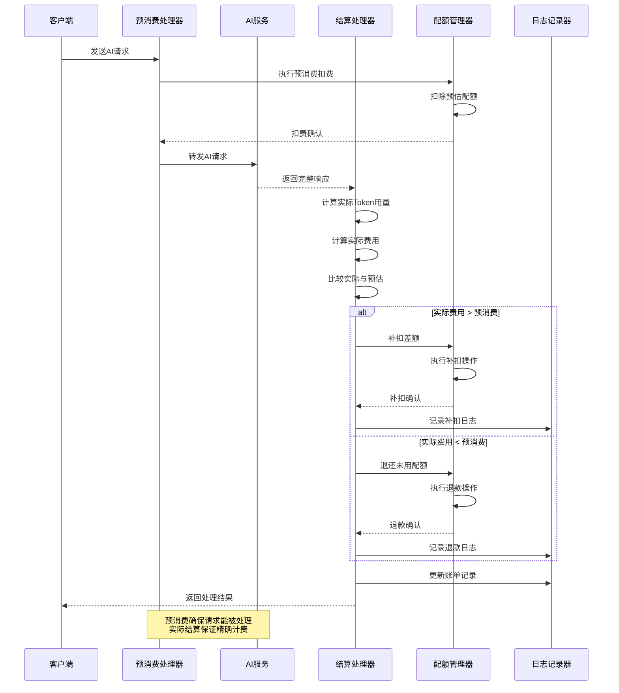
```mermaid
sequenceDiagram
    participant Client as 客户端
    participant PreProcessor as 预消费处理器
    participant AI as AI服务
    participant PostProcessor as 结算处理器
    participant QuotaManager as 配额管理器
    participant Logger as 日志记录器

    Client->>PreProcessor: 发送AI请求
    PreProcessor->>QuotaManager: 执行预消费扣费
    QuotaManager->>QuotaManager: 扣除预估配额
    QuotaManager-->>PreProcessor: 扣费确认

    PreProcessor->>AI: 转发AI请求
    AI-->>PostProcessor: 返回完整响应

    PostProcessor->>PostProcessor: 计算实际Token用量
    PostProcessor->>PostProcessor: 计算实际费用
    PostProcessor->>PostProcessor: 比较实际与预估

    alt 实际费用 > 预消费
        PostProcessor->>QuotaManager: 补扣差额
        QuotaManager->>QuotaManager: 执行补扣操作
        QuotaManager-->>PostProcessor: 补扣确认
        PostProcessor->>Logger: 记录补扣日志
    else 实际费用 < 预消费
        PostProcessor->>QuotaManager: 退还未用配额
        QuotaManager->>QuotaManager: 执行退款操作
        QuotaManager-->>PostProcessor: 退款确认
        PostProcessor->>Logger: 记录退款日志
    end

    PostProcessor->>Logger: 更新账单记录
    PostProcessor-->>Client: 返回处理结果

    Note over PreProcessor,AI: 预消费确保请求能被处理<br/>实际结算保证精确计费
```

### 1.2 核心计费概念

#### 1.2.1 配额 (Quota)
- **定义**: 用户可使用的额度单位
- **单位**: 整数，1配额 ≈ 0.002美元
- **换算**: 1美元 ≈ 500配额
- **用途**: 统一不同模型的计费标准

#### 1.2.2 倍率 (Ratio)
- **模型倍率**: 不同模型的相对价格倍数
- **分组倍率**: 用户组的优惠倍率
- **完成倍率**: 输出token的倍率系数
- **缓存倍率**: 缓存token的优惠倍率

#### 1.2.3 Token计数
- **输入Token**: 用户发送的文本token数
- **输出Token**: AI生成的文本token数
- **缓存Token**: 可复用的缓存token数
- **音频Token**: 音频处理的token等价数

## 2. 数据产生机制

### 2.1 Token计数统计详解

#### 2.1.1 文本Token计数时序

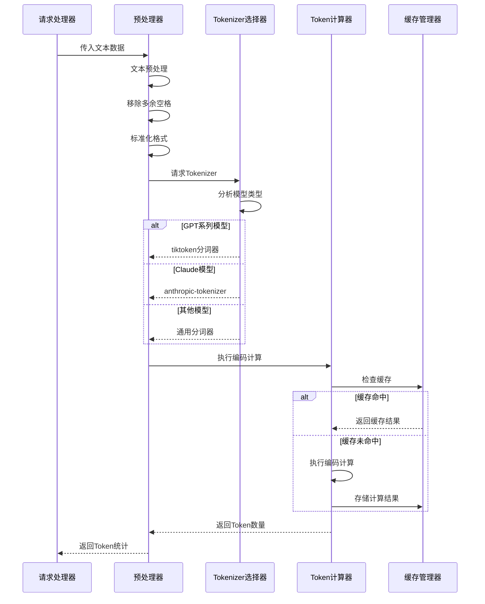
```mermaid
sequenceDiagram
    participant Req as 请求处理器
    participant PP as 预处理器
    participant TS as Tokenizer选择器
    participant TT as Token计算器
    participant Cache as 缓存管理器

    Req->>PP: 传入文本数据
    PP->>PP: 文本预处理
    PP->>PP: 移除多余空格
    PP->>PP: 标准化格式

    PP->>TS: 请求Tokenizer
    TS->>TS: 分析模型类型
    alt GPT系列模型
        TS-->>PP: tiktoken分词器
    else Claude模型
        TS-->>PP: anthropic-tokenizer
    else 其他模型
        TS-->>PP: 通用分词器
    end

    PP->>TT: 执行编码计算
    TT->>Cache: 检查缓存
    alt 缓存命中
        Cache-->>TT: 返回缓存结果
    else 缓存未命中
        TT->>TT: 执行编码计算
        TT->>Cache: 存储计算结果
    end
    TT-->>PP: 返回Token数量
    PP-->>Req: 返回Token统计
```

**核心实现代码**:
```go
// service/token_counter.go
func CountTextTokens(text string, model string) int {
    // 1. 文本预处理：移除多余空格、标准化格式
    cleanedText := preprocessText(text)

    // 2. 根据模型选择合适的tokenizer
    tokenizer := selectTokenizer(model)

    // 3. 计算token数量
    tokens := tokenizer.Encode(cleanedText)

    // 4. 返回token数
    return len(tokens)
}
```

**计数逻辑详解**:
1. **文本预处理**: 移除多余空格、标准化格式、处理特殊字符
2. **模型适配**: GPT系列使用tiktoken，Claude使用anthropic-tokenizer
3. **编码计算**: 将文本转换为token序列
4. **长度统计**: 计算编码后的token数量

#### 2.1.2 图像Token计数时序

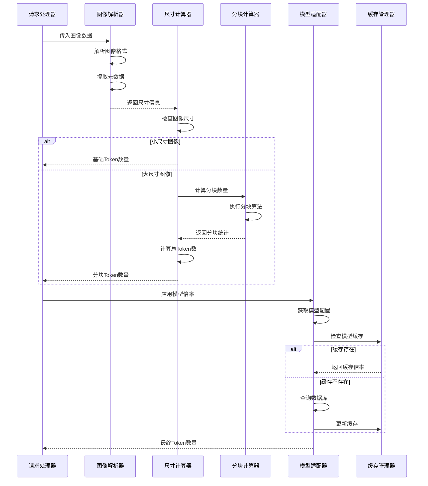
```mermaid
sequenceDiagram
    participant Req as 请求处理器
    participant IM as 图像解析器
    participant SC as 尺寸计算器
    participant TC as 分块计算器
    participant MC as 模型适配器
    participant Cache as 缓存管理器

    Req->>IM: 传入图像数据
    IM->>IM: 解析图像格式
    IM->>IM: 提取元数据
    IM-->>SC: 返回尺寸信息

    SC->>SC: 检查图像尺寸
    alt 小尺寸图像
        SC-->>Req: 基础Token数量
    else 大尺寸图像
        SC->>TC: 计算分块数量
        TC->>TC: 执行分块算法
        TC-->>SC: 返回分块统计
        SC->>SC: 计算总Token数
        SC-->>Req: 分块Token数量
    end

    Req->>MC: 应用模型倍率
    MC->>MC: 获取模型配置
    MC->>Cache: 检查模型缓存
    alt 缓存存在
        Cache-->>MC: 返回缓存倍率
    else 缓存不存在
        MC->>MC: 查询数据库
        MC->>Cache: 更新缓存
    end
    MC-->>Req: 最终Token数量
```

**核心实现代码**:
```go
// service/token_counter.go - getImageToken函数
func getImageToken(fileMeta *types.FileMeta, model string, stream bool) (int, error) {
    // 1. 获取模型的基础token配置
    baseTokens, tileTokens := getModelImageConfig(model)

    // 2. 计算图像分块数
    tiles := calculateImageTiles(fileMeta.Width, fileMeta.Height)

    // 3. 计算总token数
    totalTokens := baseTokens + (tiles * tileTokens)

    // 4. 应用模型特定调整
    if model == "gpt-4o-mini" {
        totalTokens = adjustForMiniModel(totalTokens)
    }

    return totalTokens, nil
}
```

**图像Token计算规则详解**:
- **基础费用**: 85个token作为基础费用
- **尺寸分级**: 根据图像尺寸计算需要多少个512x512的块
- **分块处理**: 每个额外分块增加170个token
- **模型差异**: 不同模型有不同的基础token数和分块token数

#### 2.1.3 音频Token计数时序

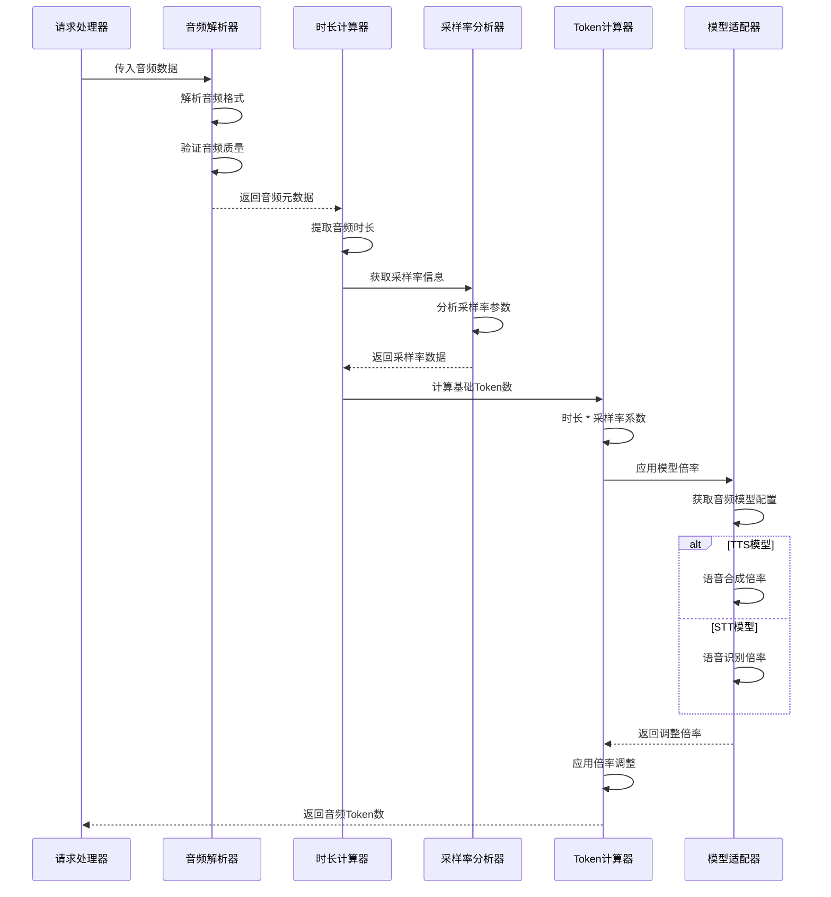
```mermaid
sequenceDiagram
    participant Req as 请求处理器
    participant AP as 音频解析器
    participant DC as 时长计算器
    participant SC as 采样率分析器
    participant TC as Token计算器
    participant MC as 模型适配器

    Req->>AP: 传入音频数据
    AP->>AP: 解析音频格式
    AP->>AP: 验证音频质量
    AP-->>DC: 返回音频元数据

    DC->>DC: 提取音频时长
    DC->>SC: 获取采样率信息
    SC->>SC: 分析采样率参数
    SC-->>DC: 返回采样率数据

    DC->>TC: 计算基础Token数
    TC->>TC: 时长 * 采样率系数
    TC->>MC: 应用模型倍率
    MC->>MC: 获取音频模型配置
    alt TTS模型
        MC->>MC: 语音合成倍率
    else STT模型
        MC->>MC: 语音识别倍率
    end
    MC-->>TC: 返回调整倍率

    TC->>TC: 应用倍率调整
    TC-->>Req: 返回音频Token数
```

**音频Token计算规则**:
- **时长计算**: 按秒计算音频时长
- **采样率影响**: 不同采样率影响token密度
- **模型差异**: 语音合成和语音识别有不同的计费标准
- **实时通信**: WebSocket连接的音频流实时累积

### 2.2 数据收集与处理流程

#### 2.2.1 请求级数据收集时序

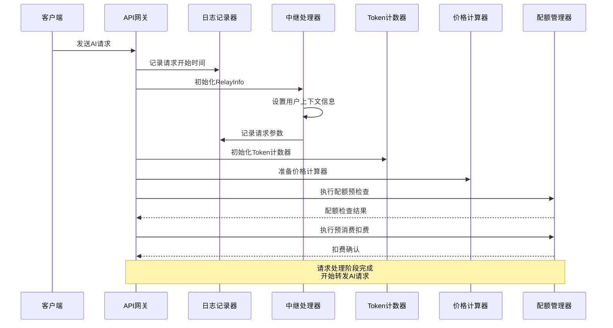
```mermaid
sequenceDiagram
    participant Client as 客户端
    participant GW as API网关
    participant Logger as 日志记录器
    participant Relay as 中继处理器
    participant TC as Token计数器
    participant PC as 价格计算器
    participant QM as 配额管理器

    Client->>GW: 发送AI请求
    GW->>Logger: 记录请求开始时间
    GW->>Relay: 初始化RelayInfo
    Relay->>Relay: 设置用户上下文信息
    Relay->>Logger: 记录请求参数

    GW->>TC: 初始化Token计数器
    GW->>PC: 准备价格计算器
    GW->>QM: 执行配额预检查
    QM-->>GW: 配额检查结果

    GW->>QM: 执行预消费扣费
    QM-->>GW: 扣费确认

    Note over GW,QM: 请求处理阶段完成<br/>开始转发AI请求
```

#### 2.2.2 实时数据流转时序

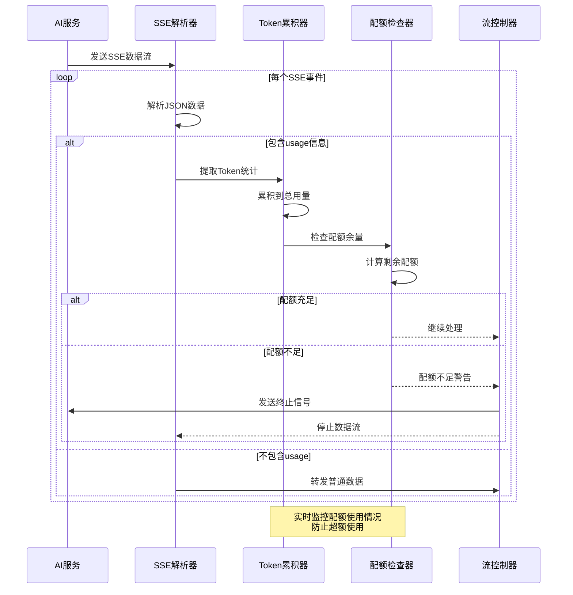
```mermaid
sequenceDiagram
    participant AI as AI服务
    participant Parser as SSE解析器
    participant Accum as Token累积器
    participant Checker as 配额检查器
    participant Controller as 流控制器

    AI->>Parser: 发送SSE数据流
    loop 每个SSE事件
        Parser->>Parser: 解析JSON数据
        alt 包含usage信息
            Parser->>Accum: 提取Token统计
            Accum->>Accum: 累积到总用量
            Accum->>Checker: 检查配额余量
            Checker->>Checker: 计算剩余配额
            alt 配额充足
                Checker-->>Controller: 继续处理
            else 配额不足
                Checker-->>Controller: 配额不足警告
                Controller->>AI: 发送终止信号
                Controller-->>Parser: 停止数据流
            end
        else 不包含usage
            Parser->>Controller: 转发普通数据
        end
    end

    Note over Accum,Checker: 实时监控配额使用情况<br/>防止超额使用
```

### 2.2 用量记录流程

#### 2.2.1 请求开始记录
```go
// relay/common/relay_info.go - GenRelayInfo
func GenRelayInfoXXX(c *gin.Context, request dto.Request) *RelayInfo {
    info := &RelayInfo{
        StartTime: time.Now(), // 记录请求开始时间
        UserId: common.GetContextKeyInt(c, constant.ContextKeyUserId),
        TokenId: common.GetContextKeyInt(c, constant.ContextKeyTokenId),
        // ... 其他信息
    }
    return info
}
```

#### 2.2.2 实时Token统计
```go
// relay/helper/stream_scanner.go
type StreamScanner struct {
    // 流式响应扫描器
}

func (s *StreamScanner) Scan() bool {
    // 1. 逐行扫描流式响应
    // 2. 解析JSON数据
    // 3. 提取usage信息
    // 4. 累积token计数
    return hasMoreData
}
```

#### 2.2.3 用量数据收集
```go
type UsageData struct {
    PromptTokens     int     // 输入token数
    CompletionTokens int     // 输出token数
    TotalTokens      int     // 总token数
    InputAudioTokens int     // 输入音频token数
    CachedTokens     int     // 缓存token数
    ReasoningTokens  int     // 推理token数
    Cost             float64 // 实际成本
}
```

## 3. 计费计算逻辑详解

### 3.1 价格计算架构

#### 3.1.1 价格数据结构详解

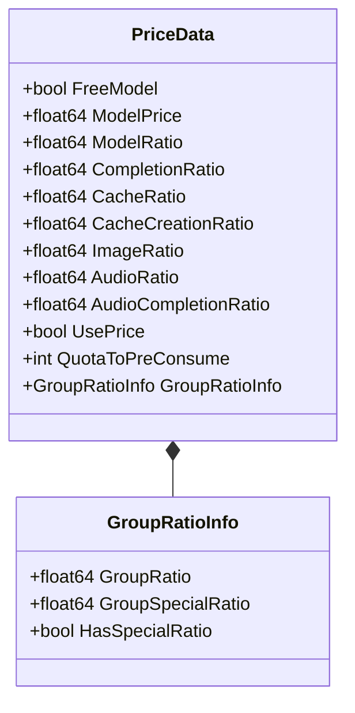
```mermaid
classDiagram
    class PriceData {
        +bool FreeModel
        +float64 ModelPrice
        +float64 ModelRatio
        +float64 CompletionRatio
        +float64 CacheRatio
        +float64 CacheCreationRatio
        +float64 ImageRatio
        +float64 AudioRatio
        +float64 AudioCompletionRatio
        +bool UsePrice
        +int QuotaToPreConsume
        +GroupRatioInfo GroupRatioInfo
    }

    class GroupRatioInfo {
        +float64 GroupRatio
        +float64 GroupSpecialRatio
        +bool HasSpecialRatio
    }

    PriceData *-- GroupRatioInfo
```

**PriceData结构体详细说明**:
```go
// types/price_data.go
type PriceData struct {
    FreeModel            bool            // 是否免费模型（0价格/倍率）
    ModelPrice           float64         // 模型价格（美元），用于价格模式
    ModelRatio           float64         // 模型倍率，用于倍率模式
    CompletionRatio      float64         // 完成倍率（输出token倍率）
    CacheRatio           float64         // 缓存读取倍率（通常<1.0）
    CacheCreationRatio   float64         // 缓存创建倍率（通常>1.0）
    ImageRatio           float64         // 图像处理倍率
    AudioRatio           float64         // 音频输入倍率
    AudioCompletionRatio float64         // 音频输出倍率
    UsePrice             bool            // 是否使用价格模式而非倍率模式
    QuotaToPreConsume    int             // 预消耗配额数量
    GroupRatioInfo       GroupRatioInfo  // 分组倍率信息
}
```

#### 3.1.2 价格计算时序图

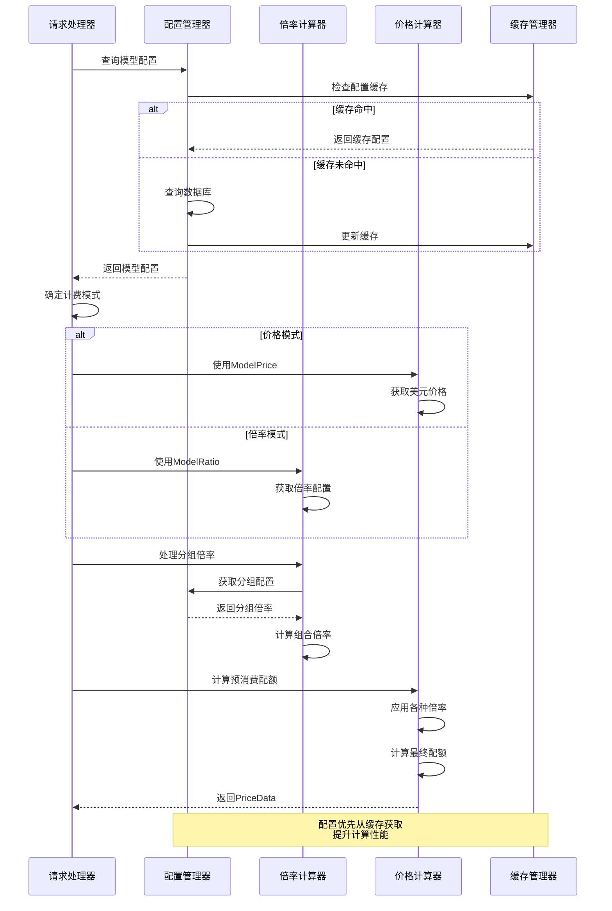
```mermaid
sequenceDiagram
    participant Req as 请求处理器
    participant Config as 配置管理器
    participant Ratio as 倍率计算器
    participant Price as 价格计算器
    participant Cache as 缓存管理器

    Req->>Config: 查询模型配置
    Config->>Cache: 检查配置缓存
    alt 缓存命中
        Cache-->>Config: 返回缓存配置
    else 缓存未命中
        Config->>Config: 查询数据库
        Config->>Cache: 更新缓存
    end
    Config-->>Req: 返回模型配置

    Req->>Req: 确定计费模式
    alt 价格模式
        Req->>Price: 使用ModelPrice
        Price->>Price: 获取美元价格
    else 倍率模式
        Req->>Ratio: 使用ModelRatio
        Ratio->>Ratio: 获取倍率配置
    end

    Req->>Ratio: 处理分组倍率
    Ratio->>Config: 获取分组配置
    Config-->>Ratio: 返回分组倍率
    Ratio->>Ratio: 计算组合倍率

    Req->>Price: 计算预消费配额
    Price->>Price: 应用各种倍率
    Price->>Price: 计算最终配额
    Price-->>Req: 返回PriceData

    Note over Config,Cache: 配置优先从缓存获取<br/>提升计算性能
```

#### 3.1.3 核心计算逻辑实现

**价格计算器主流程**:
```go
// relay/helper/price.go - ModelPriceHelper
func ModelPriceHelper(c *gin.Context, info *relaycommon.RelayInfo, promptTokens int, meta *types.TokenCountMeta) (types.PriceData, error) {

    // 步骤1: 获取模型的基础价格或倍率配置
    modelPrice, usePrice := ratio_setting.GetModelPrice(info.OriginModelName, false)

    // 步骤2: 处理用户分组倍率（支持特殊倍率）
    groupRatioInfo := HandleGroupRatio(c, info)

    // 步骤3: 获取各种倍率配置
    modelRatio, _ := ratio_setting.GetModelRatio(info.OriginModelName)
    completionRatio := ratio_setting.GetCompletionRatio(info.OriginModelName)
    cacheRatio, _ := ratio_setting.GetCacheRatio(info.OriginModelName)
    cacheCreationRatio, _ := ratio_setting.GetCreateCacheRatio(info.OriginModelName)

    // 步骤4: 计算预消耗配额
    if usePrice {
        // 价格模式：直接按价格计算
        preConsumedQuota := int(modelPrice * common.QuotaPerUnit * groupRatioInfo.GroupRatio)
    } else {
        // 倍率模式：按token数量和倍率计算
        ratio := modelRatio * groupRatioInfo.GroupRatio
        preConsumedTokens := max(promptTokens, common.PreConsumedQuota)
        preConsumedQuota := int(float64(preConsumedTokens) * ratio)
    }

    // 步骤5: 构建完整的价格数据
    priceData := types.PriceData{
        ModelPrice: modelPrice,
        ModelRatio: modelRatio,
        CompletionRatio: completionRatio,
        GroupRatioInfo: groupRatioInfo,
        UsePrice: usePrice,
        QuotaToPreConsume: preConsumedQuota,
        // ... 其他字段
    }

    return priceData, nil
}
```

### 3.2 计费模式详解

#### 3.2.1 倍率模式 (Ratio Mode) - 核心计费模式

**适用场景**: 大多数文本对话模型（如GPT、Claude、Gemini等）

**计算时序图**:
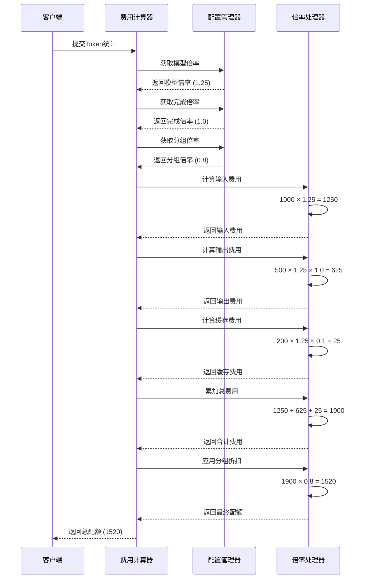
```mermaid
sequenceDiagram
    participant Client as 客户端
    participant Calculator as 费用计算器
    participant Config as 配置管理器
    participant Processor as 倍率处理器

    Client->>Calculator: 提交Token统计
    Calculator->>Config: 获取模型倍率
    Config-->>Calculator: 返回模型倍率 (1.25)

    Calculator->>Config: 获取完成倍率
    Config-->>Calculator: 返回完成倍率 (1.0)

    Calculator->>Config: 获取分组倍率
    Config-->>Calculator: 返回分组倍率 (0.8)

    Calculator->>Processor: 计算输入费用
    Processor->>Processor: 1000 × 1.25 = 1250
    Processor-->>Calculator: 返回输入费用

    Calculator->>Processor: 计算输出费用
    Processor->>Processor: 500 × 1.25 × 1.0 = 625
    Processor-->>Calculator: 返回输出费用

    Calculator->>Processor: 计算缓存费用
    Processor->>Processor: 200 × 1.25 × 0.1 = 25
    Processor-->>Calculator: 返回缓存费用

    Calculator->>Processor: 累加总费用
    Processor->>Processor: 1250 + 625 + 25 = 1900
    Processor-->>Calculator: 返回合计费用

    Calculator->>Processor: 应用分组折扣
    Processor->>Processor: 1900 × 0.8 = 1520
    Processor-->>Calculator: 返回最终配额

    Calculator-->>Client: 返回总配额 (1520)
```

**详细计算公式**:
```
总配额 = [(输入Token数 × 模型倍率) + (输出Token数 × 模型倍率 × 完成倍率) + (缓存Token数 × 模型倍率 × 缓存倍率)] × 分组倍率
```

**逐步计算示例**:
```yaml
# 示例参数
模型: GPT-4o
模型倍率: 1.25
完成倍率: 1.0
用户分组: VIP
分组倍率: 0.8

# Token统计
输入Token: 1000
输出Token: 500
缓存Token: 200

# 详细计算过程
步骤1 - 输入费用: 1000 × 1.25 = 1250
步骤2 - 输出费用: 500 × 1.25 × 1.0 = 625
步骤3 - 缓存费用: 200 × 1.25 × 0.1 = 25  (假设缓存倍率为0.1)
步骤4 - 费用合计: 1250 + 625 + 25 = 1900
步骤5 - 分组折扣: 1900 × 0.8 = 1520

最终配额: 1520
```

#### 3.2.2 价格模式 (Price Mode) - 按次计费

**适用场景**: 图像生成、异步任务、固定价格的服务

**计算时序图**:
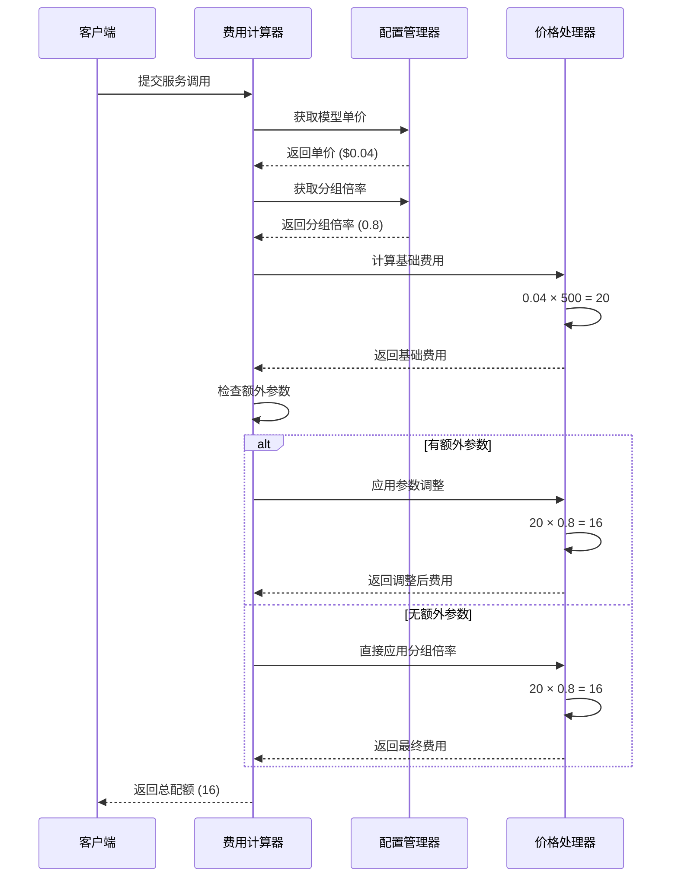
```mermaid
sequenceDiagram
    participant Client as 客户端
    participant Calculator as 费用计算器
    participant Config as 配置管理器
    participant Processor as 价格处理器

    Client->>Calculator: 提交服务调用
    Calculator->>Config: 获取模型单价
    Config-->>Calculator: 返回单价 ($0.04)

    Calculator->>Config: 获取分组倍率
    Config-->>Calculator: 返回分组倍率 (0.8)

    Calculator->>Processor: 计算基础费用
    Processor->>Processor: 0.04 × 500 = 20
    Processor-->>Calculator: 返回基础费用

    Calculator->>Calculator: 检查额外参数
    alt 有额外参数
        Calculator->>Processor: 应用参数调整
        Processor->>Processor: 20 × 0.8 = 16
        Processor-->>Calculator: 返回调整后费用
    else 无额外参数
        Calculator->>Processor: 直接应用分组倍率
        Processor->>Processor: 20 × 0.8 = 16
        Processor-->>Calculator: 返回最终费用
    end

    Calculator-->>Client: 返回总配额 (16)
```

**详细计算公式**:
```
总配额 = 模型单价(美元) × 配额汇率(500) × 分组倍率 × 参数倍率
```

**逐步计算示例**:
```yaml
# 示例参数
服务: DALL-E 3 图像生成
模型单价: $0.04/张
配额汇率: 500 (1美元 = 500配额)
用户分组: VIP
分组倍率: 0.8
图像尺寸: 1024x1024 (标准尺寸，无额外倍率)

# 详细计算过程
步骤1 - 基础费用: 0.04 × 500 = 20
步骤2 - 分组折扣: 20 × 0.8 = 16
步骤3 - 参数调整: 16 × 1.0 = 16 (无额外调整)

最终配额: 16
```

#### 3.2.3 音频计费模式 - 多模态计费

**适用场景**: 语音合成、语音识别、实时音频处理

**计算时序图**:
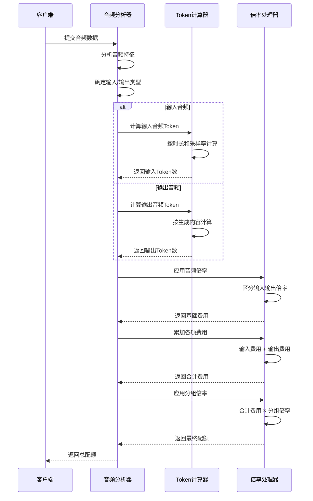
```mermaid
sequenceDiagram
    participant Client as 客户端
    participant Analyzer as 音频分析器
    participant Calculator as Token计算器
    participant Processor as 倍率处理器

    Client->>Analyzer: 提交音频数据
    Analyzer->>Analyzer: 分析音频特征
    Analyzer->>Analyzer: 确定输入/输出类型

    alt 输入音频
        Analyzer->>Calculator: 计算输入音频Token
        Calculator->>Calculator: 按时长和采样率计算
        Calculator-->>Analyzer: 返回输入Token数
    else 输出音频
        Analyzer->>Calculator: 计算输出音频Token
        Calculator->>Calculator: 按生成内容计算
        Calculator-->>Analyzer: 返回输出Token数
    end

    Analyzer->>Processor: 应用音频倍率
    Processor->>Processor: 区分输入输出倍率
    Processor-->>Analyzer: 返回基础费用

    Analyzer->>Processor: 累加各项费用
    Processor->>Processor: 输入费用 + 输出费用
    Processor-->>Analyzer: 返回合计费用

    Analyzer->>Processor: 应用分组倍率
    Processor->>Processor: 合计费用 × 分组倍率
    Processor-->>Analyzer: 返回最终配额

    Analyzer-->>Client: 返回总配额
```

**详细计算公式**:
```
总配额 = [(输入音频Token × 音频倍率) + (输出音频Token × 音频倍率 × 音频完成倍率)] × 分组倍率
```

**音频Token计算规则**:
- **时长基础**: 按音频时长计算基础token
- **采样率影响**: 更高采样率通常需要更多token
- **格式差异**: 不同音频格式有不同的处理效率
- **模型差异**: TTS和STT有不同的计费标准

### 3.3 特殊计费场景处理

#### 3.3.1 缓存Token优惠机制

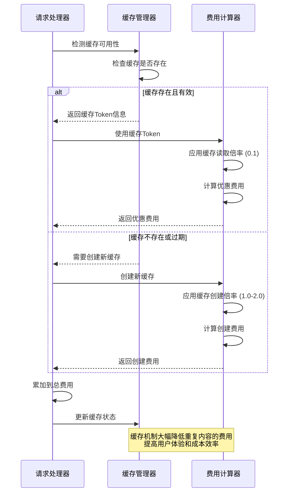
```mermaid
sequenceDiagram
    participant Request as 请求处理器
    participant Cache as 缓存管理器
    participant Calculator as 费用计算器

    Request->>Cache: 检测缓存可用性
    Cache->>Cache: 检查缓存是否存在

    alt 缓存存在且有效
        Cache-->>Request: 返回缓存Token信息
        Request->>Calculator: 使用缓存Token
        Calculator->>Calculator: 应用缓存读取倍率 (0.1)
        Calculator->>Calculator: 计算优惠费用
        Calculator-->>Request: 返回优惠费用
    else 缓存不存在或过期
        Cache-->>Request: 需要创建新缓存
        Request->>Calculator: 创建新缓存
        Calculator->>Calculator: 应用缓存创建倍率 (1.0-2.0)
        Calculator->>Calculator: 计算创建费用
        Calculator-->>Request: 返回创建费用
    end

    Request->>Request: 累加到总费用
    Request->>Cache: 更新缓存状态

    Note over Cache,Calculator: 缓存机制大幅降低重复内容的费用<br/>提高用户体验和成本效率
```

**缓存倍率说明**:
- **缓存读取**: 通常0.1-0.5倍率，大幅降低费用
- **缓存创建**: 通常1.0-2.0倍率，可能有额外费用
- **缓存时效**: 不同平台有不同的缓存过期时间

#### 3.3.2 预消费与实际结算机制

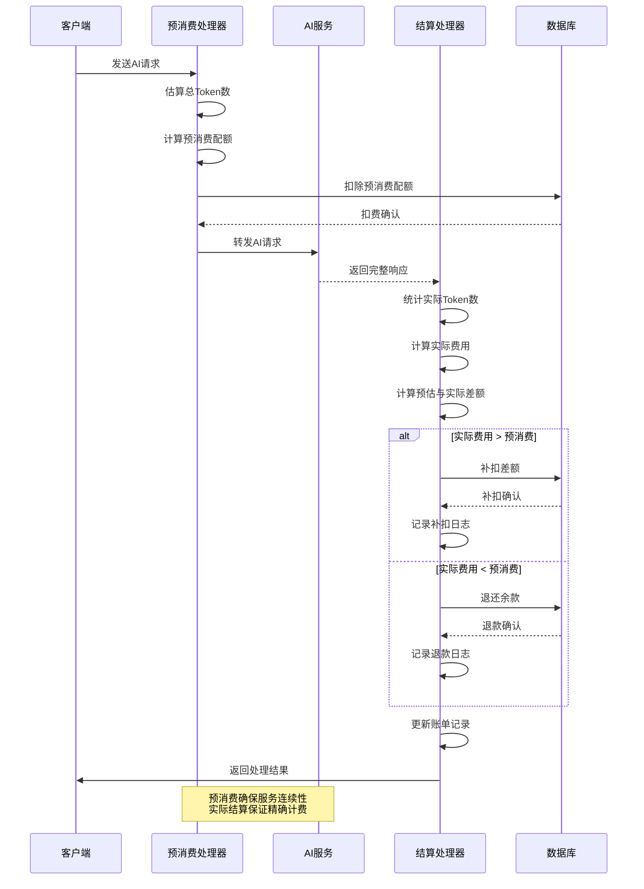
```mermaid
sequenceDiagram
    participant Client as 客户端
    participant PreConsume as 预消费处理器
    participant AI as AI服务
    participant PostConsume as 结算处理器
    participant DB as 数据库

    Client->>PreConsume: 发送AI请求
    PreConsume->>PreConsume: 估算总Token数
    PreConsume->>PreConsume: 计算预消费配额
    PreConsume->>DB: 扣除预消费配额
    DB-->>PreConsume: 扣费确认

    PreConsume->>AI: 转发AI请求
    AI-->>PostConsume: 返回完整响应

    PostConsume->>PostConsume: 统计实际Token数
    PostConsume->>PostConsume: 计算实际费用
    PostConsume->>PostConsume: 计算预估与实际差额

    alt 实际费用 > 预消费
        PostConsume->>DB: 补扣差额
        DB-->>PostConsume: 补扣确认
        PostConsume->>PostConsume: 记录补扣日志
    else 实际费用 < 预消费
        PostConsume->>DB: 退还余款
        DB-->>PostConsume: 退款确认
        PostConsume->>PostConsume: 记录退款日志
    end

    PostConsume->>PostConsume: 更新账单记录
    PostConsume->>Client: 返回处理结果

    Note over PreConsume,AI: 预消费确保服务连续性<br/>实际结算保证精确计费
```

**预消费策略**:
- **保守估算**: 预估token数通常大于平均值
- **动态调整**: 根据历史数据调整预估算法
- **余量保护**: 确保用户有足够的配额完成请求

### 3.3 特殊计费规则

#### 3.3.1 缓存Token优惠
```go
// Claude缓存机制
cacheCreationRatio5m := cacheCreationRatio     // 5分钟缓存创建
cacheCreationRatio1h := cacheCreationRatio * 6  // 1小时缓存创建优惠

// 缓存读取优惠
cacheReadRatio := 0.1  // 缓存读取仅收10%的费用
```

#### 3.3.2 免费模型处理
```go
// setting/operation_setting/quota_setting.go
type QuotaSetting struct {
    EnableFreeModelPreConsume bool // 是否启用免费模型预消费
}

// 免费模型不预消耗配额
if modelRatio == 0 || modelPrice == 0 {
    preConsumedQuota = 0
    freeModel = true
}
```

#### 3.3.3 预消费机制
```go
// 请求开始时预扣配额
preConsumedTokens := max(promptTokens, PreConsumedQuota)
preConsumedQuota := int(float64(preConsumedTokens) * ratio)

// 请求结束后根据实际用量调整
actualQuota := calculateActualQuota(usage)
if actualQuota > preConsumedQuota {
    // 补扣差额
} else {
    // 退还多扣部分
}
```

## 4. 扣费执行机制详解

### 4.1 配额扣除核心流程

#### 4.1.1 完整的扣费时序图

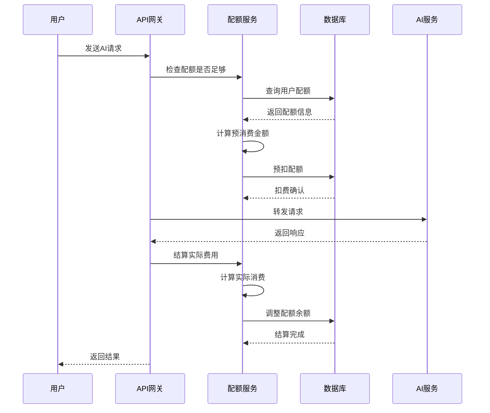
```mermaid
sequenceDiagram
    participant U as 用户
    participant API as API网关
    participant Q as 配额服务
    participant DB as 数据库
    participant AI as AI服务

    U->>API: 发送AI请求
    API->>Q: 检查配额是否足够
    Q->>DB: 查询用户配额
    DB-->>Q: 返回配额信息
    Q->>Q: 计算预消费金额
    Q->>DB: 预扣配额
    DB-->>Q: 扣费确认
    API->>AI: 转发请求
    AI-->>API: 返回响应
    API->>Q: 结算实际费用
    Q->>Q: 计算实际消费
    Q->>DB: 调整配额余额
    DB-->>Q: 结算完成
    API-->>U: 返回结果
```

#### 4.1.2 预消费阶段详细实现

**预消费检查时序图**:
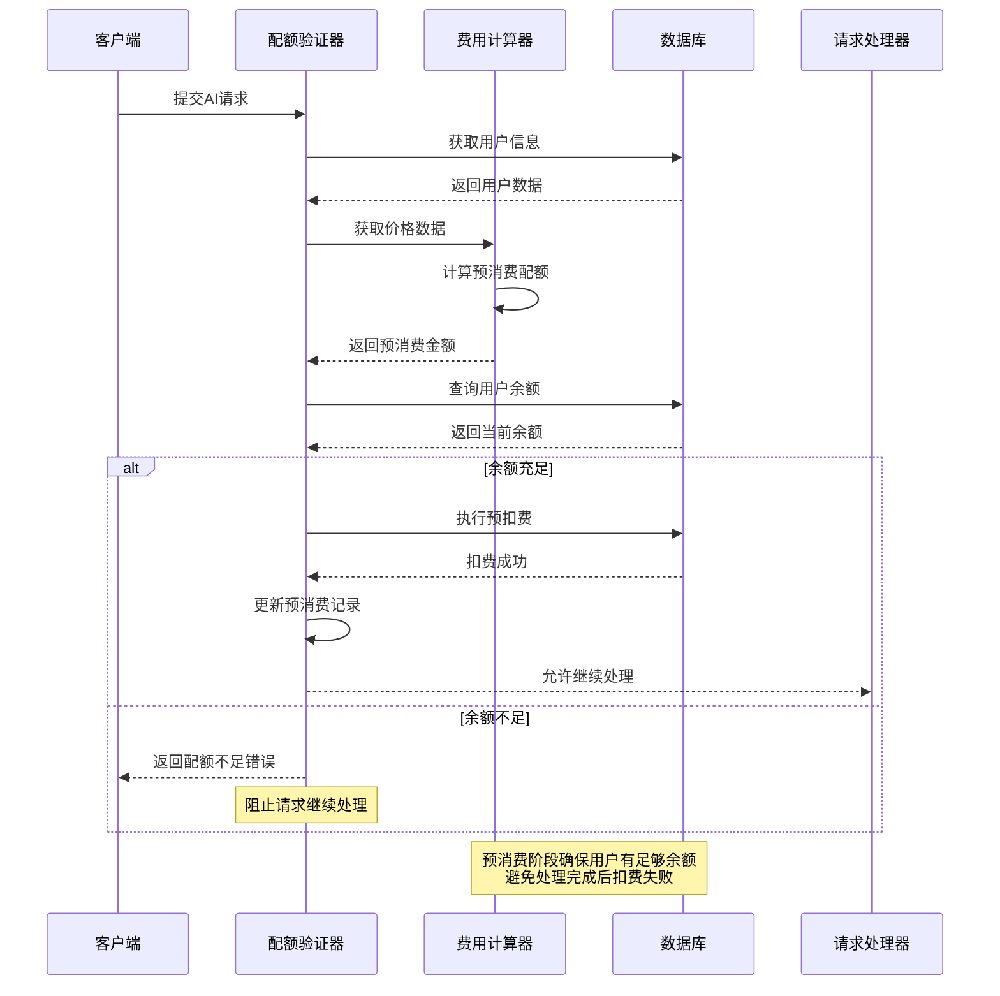
```mermaid
sequenceDiagram
    participant Client as 客户端
    participant Validator as 配额验证器
    participant Calculator as 费用计算器
    participant DB as 数据库
    participant Processor as 请求处理器

    Client->>Validator: 提交AI请求
    Validator->>DB: 获取用户信息
    DB-->>Validator: 返回用户数据

    Validator->>Calculator: 获取价格数据
    Calculator->>Calculator: 计算预消费配额
    Calculator-->>Validator: 返回预消费金额

    Validator->>DB: 查询用户余额
    DB-->>Validator: 返回当前余额

    alt 余额充足
        Validator->>DB: 执行预扣费
        DB-->>Validator: 扣费成功
        Validator->>Validator: 更新预消费记录
        Validator-->>Processor: 允许继续处理
    else 余额不足
        Validator-->>Client: 返回配额不足错误
        Note over Validator: 阻止请求继续处理
    end

    Note over DB,Calculator: 预消费阶段确保用户有足够余额<br/>避免处理完成后扣费失败
```

**预消费核心代码**:
```go
// service/quota.go - PreConsumeQuota
func PreConsumeQuota(c *gin.Context, info *relaycommon.RelayInfo) error {
    // 步骤1: 验证用户配额是否足够
    userQuota, err := model.GetUserQuota(info.UserId, false)
    if err != nil {
        return fmt.Errorf("获取用户配额失败: %w", err)
    }

    requiredQuota := info.PriceData.QuotaToPreConsume
    if userQuota < requiredQuota {
        // 记录配额不足的日志
        common.SysLog(fmt.Sprintf("用户%d配额不足: 需要%d, 当前%d",
            info.UserId, requiredQuota, userQuota))
        return errors.New("配额不足，请充值后重试")
    }

    // 步骤2: 执行预扣费操作
    err = DecreaseUserQuota(info.UserId, requiredQuota)
    if err != nil {
        return fmt.Errorf("预扣费失败: %w", err)
    }

    // 步骤3: 记录预消费信息到上下文
    info.FinalPreConsumedQuota = requiredQuota

    // 步骤4: 记录预消费日志
    RecordPreConsumption(info.UserId, info.TokenId, requiredQuota)

    return nil
}
```

#### 4.1.3 实际消费结算详细实现

**结算流程图**:
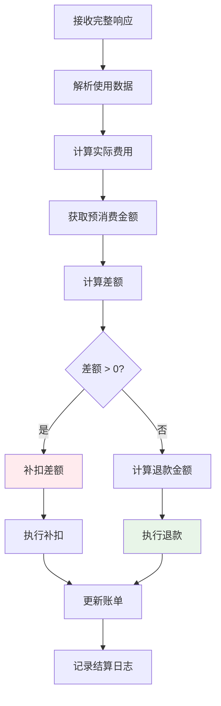
```mermaid
graph TD
    A[接收完整响应] --> B[解析使用数据]
    B --> C[计算实际费用]
    C --> D[获取预消费金额]
    D --> E[计算差额]
    E --> F{差额 > 0?}
    F -->|是| G[补扣差额]
    F -->|否| H[计算退款金额]
    G --> I[执行补扣]
    H --> J[执行退款]
    I --> K[更新账单]
    J --> K
    K --> L[记录结算日志]

    style G fill:#ffebee
    style J fill:#e8f5e8
```

**实际结算核心代码**:
```go
// service/quota.go - PostConsumeQuota
func PostConsumeQuota(c *gin.Context, info *relaycommon.RelayInfo, usage *dto.Usage) error {
    // 步骤1: 计算实际消费配额
    actualQuota := calculateActualQuota(info, usage)

    // 步骤2: 计算与预消费的差额
    preConsumedQuota := info.FinalPreConsumedQuota
    quotaDiff := actualQuota - preConsumedQuota

    // 步骤3: 根据差额执行相应操作
    if quotaDiff > 0 {
        // 实际消费大于预消费，需要补扣
        err := DecreaseUserQuota(info.UserId, quotaDiff)
        if err != nil {
            // 记录补扣失败的错误，但不中断流程
            common.SysError(fmt.Sprintf("补扣费用失败 用户%d 金额%d: %v",
                info.UserId, quotaDiff, err))
        }
        RecordAdditionalConsumption(info.UserId, quotaDiff)

    } else if quotaDiff < 0 {
        // 实际消费小于预消费，需要退还
        refundQuota := -quotaDiff
        err := IncreaseUserQuota(info.UserId, refundQuota, false)
        if err != nil {
            common.SysError(fmt.Sprintf("退还费用失败 用户%d 金额%d: %v",
                info.UserId, refundQuota, err))
        }
        RecordRefund(info.UserId, refundQuota)
    }

    // 步骤4: 更新用户使用统计
    UpdateUserUsedQuota(info.UserId, actualQuota)

    // 步骤5: 记录完整的结算日志
    RecordConsumptionSettlement(info, actualQuota, preConsumedQuota, quotaDiff)

    return nil
}
```

### 4.2 配额管理核心函数详解

#### 4.2.1 配额扣减实现

**数据库事务保证原子性**:
```go
// model/user.go - DecreaseUserQuota
func DecreaseUserQuota(id int, quota int) error {
    if quota < 0 {
        return errors.New("配额不能为负数")
    }

    // 使用数据库事务确保扣费的原子性
    tx := DB.Begin()
    if tx.Error != nil {
        return tx.Error
    }
    defer tx.Rollback()

    // 执行扣费操作
    result := tx.Model(&User{}).
        Where("id = ?", id).
        Where("quota >= ?", quota). // 确保余额足够
        Update("quota", gorm.Expr("quota - ?", quota))

    if result.Error != nil {
        return result.Error
    }

    // 检查是否真的扣费了（影响行数应该为1）
    if result.RowsAffected != 1 {
        return errors.New("扣费失败：用户不存在或余额不足")
    }

    return tx.Commit().Error
}
```

#### 4.2.2 配额增加实现

**异步缓存更新机制**:
```go
// model/user.go - IncreaseUserQuota
func IncreaseUserQuota(id int, quota int, db bool) error {
    if quota < 0 {
        return errors.New("配额不能为负数")
    }

    // 异步更新Redis缓存，提升性能
    gopool.Go(func() {
        err := cacheIncrUserQuota(id, int64(quota))
        if err != nil {
            common.SysLog(fmt.Sprintf("缓存更新失败 用户%d: %v", id, err))
        }
    })

    // 根据参数决定是否更新数据库
    if !db && common.BatchUpdateEnabled {
        // 使用批量更新队列
        addNewRecord(BatchUpdateTypeUserQuota, id, quota)
        return nil
    }

    // 直接更新数据库
    return increaseUserQuota(id, quota)
}
```

### 4.3 批量更新与缓存同步机制

#### 4.3.1 批量更新队列架构

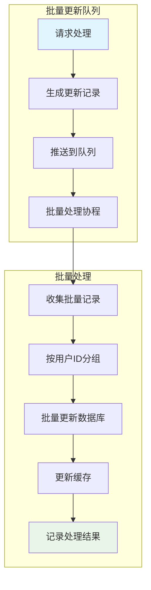
```mermaid
graph TD
    subgraph "批量更新队列"
        A[请求处理] --> B[生成更新记录]
        B --> C[推送到队列]
        C --> D[批量处理协程]
    end

    subgraph "批量处理"
        D --> E[收集批量记录]
        E --> F[按用户ID分组]
        F --> G[批量更新数据库]
        G --> H[更新缓存]
        H --> I[记录处理结果]
    end

    style A fill:#e1f5fe
    style I fill:#e8f5e8
```

**批量更新实现**:
```go
// 批量更新记录结构
type BatchUpdateRecord struct {
    Type  int // 更新类型 (配额、使用量等)
    Id    int // 用户ID
    Value int // 更新值
}

// 批量更新队列
var batchUpdateQueue = make(chan BatchUpdateRecord, 1000)

// 批量处理协程
func batchUpdateWorker() {
    const batchSize = 100
    const flushInterval = time.Second * 5

    ticker := time.NewTicker(flushInterval)
    defer ticker.Stop()

    batch := make([]BatchUpdateRecord, 0, batchSize)

    for {
        select {
        case record := <-batchUpdateQueue:
            batch = append(batch, record)

            // 达到批量大小时立即处理
            if len(batch) >= batchSize {
                processBatch(batch)
                batch = batch[:0] // 清空批次
            }

        case <-ticker.C:
            // 定时处理剩余记录
            if len(batch) > 0 {
                processBatch(batch)
                batch = batch[:0]
            }
        }
    }
}
```

#### 4.3.2 多级缓存同步

**缓存同步策略**:
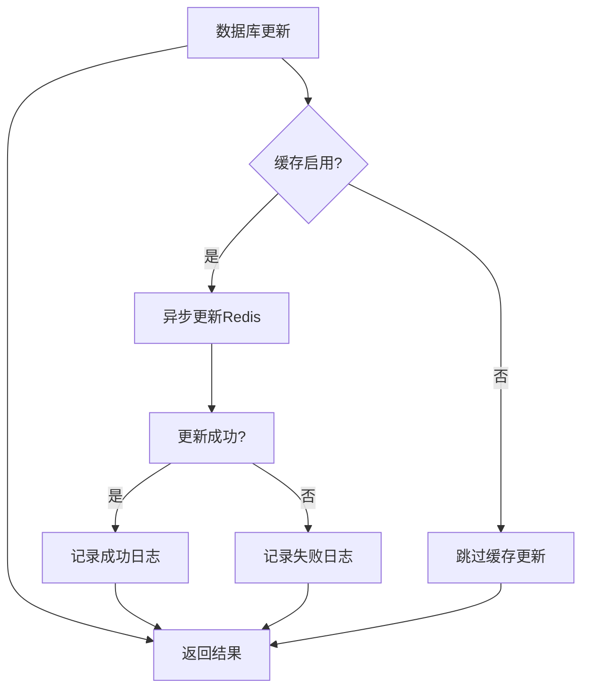
```mermaid
graph TD
    A[数据库更新] --> B{缓存启用?}
    B -->|是| C[异步更新Redis]
    B -->|否| D[跳过缓存更新]

    C --> E[更新成功?]
    E -->|是| F[记录成功日志]
    E -->|否| G[记录失败日志]

    A --> H[返回结果]
    F --> H
    G --> H
    D --> H
```

**缓存同步实现**:
```go
// Redis缓存同步函数
func cacheIncrUserQuota(userId int, delta int64) error {
    ctx := context.Background()
    key := fmt.Sprintf("user_quota:%d", userId)

    // 使用Redis事务确保原子性
    pipe := common.RedisClient.TxPipeline()
    pipe.IncrBy(ctx, key, delta)

    // 设置过期时间（可选）
    pipe.Expire(ctx, key, 24*time.Hour)

    _, err := pipe.Exec(ctx)
    return err
}
```

### 4.2 配额管理函数

#### 4.2.1 配额扣除
```go
// model/user.go - DecreaseUserQuota
func DecreaseUserQuota(id int, quota int) error {
    if quota < 0 {
        return errors.New("配额不能为负数")
    }
    
    // 使用数据库事务确保原子性
    tx := DB.Begin()
    err := tx.Model(&User{}).Where("id = ?", id).
        Update("quota", gorm.Expr("quota - ?", quota)).Error
    
    if err != nil {
        tx.Rollback()
        return err
    }
    
    return tx.Commit().Error
}
```

#### 4.2.2 配额增加
```go
// model/user.go - IncreaseUserQuota
func IncreaseUserQuota(id int, quota int, db bool) error {
    // 异步更新缓存
    gopool.Go(func() {
        err := cacheIncrUserQuota(id, int64(quota))
        if err != nil {
            common.SysLog("failed to increase user quota: " + err.Error())
        }
    })
    
    // 数据库更新
    if !db && common.BatchUpdateEnabled {
        addNewRecord(BatchUpdateTypeUserQuota, id, quota)
        return nil
    }
    
    return increaseUserQuota(id, quota)
}
```

### 4.3 批量更新机制

#### 4.3.1 批量更新队列
```go
// model/main.go
type BatchUpdateRecord struct {
    Type  int // 更新类型
    Id    int // 用户ID
    Value int // 更新值
}

var batchUpdateQueue = make(chan BatchUpdateRecord, 1000)

// 批量更新处理协程
func batchUpdateWorker() {
    for record := range batchUpdateQueue {
        switch record.Type {
        case BatchUpdateTypeUserQuota:
            updateUserQuotaBatch(record.Id, record.Value)
        case BatchUpdateTypeUsedQuota:
            updateUserUsedQuotaBatch(record.Id, record.Value)
        }
    }
}
```

#### 4.3.2 缓存同步机制
```go
// Redis缓存同步
func cacheIncrUserQuota(userId int, delta int64) error {
    key := fmt.Sprintf("user_quota:%d", userId)
    return common.RedisClient.IncrBy(key, delta).Err()
}

func cacheDecrUserQuota(userId int, delta int64) error {
    return cacheIncrUserQuota(userId, -delta)
}
```

## 5. 计费配置管理

### 5.1 模型倍率配置

#### 5.1.1 默认模型倍率
```go
// setting/ratio_setting/model_ratio.go
var defaultModelRatio = map[string]float64{
    "gpt-4o":                    1.25,  // $2.5 / 1M tokens
    "gpt-4o-mini":              0.075, // $0.15 / 1M tokens
    "claude-3-opus-20240229":   7.5,   // $15 / 1M tokens
    "claude-3-sonnet-20240229": 1.5,   // $3 / 1M tokens
    "gemini-pro":               0.125, // $0.25 / 1M tokens
    // ... 更多模型配置
}
```

#### 5.1.2 自定义模型倍率
- **配置位置**: 系统设置 → 倍率设置 → 模型倍率
- **配置格式**: JSON对象 `{模型名: 倍率值}`
- **支持模式**: 完全匹配、通配符匹配

### 5.2 分组倍率配置

#### 5.2.1 用户分组倍率
```go
// setting/ratio_setting/group_ratio.go
var groupRatio = map[string]float64{
    "default": 1.0,  // 默认倍率
    "vip":     0.8,  // VIP用户8折
    "svip":    0.6,  // 超级VIP用户6折
}
```

#### 5.2.2 分组间特殊倍率
```json
{
  "vip": {
    "claude-3-opus": 0.7,  // VIP用户使用Claude-3-Opus额外优惠
    "gpt-4": 0.8           // VIP用户使用GPT-4的倍率
  }
}
```

### 5.3 完成倍率配置

#### 5.3.1 输出Token倍率
```go
var defaultCompletionRatio = map[string]float64{
    "gpt-4":          1.0,  // 输出token与输入token同价
    "claude-3-opus":  1.0,
    "gemini-pro":     1.0,
    "o1":             4.0,  // o1系列输出token 4倍价格
    "o1-mini":        4.0,
    "o1-preview":     4.0,
}
```

#### 5.3.2 缓存倍率配置
```go
var defaultCacheRatio = map[string]float64{
    "claude-3-opus": 0.1,  // 缓存token仅收10%
    "claude-3-sonnet": 0.1,
}
```

## 6. 实时通信与流式计费详解

### 6.1 WebSocket实时通信计费架构

#### 6.1.1 实时通信计费流程图

```mermaid
graph TD
    A[建立WebSocket连接] --> B[初始化会话]
    B --> C[估算会话消耗]
    C --> D[预扣配额]
    D --> E[开始音频流传输]
    E --> F[实时Token累积]
    F --> G[周期性配额检查]
    G --> H{配额充足?}
    H -->|是| F
    H -->|否| I[发送配额警告]
    I --> J[继续或终止会话]
    J --> K[会话结束]
    K --> L[最终配额结算]

    style A fill:#e1f5fe
    style L fill:#e8f5e8
    style H fill:#ffebee
    style I fill:#fff3e0
```

#### 6.1.2 实时Token统计实现

**实时通信预消费逻辑**:
```go
// service/quota.go - PreWssConsumeQuota
func PreWssConsumeQuota(ctx *gin.Context, relayInfo *relaycommon.RelayInfo, usage *dto.RealtimeUsage) error {

    // 步骤1: 估算会话总消耗
    // 基于历史数据和会话参数估算总token用量
    estimatedTokens := estimateRealtimeTokens(relayInfo)

    // 步骤2: 计算预消费配额
    priceData := relayInfo.PriceData
    preConsumeQuota := int(float64(estimatedTokens) * priceData.ModelRatio * priceData.GroupRatioInfo.GroupRatio)

    // 步骤3: 检查用户配额是否足够
    userQuota, err := model.GetUserQuota(relayInfo.UserId, false)
    if err != nil || userQuota < preConsumeQuota {
        return errors.New("配额不足，无法建立实时通信")
    }

    // 步骤4: 执行预扣费
    err = DecreaseUserQuota(relayInfo.UserId, preConsumeQuota)
    if err != nil {
        return fmt.Errorf("预扣费失败: %w", err)
    }

    // 步骤5: 初始化实时会话状态
    relayInfo.FinalPreConsumedQuota = preConsumeQuota
    relayInfo.AudioUsage = true

    return nil
}
```

**实时会话估算算法**:
```go
func estimateRealtimeTokens(info *relaycommon.RelayInfo) int {
    // 基础估算参数
    const (
        avgTokensPerMinute = 1500  // 每分钟平均token数
        maxSessionMinutes  = 30    // 最大会话时长(分钟)
        safetyFactor       = 1.5   // 安全系数
    )

    // 根据模型调整估算
    model := info.OriginModelName
    switch {
    case strings.Contains(model, "gpt-4o-realtime"):
        // GPT-4o实时模型有特定的token模式
        return int(float64(avgTokensPerMinute * maxSessionMinutes) * safetyFactor * 1.2)
    case strings.Contains(model, "claude"):
        // Claude模型的token效率不同
        return int(float64(avgTokensPerMinute * maxSessionMinutes) * safetyFactor * 0.8)
    default:
        return int(float64(avgTokensPerMinute * maxSessionMinutes) * safetyFactor)
    }
}
```

#### 6.1.3 动态配额调整机制

**实时配额监控流程**:
```go
// 实时通信过程中动态调整配额
func adjustRealtimeQuota(userId int, sessionUsage *dto.RealtimeUsage, relayInfo *relaycommon.RelayInfo) error {

    // 步骤1: 获取当前会话实际用量
    currentTokens := sessionUsage.TotalTokens
    currentQuota := calculateQuotaFromTokens(currentTokens, relayInfo)

    // 步骤2: 计算与预消费的差额
    preConsumedQuota := relayInfo.FinalPreConsumedQuota
    quotaDiff := currentQuota - preConsumedQuota

    // 步骤3: 实时调整配额
    if quotaDiff > 0 {
        // 需要补扣
        remainingQuota, _ := model.GetUserQuota(userId, false)
        if remainingQuota < quotaDiff {
            // 配额不足，发送警告并可能终止会话
            sendQuotaWarning(userId, "实时通信配额不足，即将终止会话")
            return errors.New("实时通信配额不足")
        }
        DecreaseUserQuota(userId, quotaDiff)
        relayInfo.FinalPreConsumedQuota += quotaDiff

    } else if quotaDiff < -100 { // 阈值判断，避免频繁小额退款
        // 可以退还部分配额
        refundQuota := -quotaDiff
        IncreaseUserQuota(userId, refundQuota, false)
        relayInfo.FinalPreConsumedQuota -= refundQuota
    }

    return nil
}
```

### 6.2 流式响应计费机制

#### 6.2.1 流式响应数据流图

```mermaid
graph TD
    A[AI服务响应] --> B[流式数据流]
    B --> C[SSE事件解析]
    C --> D{包含usage数据?}
    D -->|是| E[提取Token信息]
    D -->|否| F[传递原始数据]
    E --> G[累积Token计数]
    G --> H[计算增量费用]
    H --> I[检查配额余量]
    I --> J{配额充足?}
    J -->|是| K[继续传输]
    J -->|否| L[终止流式输出]
    K --> B
    F --> B

    style J fill:#ffebee
    style L fill:#ffebee
    style K fill:#e8f5e8
```

#### 6.2.2 流式Token累积实现

**流式扫描器核心逻辑**:
```go
// relay/helper/stream_scanner.go
type StreamScanner struct {
    accumulatedTokens int
    lastUsage        *dto.Usage
    quotaChecked     bool
}

func (s *StreamScanner) accumulateTokens(data []byte) error {
    // 步骤1: 解析SSE数据格式
    lines := strings.Split(string(data), "\n")
    for _, line := range lines {
        if strings.HasPrefix(line, "data: ") {
            jsonData := strings.TrimPrefix(line, "data: ")

            // 步骤2: 解析JSON数据
            var event map[string]interface{}
            if err := common.Unmarshal([]byte(jsonData), &event); err != nil {
                continue // 跳过无法解析的数据
            }

            // 步骤3: 提取usage信息
            if usageData, exists := event["usage"]; exists {
                var usage dto.Usage
                usageBytes, _ := common.Marshal(usageData)
                common.Unmarshal(usageBytes, &usage)

                // 步骤4: 计算增量token
                if s.lastUsage != nil {
                    deltaPrompt := usage.PromptTokens - s.lastUsage.PromptTokens
                    deltaCompletion := usage.CompletionTokens - s.lastUsage.CompletionTokens

                    s.accumulatedTokens += deltaPrompt + deltaCompletion
                }

                s.lastUsage = &usage
            }
        }
    }

    return nil
}
```

#### 6.2.3 流式配额控制策略

**动态配额检查算法**:
```go
// 检查配额是否足够继续流式输出
func checkStreamQuota(userId int, currentUsage *dto.Usage, relayInfo *relaycommon.RelayInfo) (bool, error) {

    // 步骤1: 获取用户当前剩余配额
    remainingQuota, err := model.GetUserQuota(userId, false)
    if err != nil {
        return false, err
    }

    // 步骤2: 估算剩余响应所需的配额
    estimatedRemainingTokens := estimateRemainingTokens(currentUsage, relayInfo)
    estimatedQuota := calculateQuotaFromTokens(estimatedRemainingTokens, relayInfo)

    // 步骤3: 比较剩余配额与预估消耗
    bufferQuota := int(float64(estimatedQuota) * 1.2) // 20%缓冲
    hasEnoughQuota := remainingQuota >= bufferQuota

    // 步骤4: 如果配额不足，记录警告
    if !hasEnoughQuota {
        common.SysLog(fmt.Sprintf("用户%d流式响应配额不足: 剩余%d, 需要%d",
            userId, remainingQuota, bufferQuota))
    }

    return hasEnoughQuota, nil
}
```

**剩余Token估算算法**:
```go
func estimateRemainingTokens(currentUsage *dto.Usage, relayInfo *relaycommon.RelayInfo) int {
    // 基于当前进度估算剩余token数
    totalPromptTokens := currentUsage.PromptTokens
    currentCompletionTokens := currentUsage.CompletionTokens

    // 根据模型特点估算完成比例
    model := relayInfo.OriginModelName
    var estimatedRatio float64

    switch {
    case strings.Contains(model, "gpt-4"):
        // GPT-4系列通常输出较长
        estimatedRatio = 2.0
    case strings.Contains(model, "gpt-3.5"):
        // GPT-3.5系列输出中等
        estimatedRatio = 1.5
    case strings.Contains(model, "claude"):
        // Claude系列输出相对较短
        estimatedRatio = 1.2
    default:
        estimatedRatio = 1.8 // 默认估算比例
    }

    // 估算剩余completion tokens
    estimatedRemaining := int(float64(totalPromptTokens) * estimatedRatio) - currentCompletionTokens

    return max(0, estimatedRemaining)
}
```

## 7. 计费审计与监控体系

### 7.1 多维度日志记录架构

#### 7.1.1 日志数据流图

```mermaid
graph TD
    subgraph "日志产生"
        A1[请求开始] --> B1[记录请求日志]
        A2[预消费] --> B2[记录预消费日志]
        A3[响应完成] --> B3[记录完成日志]
        A4[异常发生] --> B4[记录异常日志]
    end

    subgraph "日志处理"
        B1 --> C1[结构化存储]
        B2 --> C1
        B3 --> C1
        B4 --> C1
    end

    subgraph "日志应用"
        C1 --> D1[审计查询]
        C1 --> D2[统计分析]
        C1 --> D3[异常检测]
        C1 --> D4[账单生成]
    end

    style A1 fill:#e1f5fe
    style D4 fill:#e8f5e8
```

#### 7.1.2 完整的日志记录结构

**核心日志实体定义**:
```go
// 用量日志 - 记录每次API调用的详细用量
type UsageLog struct {
    Id                int     `json:"id" gorm:"primaryKey"`
    UserId            int     `json:"user_id" gorm:"index"`
    TokenId           int     `json:"token_id" gorm:"index"`
    ModelName         string  `json:"model_name" gorm:"index"`
    RequestId         string  `json:"request_id" gorm:"index"`

    // Token统计
    PromptTokens      int     `json:"prompt_tokens"`
    CompletionTokens  int     `json:"completion_tokens"`
    CachedTokens      int     `json:"cached_tokens"`
    AudioTokens       int     `json:"audio_tokens"`
    TotalTokens       int     `json:"total_tokens"`

    // 费用统计
    QuotaConsumed     int     `json:"quota_consumed"`      // 实际消耗配额
    PreConsumedQuota  int     `json:"pre_consumed_quota"`  // 预消费配额
    RefundQuota       int     `json:"refund_quota"`        // 退还配额
    Price             float64 `json:"price"`               // 美元价格

    // 时间信息
    StartTime         int64   `json:"start_time"`
    EndTime           int64   `json:"end_time"`
    Duration          int64   `json:"duration"`            // 耗时(ms)

    // 状态信息
    Status            string  `json:"status"`              // success/error
    ErrorMessage      string  `json:"error_message"`
    ChannelId         int     `json:"channel_id"`
    ChannelType       int     `json:"channel_type"`

    CreatedTime       int64   `json:"created_time"`
    UpdatedTime       int64   `json:"updated_time"`
}

// 配额操作日志 - 记录所有配额变动
type QuotaLog struct {
    Id          int    `json:"id" gorm:"primaryKey"`
    UserId      int    `json:"user_id" gorm:"index"`
    TokenId     int    `json:"token_id" gorm:"index"`
    RequestId   string `json:"request_id" gorm:"index"`

    // 操作信息
    Operation   string `json:"operation"`   // increase/decrease/pre_consume/refund
    Amount      int    `json:"amount"`      // 操作金额
    BalanceBefore int  `json:"balance_before"` // 操作前余额
    BalanceAfter  int  `json:"balance_after"`  // 操作后余额

    // 关联信息
    Reason      string `json:"reason"`      // 操作原因
    ModelName   string `json:"model_name"`  // 关联模型

    CreatedTime int64  `json:"created_time"`
}
```

#### 7.1.3 日志记录实现策略

**分层日志记录**:
```go
// 日志记录管理器
type LogManager struct {
    usageLogger  *UsageLogger
    quotaLogger  *QuotaLogger
    errorLogger  *ErrorLogger
}

// 请求全生命周期日志记录
func (lm *LogManager) LogRequestLifecycle(info *relaycommon.RelayInfo, usage *dto.Usage) error {

    // 1. 请求开始日志
    lm.usageLogger.LogRequestStart(info)

    // 2. 预消费日志
    lm.quotaLogger.LogPreConsumption(info)

    // 3. 请求完成日志
    lm.usageLogger.LogRequestComplete(info, usage)

    // 4. 配额结算日志
    lm.quotaLogger.LogQuotaSettlement(info, usage)

    // 5. 异常情况日志（如有）
    if usage.Error != nil {
        lm.errorLogger.LogError(info, usage.Error)
    }

    return nil
}
```

### 7.2 实时监控指标体系

#### 7.2.1 多维度监控指标架构

```mermaid
graph TD
    subgraph "用户维度"
        U1[配额使用率] --> UM[用户监控]
        U2[消费趋势] --> UM
        U3[异常行为] --> UM
    end

    subgraph "模型维度"
        M1[调用频率] --> MM[模型监控]
        M2[平均延迟] --> MM
        M3[错误率] --> MM
    end

    subgraph "系统维度"
        S1[总请求量] --> SM[系统监控]
        S2[总收入] --> SM
        S3[系统健康] --> SM
    end

    UM --> A[告警中心]
    MM --> A
    SM --> A

    A --> N[通知系统]
```

#### 7.2.2 核心监控指标实现

**指标收集器架构**:
```go
// 监控指标收集器
type MetricsCollector struct {
    // Prometheus指标
    requestCounter     *prometheus.CounterVec     // 请求计数
    tokenCounter       *prometheus.CounterVec     // Token计数
    quotaGauge         *prometheus.GaugeVec       // 配额使用
    latencyHistogram   *prometheus.HistogramVec   // 延迟分布
    errorCounter       *prometheus.CounterVec     // 错误计数

    // 自定义指标
    revenueCalculator  *RevenueCalculator         // 收入计算
    anomalyDetector    *AnomalyDetector           // 异常检测
}

// 核心指标定义
func (mc *MetricsCollector) initMetrics() {
    // 请求计数器 - 按模型、用户、渠道分组
    mc.requestCounter = prometheus.NewCounterVec(
        prometheus.CounterOpts{
            Name: "newapi_requests_total",
            Help: "Total number of API requests",
        },
        []string{"model", "user_group", "channel_type", "status"},
    )

    // Token使用量 - 按类型统计
    mc.tokenCounter = prometheus.NewCounterVec(
        prometheus.CounterOpts{
            Name: "newapi_tokens_total",
            Help: "Total number of tokens used",
        },
        []string{"type", "model"}, // type: prompt/completion/cache/audio
    )

    // 配额使用率 - 实时监控
    mc.quotaGauge = prometheus.NewGaugeVec(
        prometheus.GaugeOpts{
            Name: "newapi_quota_usage_ratio",
            Help: "Current quota usage ratio per user",
        },
        []string{"user_id"},
    )

    // 请求延迟分布
    mc.latencyHistogram = prometheus.NewHistogramVec(
        prometheus.HistogramOpts{
            Name: "newapi_request_duration_seconds",
            Help: "Request duration in seconds",
            Buckets: prometheus.DefBuckets,
        },
        []string{"model", "endpoint"},
    )
}
```

#### 7.2.3 实时监控面板

**监控Dashboard设计**:
```yaml
# 监控面板布局
dashboard:
  title: "NewAPI计费监控面板"

  panels:
    # 核心指标面板
    - title: "核心业务指标"
      type: "stat"
      metrics:
        - name: "总请求数"
          query: "sum(newapi_requests_total)"
        - name: "总Token数"
          query: "sum(newapi_tokens_total)"
        - name: "总收入"
          query: "sum(newapi_revenue_total)"

    # 性能监控面板
    - title: "系统性能"
      type: "graph"
      metrics:
        - name: "平均响应时间"
          query: "histogram_quantile(0.95, sum(rate(newapi_request_duration_seconds_bucket[5m])) by (le))"
        - name: "错误率"
          query: "sum(rate(newapi_requests_total{status='error'}[5m])) / sum(rate(newapi_requests_total[5m]))"

    # 用户监控面板
    - title: "用户配额监控"
      type: "table"
      query: "topk(10, newapi_quota_usage_ratio)"

    # 模型使用面板
    - title: "模型使用统计"
      type: "barchart"
      query: "sum(newapi_requests_total) by (model)"
```

### 7.3 异常检测与告警机制

#### 7.3.1 异常检测规则引擎

```mermaid
graph TD
    A[收集指标数据] --> B[规则引擎]
    B --> C{匹配规则?}
    C -->|是| D[生成告警]
    C -->|否| E[继续监控]

    D --> F[告警聚合]
    F --> G[告警抑制]
    G --> H{需要通知?}
    H -->|是| I[发送通知]
    H -->|否| J[记录日志]

    style D fill:#ffebee
    style I fill:#e8f5e8
```

**异常检测规则示例**:
```go
// 异常检测规则定义
type AnomalyRule struct {
    Name        string
    Description string
    Condition   func(metrics *BillingMetrics) bool
    Severity    string // info/warning/error/critical
    Cooldown    time.Duration // 冷却时间
}

// 预定义异常检测规则
var anomalyRules = []AnomalyRule{
    {
        Name:        "HighErrorRate",
        Description: "错误率过高",
        Condition:   func(m *BillingMetrics) bool { return m.ErrorRate > 0.1 },
        Severity:    "warning",
        Cooldown:    time.Minute * 5,
    },
    {
        Name:        "LowQuotaAlert",
        Description: "用户配额不足",
        Condition:   func(m *BillingMetrics) bool { return m.RemainingQuota < 100 },
        Severity:    "info",
        Cooldown:    time.Minute * 1,
    },
    {
        Name:        "AbnormalUsage",
        Description: "异常使用模式",
        Condition:   func(m *BillingMetrics) bool {
            return m.RequestsPerMinute > 1000 // 每分钟请求数异常
        },
        Severity:    "error",
        Cooldown:    time.Minute * 10,
    },
    {
        Name:        "RevenueDrop",
        Description: "收入异常下降",
        Condition:   func(m *BillingMetrics) bool {
            return m.RevenueChangePercent < -0.5 // 收入下降50%
        },
        Severity:    "critical",
        Cooldown:    time.Hour * 1,
    },
}
```

#### 7.3.2 多渠道告警通知

**告警通知架构**:
```go
// 告警通知管理器
type AlertManager struct {
    notifiers []Notifier
    aggregator *AlertAggregator
    suppressor *AlertSuppressor
}

// 支持的通知渠道
type Notifier interface {
    Send(alert *Alert) error
}

// 具体通知实现
type EmailNotifier struct {
    smtpServer string
    from       string
    to         []string
}

type WebhookNotifier struct {
    url     string
    headers map[string]string
}

type SlackNotifier struct {
    webhookURL string
    channel    string
}
```

### 7.4 审计查询与合规性

#### 7.4.1 审计查询系统

**多维度审计查询**:
```go
// 审计查询接口
type AuditQuery interface {
    // 按用户查询
    QueryByUser(userId int, startTime, endTime int64) ([]*AuditRecord, error)

    // 按时间范围查询
    QueryByTimeRange(startTime, endTime int64) ([]*AuditRecord, error)

    // 按操作类型查询
    QueryByOperation(operation string, startTime, endTime int64) ([]*AuditRecord, error)

    // 异常操作查询
    QueryAnomalies(startTime, endTime int64) ([]*AnomalyRecord, error)
}

// 审计记录结构
type AuditRecord struct {
    Id          int64     `json:"id"`
    Timestamp   int64     `json:"timestamp"`
    UserId      int        `json:"user_id"`
    Operation   string    `json:"operation"`
    Resource    string    `json:"resource"`
    Details     string    `json:"details"`
    IpAddress   string    `json:"ip_address"`
    UserAgent   string    `json:"user_agent"`
    Result      string    `json:"result"`      // success/failed
    ErrorMsg    string    `json:"error_msg,omitempty"`
}
```

#### 7.4.2 数据保留与清理策略

**数据生命周期管理**:
```go
// 数据保留策略
type RetentionPolicy struct {
    UsageLogs struct {
        HotData    time.Duration // 热数据保留期 (7天)
        WarmData   time.Duration // 温数据保留期 (30天)
        ColdData   time.Duration // 冷数据保留期 (1年)
    }
    AuditLogs struct {
        Retention  time.Duration // 审计日志保留期 (7年)
        Archive    bool         // 是否归档
    }
    Metrics struct {
        Retention  time.Duration // 监控指标保留期 (90天)
    }
}

// 数据清理任务
func (rp *RetentionPolicy) Cleanup() error {
    now := time.Now()

    // 清理过期用量日志
    if err := cleanupUsageLogs(now.Add(-rp.UsageLogs.ColdData)); err != nil {
        return err
    }

    // 清理过期监控指标
    if err := cleanupMetrics(now.Add(-rp.Metrics.Retention)); err != nil {
        return err
    }

    // 归档审计日志（不删除）
    if err := archiveAuditLogs(now.Add(-rp.AuditLogs.Retention)); err != nil {
        return err
    }

    return nil
}
```

## 8. 安全与风控体系

### 8.1 多层次安全防护架构

#### 8.1.1 安全防护层次图

```mermaid
sequenceDiagram
    participant Client as 客户端
    participant Gateway as API网关
    participant Auth as 身份认证
    participant Validator as 参数验证
    participant Quota as 配额检查
    participant Processor as 业务处理器
    participant DB as 数据库
    participant Monitor as 监控系统

    Client->>Gateway: 发送请求
    Gateway->>Gateway: 频率限制检查
    Gateway->>Gateway: IP白名单验证
    Gateway->>Gateway: 地理位置检查

    Gateway->>Auth: 身份认证
    Auth->>Auth: Token验证
    Auth->>Auth: 用户权限检查

    Auth->>Validator: 参数校验
    Validator->>Validator: 格式验证
    Validator->>Validator: 内容过滤

    Validator->>Quota: 配额检查
    Quota->>DB: 查询用户余额
    DB-->>Quota: 返回余额信息

    alt 配额充足
        Quota->>Processor: 执行业务逻辑
        Processor->>DB: 数据库操作
        DB-->>Processor: 操作结果
        Processor->>Monitor: 记录业务日志
    else 配额不足
        Quota->>Monitor: 记录异常事件
        Quota-->>Client: 返回错误信息
    end

    Monitor->>Monitor: 审计日志记录
    Monitor->>Monitor: 异常检测分析

    Note over Gateway,Auth: 网络层 + 应用层安全防护<br/>防止未经授权的访问
    Note over Validator,Quota: 数据验证 + 业务规则检查<br/>确保数据安全和业务合规
    Note over DB,Monitor: 数据持久化 + 监控审计<br/>保障系统稳定和可追溯性
```

#### 8.1.2 配额安全验证实现

**多重配额检查机制**:
```go
// 严格的配额检查逻辑 - 三重验证
func validateQuotaComprehensive(userId int, requiredQuota int, requestId string) error {

    // 第一重检查：缓存快速检查
    cachedQuota := getCachedUserQuota(userId)
    if cachedQuota < requiredQuota {
        // 记录快速失败
        logQuotaCheckFailure(userId, requiredQuota, cachedQuota, "cache_check", requestId)
        return errors.New("配额不足")
    }

    // 第二重检查：数据库精确检查（带行锁）
    dbQuota, err := getUserQuotaWithLock(userId)
    if err != nil {
        return fmt.Errorf("数据库配额检查失败: %w", err)
    }

    if dbQuota < requiredQuota {
        logQuotaCheckFailure(userId, requiredQuota, dbQuota, "db_check", requestId)
        return errors.New("配额不足")
    }

    // 第三重检查：业务规则验证
    if err := validateQuotaBusinessRules(userId, requiredQuota); err != nil {
        logQuotaCheckFailure(userId, requiredQuota, 0, "business_rule", requestId)
        return err
    }

    return nil
}

// 业务规则验证
func validateQuotaBusinessRules(userId int, requiredQuota int) error {
    // 检查用户状态
    if isUserSuspended(userId) {
        return errors.New("用户已被暂停服务")
    }

    // 检查配额是否异常（防止负数或超大值）
    if requiredQuota <= 0 || requiredQuota > 1000000 { // 1M配额上限
        return errors.New("配额金额异常")
    }

    // 检查用户每日配额限制
    if exceedsDailyLimit(userId, requiredQuota) {
        return errors.New("超过每日配额限制")
    }

    return nil
}
```

#### 8.1.3 并发安全控制

**分布式锁机制**:
```go
// 防止并发请求导致的重复扣费
func atomicQuotaOperation(userId int, operation func() error) error {
    lockKey := fmt.Sprintf("quota_lock:%d", userId)

    // 获取分布式锁（带超时和重试）
    lock := acquireDistributedLock(lockKey, 30*time.Second, 3)
    if lock == nil {
        return errors.New("获取配额操作锁失败，请重试")
    }
    defer releaseDistributedLock(lock)

    // 执行原子操作
    return operation()
}

// 分布式锁实现
func acquireDistributedLock(key string, timeout time.Duration, maxRetries int) *redisLock {
    for i := 0; i < maxRetries; i++ {
        lock, err := redis.Lock(key, timeout)
        if err == nil {
            return lock
        }

        // 指数退避重试
        time.Sleep(time.Duration(1<<uint(i)) * 100 * time.Millisecond)
    }
    return nil
}
```

### 8.2 智能风控规则引擎

#### 8.2.1 风控规则架构

```mermaid
graph TD
    A[请求到达] --> B[规则引擎]
    B --> C[预处理规则]
    C --> D[实时规则]
    D --> E[后处理规则]

    C --> F{通过?}
    F -->|否| G[拒绝请求]
    F -->|是| D

    D --> H{通过?}
    H -->|否| I[标记可疑]
    H -->|是| E

    E --> J{通过?}
    J -->|否| K[异步审核]
    J -->|是| L[放行请求]

    I --> M[增强监控]
    K --> N[人工审核]

    style G fill:#ffebee
    style L fill:#e8f5e8
```

#### 8.2.2 风控规则分类

**预处理规则（请求前检查）**:
```go
type PreCheckRules struct {
    // 用户状态检查
    userStatusCheck func(userId int) bool

    // IP信誉检查
    ipReputationCheck func(ip string) (score float64, risk RiskLevel)

    // 设备指纹检查
    deviceFingerprintCheck func(fingerprint string) bool

    // 地理位置检查
    geoLocationCheck func(country, region string) bool
}
```

**实时规则（请求中检查）**:
```go
type RealTimeRules struct {
    // 请求频率限制
    rateLimitCheck func(userId int, endpoint string) (allowed bool, retryAfter time.Duration)

    // 配额余量检查
    quotaSufficiencyCheck func(userId int, estimatedCost int) bool

    // 模型使用限制
    modelUsageLimitCheck func(userId int, model string) bool

    // 时间窗口限制
    timeWindowLimitCheck func(userId int, window time.Duration) bool
}
```

**后处理规则（请求后检查）**:
```go
type PostProcessRules struct {
    // 异常模式检测
    anomalyPatternDetection func(requestLog *RequestLog) []AnomalyType

    // 成本异常检测
    costAnomalyDetection func(usageLog *UsageLog) bool

    // 行为模式分析
    behaviorPatternAnalysis func(userLogs []*UsageLog) RiskProfile
}
```

#### 8.2.3 动态风控配置

**风控配置管理系统**:
```go
// 风控配置结构
type RiskControlConfig struct {
    // 全局配置
    Global struct {
        EnableRiskControl    bool    `json:"enable_risk_control"`
        RiskThreshold        float64 `json:"risk_threshold"`
        AutoBlockEnabled     bool    `json:"auto_block_enabled"`
        ManualReviewEnabled  bool    `json:"manual_review_enabled"`
    }

    // 规则配置
    Rules struct {
        PreCheckRules    PreCheckRulesConfig    `json:"pre_check"`
        RealTimeRules    RealTimeRulesConfig    `json:"real_time"`
        PostProcessRules PostProcessRulesConfig `json:"post_process"`
    }

    // 响应配置
    Responses struct {
        BlockActions      []BlockAction      `json:"block_actions"`
        ReviewActions     []ReviewAction     `json:"review_actions"`
        NotificationRules []NotificationRule `json:"notifications"`
    }
}

// 动态配置更新
func (rcc *RiskControlConfig) UpdateConfig(newConfig *RiskControlConfig) error {
    // 验证配置有效性
    if err := validateConfig(newConfig); err != nil {
        return fmt.Errorf("配置验证失败: %w", err)
    }

    // 原子更新配置
    atomic.StorePointer(&currentConfig, unsafe.Pointer(newConfig))

    // 重新初始化规则引擎
    return ruleEngine.ReloadRules(newConfig)
}
```

### 8.3 异常处理与恢复机制

#### 8.3.1 异常场景分类

**计费异常类型**:
```go
type BillingException struct {
    Type        ExceptionType
    Severity    ExceptionSeverity
    UserId      int
    RequestId   string
    Description string
    Context     map[string]interface{}
    Timestamp   time.Time
}

type ExceptionType int
const (
    ExceptionTypeInsufficientQuota ExceptionType = iota
    ExceptionTypeConcurrentModification
    ExceptionTypeDatabaseError
    ExceptionTypeCacheInconsistency
    ExceptionTypeNetworkTimeout
    ExceptionTypeInvalidCalculation
)

type ExceptionSeverity int
const (
    SeverityLow ExceptionSeverity = iota
    SeverityMedium
    SeverityHigh
    SeverityCritical
)
```

#### 8.3.2 异常恢复策略

**自动恢复机制**:
```go
// 异常恢复管理器
type ExceptionRecoveryManager struct {
    recoveryStrategies map[ExceptionType]RecoveryStrategy
}

// 恢复策略接口
type RecoveryStrategy interface {
    CanRecover(exc *BillingException) bool
    Recover(exc *BillingException) error
    MaxRetries() int
}

// 具体恢复策略实现
type InsufficientQuotaRecovery struct {
    maxRetries int
}

func (r *InsufficientQuotaRecovery) Recover(exc *BillingException) error {
    // 尝试重新检查配额
    // 发送配额不足通知
    // 记录重试信息
    return nil
}

type DatabaseErrorRecovery struct {
    maxRetries int
}

func (r *DatabaseErrorRecovery) Recover(exc *BillingException) error {
    // 等待数据库恢复
    // 使用备用数据库连接
    // 记录错误信息
    return nil
}
```

#### 8.3.3 降级处理机制

**服务降级策略**:
```go
// 降级管理器
type DegradationManager struct {
    degradationLevel DegradationLevel
    enabledFeatures  map[string]bool
}

// 降级级别
type DegradationLevel int
const (
    DegradationLevelNormal DegradationLevel = iota
    DegradationLevelPartial  // 部分功能降级
    DegradationLevelMinimal  // 最小功能模式
    DegradationLevelEmergency // 紧急模式
)

// 降级处理
func (dm *DegradationManager) HandleDegradation(level DegradationLevel) {
    switch level {
    case DegradationLevelPartial:
        // 禁用非核心功能
        dm.disableFeature("advanced_analytics")
        dm.disableFeature("real_time_monitoring")

    case DegradationLevelMinimal:
        // 只保留核心计费功能
        dm.disableFeature("batch_processing")
        dm.disableFeature("advanced_reporting")

    case DegradationLevelEmergency:
        // 启用紧急模式：只处理基本请求
        dm.enableEmergencyMode()
    }
}
```

### 8.2 风控规则

#### 8.2.1 用量限制
```go
type RateLimitRule struct {
    MaxRequestsPerMinute int     // 每分钟最大请求数
    MaxTokensPerHour     int     // 每小时最大token数
    MaxQuotaPerDay       int     // 每天最大配额消耗
    SuspiciousPatterns   []string // 可疑请求模式
}
```

#### 8.2.2 异常检测
- **高频请求检测**: 短时间内大量请求
- **异常用量检测**: 单次请求token数异常
- **费用异常检测**: 费用远高于预期
- **模式异常检测**: 请求模式不符合正常使用

## 9. 计费优化策略

### 9.1 性能优化

#### 9.1.1 缓存策略
```go
// 多级缓存架构
type CacheManager struct {
    // L1: 内存缓存 - 高频访问数据
    memoryCache *bigcache.BigCache
    
    // L2: Redis缓存 - 分布式缓存
    redisCache *redis.Client
    
    // L3: 数据库 - 持久化存储
    database *gorm.DB
}
```

#### 9.1.2 异步处理
```go
// 异步计费处理
func asyncBillingProcessor() {
    for {
        select {
        case billingTask := <-billingQueue:
            // 异步处理计费任务
            go processBillingTask(billingTask)
        case quotaTask := <-quotaQueue:
            // 异步处理配额任务
            go processQuotaTask(quotaTask)
        }
    }
}
```

### 9.2 成本优化

#### 9.2.1 智能路由
```go
// 根据成本和性能智能选择渠道
func smartChannelSelection(model string, userGroup string) *Channel {
    channels := getAvailableChannels(model)
    
    // 1. 过滤用户有权限的渠道
    // 2. 根据成本排序
    // 3. 考虑性能指标
    // 4. 返回最优渠道
}
```

#### 9.2.2 批量处理
```go
// 批量Token计数优化
func batchTokenCount(texts []string, model string) []int {
    // 1. 批量预处理文本
    // 2. 向量化处理
    // 3. 并行计算token
    // 4. 返回结果数组
}
```

## 10. 配置示例与最佳实践

### 10.1 完整配置示例

#### 10.1.1 模型倍率配置
```json
{
  "ModelRatio": {
    "gpt-4o": 1.25,
    "gpt-4o-mini": 0.075,
    "claude-3-opus": 7.5,
    "claude-3-sonnet": 1.5,
    "gemini-pro": 0.125
  },
  "CompletionRatio": {
    "o1": 4.0,
    "o1-mini": 4.0
  },
  "CacheRatio": {
    "claude-3-opus": 0.1,
    "claude-3-sonnet": 0.1
  }
}
```

#### 10.1.2 分组倍率配置
```json
{
  "GroupRatio": {
    "default": 1.0,
    "vip": 0.8,
    "svip": 0.6
  },
  "GroupGroupRatio": {
    "vip": {
      "claude-3-opus": 0.7,
      "gpt-4": 0.8
    }
  }
}
```

### 10.2 最佳实践

#### 10.2.1 配置原则
1. **渐进式配置**: 从基础配置开始，逐步优化
2. **监控优先**: 重要模型和用户重点监控
3. **成本控制**: 设置合理的倍率和限额
4. **用户友好**: 提供清晰的计费说明

#### 10.2.2 运维建议
1. **定期审查**: 每月审查计费配置合理性
2. **性能监控**: 关注计费系统的性能指标
3. **异常处理**: 建立异常计费的处理流程
4. **备份恢复**: 定期备份计费配置和数据

## 9. 计费优化策略详解

### 9.1 性能优化架构

#### 9.1.1 多级缓存体系

```mermaid
graph TD
    subgraph "缓存层次"
        L1[内存缓存<br/>高频数据<br/>10ms延迟] --> L2[Redis缓存<br/>分布式缓存<br/>50ms延迟]
        L2 --> L3[数据库<br/>持久化存储<br/>100ms+延迟]
    end

    subgraph "缓存策略"
        C1[热点数据缓存] --> CS[缓存同步]
        C2[预加载机制] --> CS
        C3[智能失效] --> CS
    end

    subgraph "性能监控"
        P1[缓存命中率] --> PM[性能指标]
        P2[响应时间] --> PM
        P3[吞吐量] --> PM
    end

    style L1 fill:#e8f5e8
    style L2 fill:#fff3e0
    style L3 fill:#ffebee
```

**缓存实现策略**:
```go
// 多级缓存管理器
type CacheManager struct {
    // L1: 内存缓存 - 高频访问数据
    memoryCache *bigcache.BigCache

    // L2: Redis分布式缓存 - 跨实例共享
    redisCache *redis.ClusterClient

    // L3: 数据库 - 最终一致性保障
    database *gorm.DB

    // 缓存配置
    config CacheConfig
}

// 智能缓存策略
func (cm *CacheManager) GetQuota(userId int) (int, error) {
    // 1. 尝试L1缓存
    if quota, found := cm.getMemoryQuota(userId); found {
        cm.recordCacheHit("memory", userId)
        return quota, nil
    }

    // 2. 尝试L2缓存
    if quota, err := cm.getRedisQuota(userId); err == nil {
        // 回填L1缓存
        cm.setMemoryQuota(userId, quota)
        cm.recordCacheHit("redis", userId)
        return quota, nil
    }

    // 3. 从数据库获取
    quota, err := cm.getDatabaseQuota(userId)
    if err != nil {
        return 0, err
    }

    // 4. 回填各级缓存
    cm.setMemoryQuota(userId, quota)
    cm.setRedisQuota(userId, quota)

    cm.recordCacheMiss(userId)
    return quota, nil
}
```

#### 9.1.2 异步处理优化

**异步处理架构**:
```go
// 异步处理队列
type AsyncProcessor struct {
    // 任务队列
    taskQueue chan BillingTask

    // 工作协程池
    workers []*Worker

    // 结果回调
    callbacks map[string]ResultCallback
}

// 计费任务类型
type BillingTask struct {
    ID          string
    Type        TaskType
    UserId      int
    Payload     interface{}
    Priority    int
    Timeout     time.Duration
    RetryCount  int
    MaxRetries  int
}

// 异步任务处理
func (ap *AsyncProcessor) ProcessTask(task BillingTask) error {
    // 1. 任务预处理
    if err := ap.preprocessTask(&task); err != nil {
        return err
    }

    // 2. 任务分发
    worker := ap.selectWorker(task.Priority)
    if worker == nil {
        return errors.New("无可用工作协程")
    }

    // 3. 异步执行
    go worker.Execute(task)

    return nil
}

// 工作协程实现
func (w *Worker) Execute(task BillingTask) {
    defer func() {
        if r := recover(); r != nil {
            // 记录panic并重试
            w.handlePanic(task, r)
        }
    }()

    // 执行具体任务
    result := w.doExecute(task)

    // 回调通知
    if callback, exists := w.processor.callbacks[task.ID]; exists {
        callback(result)
    }
}
```

### 9.2 成本优化策略

#### 9.2.1 智能路由选择

```mermaid
graph TD
    A[接收请求] --> B[收集渠道信息]
    B --> C[评估渠道指标]
    C --> D{满足条件?}
    D -->|是| E[加入候选列表]
    D -->|否| F[排除渠道]

    E --> G[计算综合评分]
    G --> H[排序候选渠道]
    H --> I[选择最优渠道]

    I --> J[执行请求]
    J --> K[收集反馈]
    K --> L[更新渠道指标]

    style C fill:#e1f5fe
    style I fill:#e8f5e8
```

**智能路由算法**:
```go
// 渠道选择器
type ChannelSelector struct {
    channels     []*ChannelInfo
    metricsStore *MetricsStore
    costAnalyzer *CostAnalyzer
}

// 综合评分算法
func (cs *ChannelSelector) SelectBestChannel(model string, userGroup string) (*ChannelInfo, error) {

    candidates := make([]*ChannelCandidate, 0)

    for _, channel := range cs.channels {
        // 1. 过滤不支持的渠道
        if !channel.SupportsModel(model) {
            continue
        }

        // 2. 检查用户权限
        if !channel.HasPermission(userGroup) {
            continue
        }

        // 3. 计算综合评分
        score := cs.calculateChannelScore(channel, model, userGroup)
        candidates = append(candidates, &ChannelCandidate{
            Channel: channel,
            Score:   score,
        })
    }

    // 4. 选择最高分渠道
    if len(candidates) == 0 {
        return nil, errors.New("无可用渠道")
    }

    sort.Slice(candidates, func(i, j int) bool {
        return candidates[i].Score > candidates[j].Score
    })

    return candidates[0].Channel, nil
}

// 综合评分计算
func (cs *ChannelSelector) calculateChannelScore(channel *ChannelInfo, model, userGroup string) float64 {
    // 成本权重 (40%)
    costScore := cs.calculateCostScore(channel, model)

    // 性能权重 (30%)
    performanceScore := cs.calculatePerformanceScore(channel)

    // 稳定性权重 (20%)
    stabilityScore := cs.calculateStabilityScore(channel)

    // 用户偏好权重 (10%)
    preferenceScore := cs.calculatePreferenceScore(channel, userGroup)

    // 加权计算
    totalScore := costScore*0.4 + performanceScore*0.3 +
                  stabilityScore*0.2 + preferenceScore*0.1

    return totalScore
}
```

#### 9.2.2 动态价格调整

**价格调整策略**:
```go
// 动态价格管理器
type DynamicPricingManager struct {
    basePrices    map[string]float64    // 基准价格
    demandFactors map[string]float64    // 需求系数
    supplyFactors map[string]float64    // 供应系数
    timeFactors   map[string]float64    // 时间系数
}

// 实时价格计算
func (dpm *DynamicPricingManager) CalculateDynamicPrice(model string, channelId int, currentTime time.Time) float64 {
    basePrice := dpm.basePrices[model]

    // 需求系数 (高峰期上浮)
    demandFactor := dpm.calculateDemandFactor(model, currentTime)

    // 供应系数 (渠道负载影响)
    supplyFactor := dpm.calculateSupplyFactor(channelId)

    // 时间系数 (节假日调整)
    timeFactor := dpm.calculateTimeFactor(currentTime)

    // 计算动态价格
    dynamicPrice := basePrice * demandFactor * supplyFactor * timeFactor

    // 价格限制
    return math.Max(dynamicPrice, basePrice*0.5) // 最低5折
}

// 需求系数计算
func (dpm *DynamicPricingManager) calculateDemandFactor(model string, t time.Time) float64 {
    hour := t.Hour()

    // 高峰时段 (工作时间)
    if hour >= 9 && hour <= 18 {
        return 1.2 // 上浮20%
    }

    // 深夜时段
    if hour >= 0 && hour <= 6 {
        return 0.8 // 下浮20%
    }

    return 1.0 // 正常价格
}
```

## 10. 配置示例与最佳实践

### 10.1 生产环境配置示例

#### 10.1.1 高可用配置

```json
{
  "billing_system": {
    "enable_pre_consumption": true,
    "enable_stream_billing": true,
    "enable_realtime_billing": true,
    "max_concurrent_requests": 1000,
    "batch_update_enabled": true,
    "cache_enabled": true
  },

  "quota_management": {
    "min_quota_threshold": 100,
    "auto_recharge_enabled": false,
    "quota_precision": 0,
    "negative_quota_allowed": false
  },

  "monitoring": {
    "metrics_enabled": true,
    "alerts_enabled": true,
    "audit_logs_enabled": true,
    "performance_monitoring": true
  },

  "security": {
    "enable_risk_control": true,
    "max_request_per_minute": 60,
    "max_quota_per_day": 10000,
    "ip_whitelist_enabled": false
  }
}
```

#### 10.1.2 性能优化配置

```json
{
  "cache_config": {
    "memory_cache_size": "512MB",
    "redis_cluster_enabled": true,
    "cache_ttl": "30m",
    "cache_preload_enabled": true
  },

  "async_processing": {
    "worker_pool_size": 10,
    "queue_buffer_size": 10000,
    "task_timeout": "5m",
    "max_retries": 3
  },

  "database_optimization": {
    "connection_pool_size": 20,
    "max_idle_connections": 10,
    "query_timeout": "30s",
    "batch_insert_enabled": true
  }
}
```

### 10.2 最佳实践指南

#### 10.2.1 配置管理最佳实践

1. **渐进式配置**
   ```yaml
   # 建议的配置上线流程
   1. 开发环境测试
   2. 预发布环境验证
   3. 灰度发布 (10%流量)
   4. 逐步增加流量
   5. 完整上线
   ```

2. **配置监控**
   ```yaml
   # 关键配置监控指标
   - 配置加载成功率: > 99.9%
   - 配置更新延迟: < 5秒
   - 配置一致性检查: 定时运行
   ```

3. **配置备份**
   ```yaml
   # 配置备份策略
   - 每日自动备份
   - 重大变更手工备份
   - 异地容灾备份
   - 保留期: 1年
   ```

#### 10.2.2 性能优化最佳实践

1. **缓存策略优化**
   ```go
   // 缓存预热策略
   func preloadHotData() {
       // 预加载活跃用户配额
       // 预加载热门模型配置
       // 预加载常用倍率配置
   }
   ```

2. **数据库优化**
   ```sql
   -- 推荐的数据库索引
   CREATE INDEX idx_user_quota ON users(id, quota);
   CREATE INDEX idx_usage_logs_user_time ON usage_logs(user_id, created_time);
   CREATE INDEX idx_quota_logs_user ON quota_logs(user_id, operation);
   ```

3. **并发控制**
   ```go
   // 连接池配置
   db.SetMaxOpenConns(100)
   db.SetMaxIdleConns(20)
   db.SetConnMaxLifetime(time.Hour)

   // Redis连接池
   redisPool := &redis.Pool{
       MaxIdle:     10,
       MaxActive:   100,
       IdleTimeout: 5 * time.Minute,
   }
   ```

#### 10.2.3 监控告警最佳实践

1. **分层监控**
   ```yaml
   # 基础设施层
   - CPU使用率
   - 内存使用率
   - 磁盘I/O
   - 网络流量

   # 应用层
   - 请求响应时间
   - 错误率
   - 吞吐量
   - 队列长度

   # 业务层
   - 配额消耗趋势
   - 用户活跃度
   - 模型使用分布
   - 收入增长率
   ```

2. **智能告警**
   ```yaml
   # 告警规则示例
   - 条件: 错误率 > 5%
     级别: 警告
     渠道: 邮件 + 钉钉

   - 条件: 配额不足用户 > 10个/分钟
     级别: 严重
     渠道: 电话 + 短信

   - 条件: 系统响应时间 > 10秒
     级别: 紧急
     渠道: 电话 + 邮件 + 钉钉
   ```

## 11. 总结

NewAPI的计量计费系统是一个企业级的、全面的计费解决方案，具有以下核心特点：

### 系统架构优势

1. **分层架构设计**: 从数据采集到费用结算的完整处理链路
2. **高可用性**: 支持预消费、多级缓存、异步处理等高可用机制
3. **安全性**: 多重验证、风控规则、审计日志等安全保障措施
4. **可扩展性**: 支持新模型、新渠道的快速接入和配置

### 技术亮点

1. **精确计量**: 支持文本、图像、音频、缓存等多类型Token精确计量
2. **实时计费**: 流式响应实时扣费、WebSocket会话动态调整
3. **智能优化**: 缓存倍率、批量处理、动态路由等性能优化
4. **全面监控**: Prometheus指标、异常检测、多渠道告警

### 业务价值

1. **精确计费**: 确保每一分费用都精确计算和扣除
2. **用户体验**: 预消费机制保证服务连续性
3. **运营效率**: 自动化计费流程减少人工干预
4. **风险控制**: 多层次风控体系保障系统安全

该计费系统不仅满足了当前NewAPI的所有计费需求，还为未来的业务扩展和功能增强提供了坚实的技术基础。通过精细化的设计和优化的实现，NewAPI的计量计费系统已经成为整个平台的核心竞争力之一。