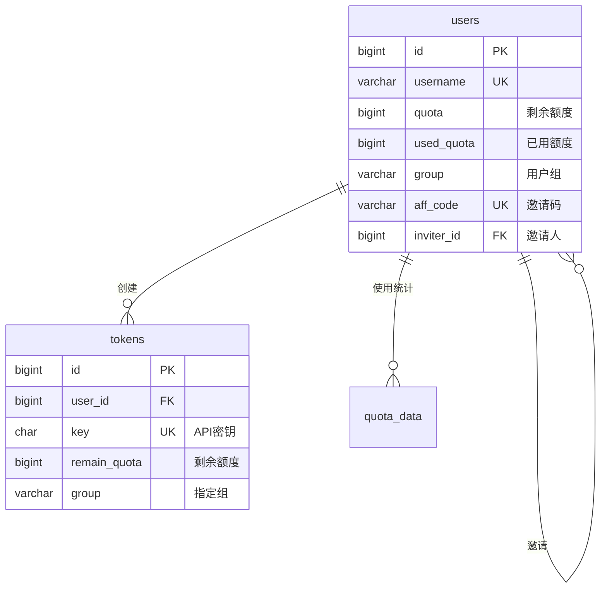
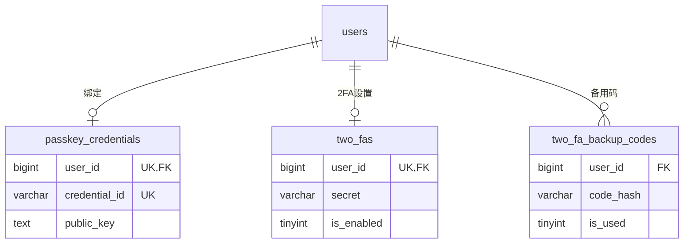
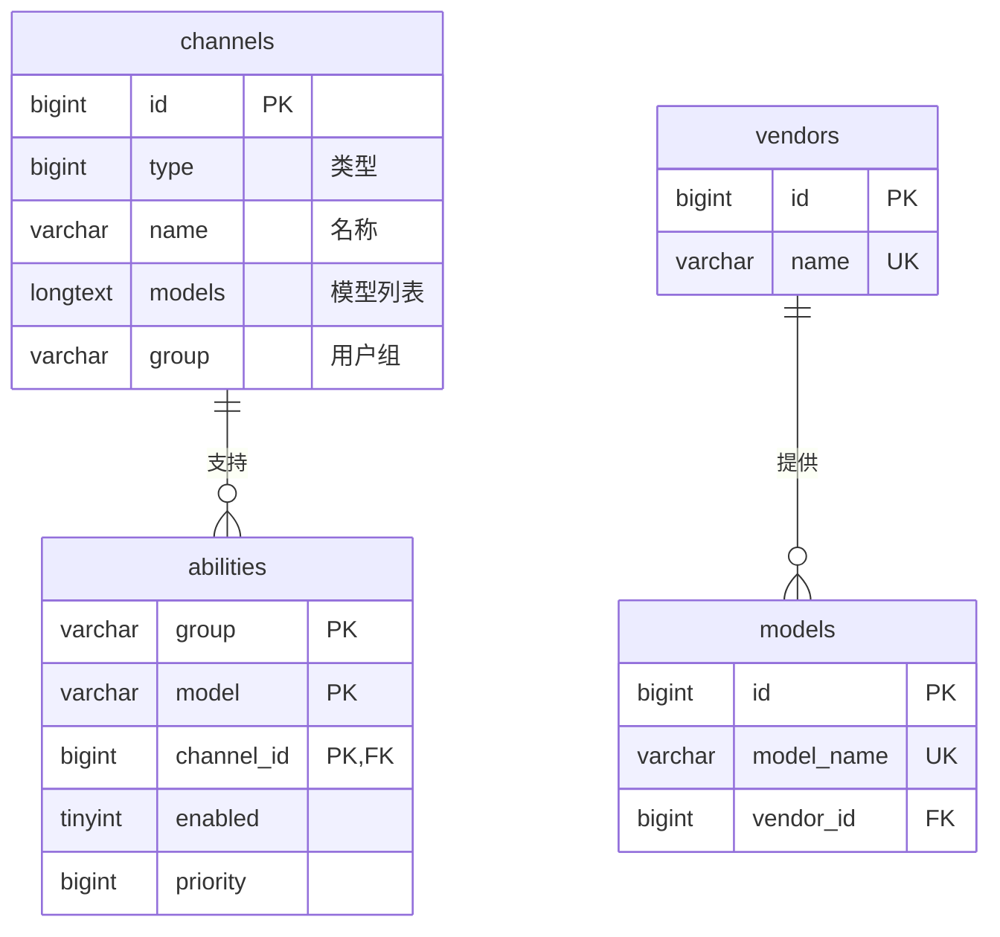
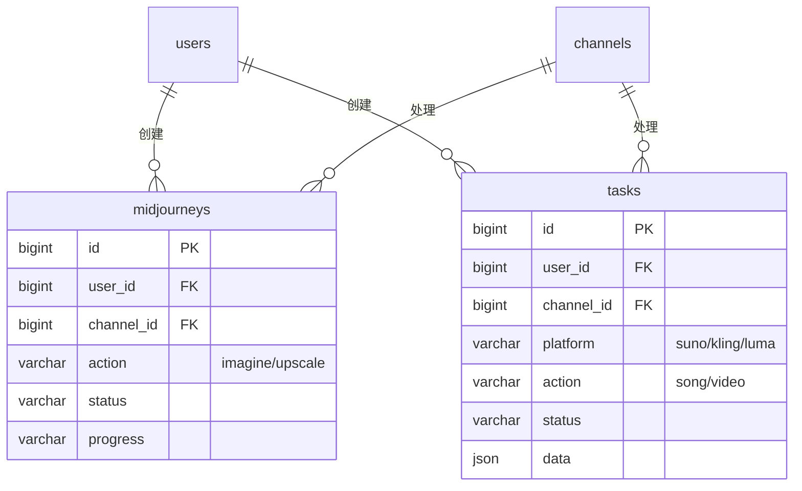
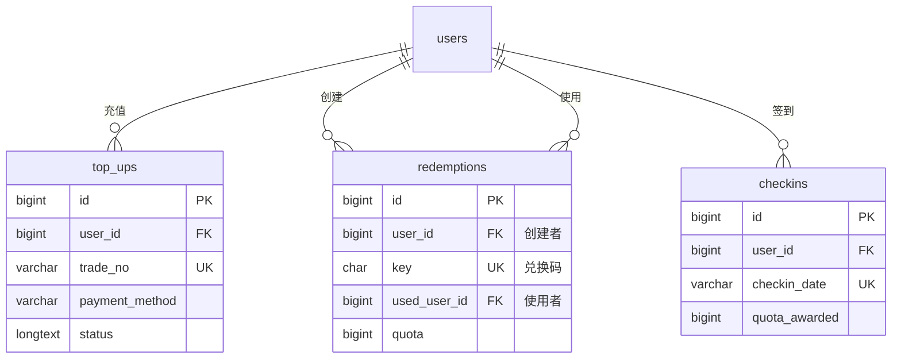
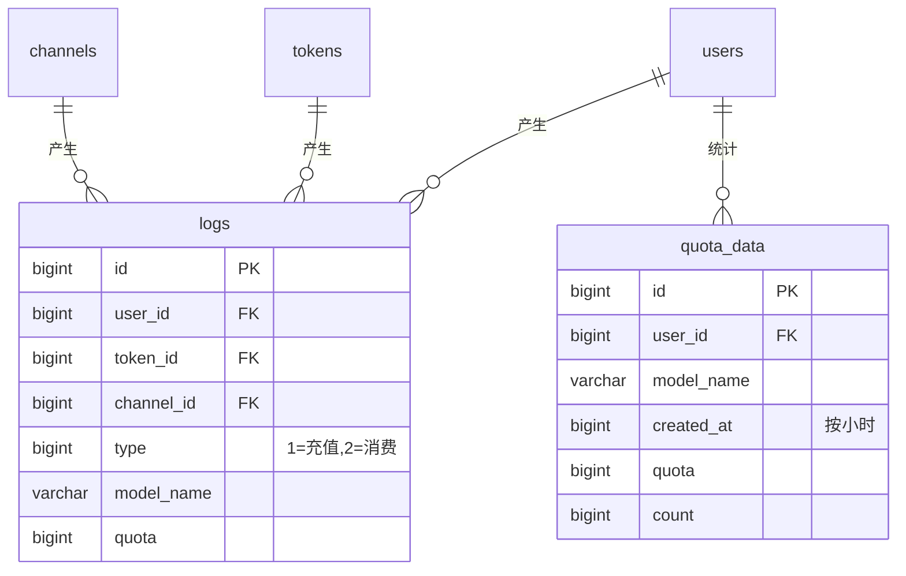

# New API 数据库表关系图

本文档展示 New API 项目的完整数据库架构，包括19个表及其关系。

## 快速导航

- [完整ER关系图](#完整er关系图)
- [按模块分类的关系图](#按模块分类的关系图)
- [表关系说明](#表关系说明)
- [表分类汇总](#表分类汇总)

---

## 完整ER关系图

```mermaid
erDiagram
    %% ==========================================
    %% 核心用户表和关联表
    %% ==========================================
    users ||--o{ tokens : "创建"
    users ||--o{ logs : "产生"
    users ||--o{ checkins : "签到"
    users ||--o{ midjourneys : "创建MJ任务"
    users ||--o{ tasks : "创建异步任务"
    users ||--o{ top_ups : "充值订单"
    users ||--o{ quota_data : "使用统计"
    users ||--o| passkey_credentials : "绑定Passkey"
    users ||--o| two_fas : "2FA设置"
    users ||--o{ two_fa_backup_codes : "2FA备用码"
    users ||--o{ redemptions : "创建兑换码"
    users ||--o{ redemptions : "使用兑换码"
    users ||--o{ users : "邀请关系"

    %% ==========================================
    %% 渠道和模型关系
    %% ==========================================
    channels ||--o{ abilities : "支持模型"
    channels ||--o{ logs : "产生日志"
    channels ||--o{ midjourneys : "处理MJ任务"
    channels ||--o{ tasks : "处理异步任务"

    vendors ||--o{ models : "提供模型"

    %% ==========================================
    %% Token关系
    %% ==========================================
    tokens ||--o{ logs : "产生日志"

    %% ==========================================
    %% 表结构定义
    %% ==========================================

    users {
        bigint id PK "用户ID"
        varchar username UK "用户名"
        longtext password "密码哈希"
        varchar display_name "显示名称"
        bigint role "角色(1=用户,10=管理员)"
        bigint status "状态(1=启用,2=禁用)"
        varchar email "邮箱"
        varchar github_id "GitHub OAuth ID"
        varchar discord_id "Discord OAuth ID"
        varchar telegram_id "Telegram OAuth ID"
        varchar wechat_id "微信 OAuth ID"
        varchar linux_do_id "LinuxDO OAuth ID"
        char access_token UK "系统访问令牌"
        bigint quota "剩余额度"
        bigint used_quota "已使用额度"
        varchar group "用户组"
        varchar aff_code UK "邀请码"
        bigint inviter_id FK "邀请人ID"
    }

    tokens {
        bigint id PK "令牌ID"
        bigint user_id FK "用户ID"
        char key UK "API密钥(sk-)"
        bigint status "状态(1=启用,2=耗尽,3=过期)"
        varchar name "令牌名称"
        bigint expired_time "过期时间"
        bigint remain_quota "剩余额度"
        tinyint unlimited_quota "是否无限额度"
        varchar model_limits "模型限制"
        varchar allow_ips "IP白名单"
        varchar group "指定用户组"
    }

    channels {
        bigint id PK "渠道ID"
        bigint type "渠道类型(1=OpenAI,2=Claude)"
        longtext key "API密钥(多Key)"
        bigint status "状态(1=启用,2=禁用,3=自动禁用)"
        varchar name "渠道名称"
        bigint weight "权重"
        varchar base_url "API基础URL"
        longtext models "支持模型列表"
        varchar group "用户组"
        bigint priority "优先级"
        bigint auto_ban "是否自动禁用"
        varchar tag "标签"
    }

    abilities {
        varchar group PK "用户组"
        varchar model PK "模型名称"
        bigint channel_id PK,FK "渠道ID"
        tinyint enabled "是否启用"
        bigint priority "优先级"
        bigint weight "权重"
        varchar tag "标签"
    }

    models {
        bigint id PK "模型ID"
        varchar model_name UK "模型名称"
        text description "模型描述"
        varchar icon "图标"
        varchar tags "标签"
        bigint vendor_id FK "供应商ID"
        text endpoints "支持端点"
        bigint status "状态(1=启用,0=禁用)"
        bigint name_rule "名称匹配规则"
    }

    vendors {
        bigint id PK "供应商ID"
        varchar name UK "供应商名称"
        text description "描述"
        varchar icon "图标"
        bigint status "状态"
    }

    logs {
        bigint id PK "日志ID"
        bigint user_id FK "用户ID"
        bigint created_at "创建时间"
        bigint type "日志类型(1=充值,2=消费)"
        varchar username "用户名"
        varchar token_name "令牌名称"
        varchar model_name "模型名称"
        bigint quota "消费额度"
        bigint prompt_tokens "提示词token"
        bigint completion_tokens "生成token"
        bigint channel_id FK "渠道ID"
        bigint token_id FK "令牌ID"
        varchar group "用户组"
        varchar ip "IP地址"
    }

    checkins {
        bigint id PK "签到ID"
        bigint user_id FK "用户ID"
        varchar checkin_date UK "签到日期(YYYY-MM-DD)"
        bigint quota_awarded "奖励额度"
        bigint created_at "创建时间"
    }

    midjourneys {
        bigint id PK "任务ID"
        bigint user_id FK "用户ID"
        varchar action "操作类型(imagine,upscale)"
        varchar mj_id "Midjourney任务ID"
        longtext prompt "提示词"
        varchar status "状态(SUCCESS,FAILURE)"
        varchar progress "进度"
        bigint channel_id FK "渠道ID"
        bigint quota "消费额度"
    }

    tasks {
        bigint id PK "任务ID"
        varchar task_id "第三方任务ID"
        varchar platform "平台(suno,kling,luma)"
        bigint user_id FK "用户ID"
        varchar group "用户组"
        bigint channel_id FK "渠道ID"
        bigint quota "消费额度"
        varchar action "操作类型(song,video)"
        varchar status "状态(QUEUED,SUCCESS)"
        varchar progress "进度"
        json properties "任务属性"
        json data "结果数据"
    }

    top_ups {
        bigint id PK "充值ID"
        bigint user_id FK "用户ID"
        bigint amount "金额(整数)"
        double money "金额(浮点)"
        varchar trade_no UK "订单号"
        varchar payment_method "支付方式(stripe,epay)"
        bigint create_time "创建时间"
        longtext status "订单状态"
    }

    redemptions {
        bigint id PK "兑换码ID"
        bigint user_id FK "创建者ID"
        char key UK "兑换码(32位)"
        bigint status "状态(1=可用,2=已用,3=禁用)"
        varchar name "名称"
        bigint quota "兑换额度"
        bigint used_user_id FK "使用者ID"
        bigint expired_time "过期时间"
    }

    quota_data {
        bigint id PK "统计ID"
        bigint user_id FK "用户ID"
        varchar username "用户名"
        varchar model_name "模型名称"
        bigint created_at "统计时间(按小时)"
        bigint token_used "使用token数"
        bigint count "请求次数"
        bigint quota "消费额度"
    }

    passkey_credentials {
        bigint id PK "凭证ID"
        bigint user_id UK,FK "用户ID"
        varchar credential_id UK "凭证ID(Base64)"
        text public_key "公钥"
        varchar attestation_type "认证类型"
        int sign_count "签名计数"
        text transports "传输方式"
    }

    two_fas {
        bigint id PK "2FA设置ID"
        bigint user_id UK,FK "用户ID"
        varchar secret "TOTP密钥"
        tinyint is_enabled "是否启用"
        bigint failed_attempts "失败次数"
        datetime locked_until "锁定截止时间"
    }

    two_fa_backup_codes {
        bigint id PK "备用码ID"
        bigint user_id FK "用户ID"
        varchar code_hash "备用码哈希"
        tinyint is_used "是否已使用"
        datetime used_at "使用时间"
    }

    prefill_groups {
        bigint id PK "组ID"
        varchar name UK "组名称"
        varchar type "组类型(model,tag,endpoint)"
        json items "组项目"
        varchar description "描述"
    }

    options {
        varchar key PK "配置键"
        longtext value "配置值"
    }

    setups {
        bigint id PK "记录ID"
        varchar version "版本号"
        bigint initialized_at "初始化时间"
    }
```



---

## 按模块分类的关系图

### 1. 核心用户模块



### 2. 认证安全模块



### 3. 渠道和模型模块



### 4. 任务处理模块



### 5. 支付充值模块



### 6. 日志和统计模块



---

## 表关系说明

### 主要外键关系

| 从表 | 字段 | 引用表 | 引用字段 | 关系类型 | 说明 |
|-----|------|--------|---------|---------|------|
| **tokens** | user_id | users | id | 1:N | 一个用户可以创建多个API令牌 |
| **logs** | user_id | users | id | 1:N | 一个用户产生多条日志记录 |
| **logs** | token_id | tokens | id | 1:N | 一个令牌产生多条日志记录 |
| **logs** | channel_id | channels | id | 1:N | 一个渠道产生多条日志记录 |
| **abilities** | channel_id | channels | id | 1:N | 一个渠道支持多个模型能力 |
| **models** | vendor_id | vendors | id | 1:N | 一个供应商提供多个模型 |
| **checkins** | user_id | users | id | 1:N | 一个用户有多条签到记录 |
| **midjourneys** | user_id | users | id | 1:N | 一个用户创建多个MJ任务 |
| **midjourneys** | channel_id | channels | id | 1:N | 一个渠道处理多个MJ任务 |
| **tasks** | user_id | users | id | 1:N | 一个用户创建多个异步任务 |
| **tasks** | channel_id | channels | id | 1:N | 一个渠道处理多个异步任务 |
| **top_ups** | user_id | users | id | 1:N | 一个用户有多条充值记录 |
| **redemptions** | user_id | users | id | 1:N | 一个用户创建多个兑换码 |
| **redemptions** | used_user_id | users | id | 1:N | 一个用户使用多个兑换码 |
| **quota_data** | user_id | users | id | 1:N | 一个用户有多条使用统计 |
| **passkey_credentials** | user_id | users | id | 1:1 | 一个用户绑定一个Passkey |
| **two_fas** | user_id | users | id | 1:1 | 一个用户有一个2FA设置 |
| **two_fa_backup_codes** | user_id | users | id | 1:N | 一个用户有多个2FA备用码 |
| **users** | inviter_id | users | id | 1:N | 用户邀请关系（自引用） |

### 业务逻辑关系

| 表1 | 表2 | 关系字段 | 关系说明 |
|-----|-----|---------|---------|
| **abilities** | users | group | 通过用户组关联模型权限 |
| **channels** | users | group | 通过用户组关联渠道访问权限 |
| **tokens** | users | group | 令牌可以覆盖用户默认组 |
| **logs** | users/channels/tokens | username/channel_name/token_name | 冗余字段避免关联查询 |
| **quota_data** | users | username | 冗余用户名用于统计 |

---

## 表分类汇总

### 核心业务表（5个）
这些表构成系统的核心业务逻辑：

1. **users** - 用户管理和认证
2. **tokens** - API密钥管理
3. **channels** - AI服务商接入配置
4. **abilities** - 模型-渠道-用户组映射
5. **logs** - 审计和使用记录

### 任务和资源表（3个）
处理异步和长时任务：

6. **tasks** - 异步任务（音频、视频生成）
7. **midjourneys** - Midjourney绘图任务
8. **quota_data** - 使用量统计（按小时聚合）

### 支付和充值表（3个）
管理用户充值和奖励：

9. **top_ups** - 在线充值订单
10. **redemptions** - 兑换码
11. **checkins** - 签到奖励

### 元数据和配置表（4个）
系统配置和模型元数据：

12. **models** - 模型目录
13. **vendors** - 供应商目录
14. **prefill_groups** - 配置模板
15. **options** - 系统配置（键值对）

### 安全和认证表（3个）
提供多因素认证和无密码登录：

16. **two_fas** - 双因素认证（TOTP）
17. **two_fa_backup_codes** - 2FA备用恢复码
18. **passkey_credentials** - Passkey无密码登录（WebAuthn/FIDO2）

### 其他（1个）

19. **setups** - 系统初始化记录

---

## 设计模式和特点

### 1. 软删除模式
以下表使用 `deleted_at` 字段实现软删除（GORM标准）：
- users, tokens, channels, models, vendors, prefill_groups
- redemptions, two_fas, two_fa_backup_codes, passkey_credentials

### 2. 多租户支持
通过 `group` 字段实现用户组隔离：
- users.group - 用户所属组
- channels.group - 渠道可用组（逗号分隔）
- abilities.group - 模型能力组映射
- tokens.group - 令牌指定组（可覆盖用户组）

### 3. 冗余字段优化
为避免频繁JOIN查询，部分表包含冗余字段：
- logs.username - 冗余用户名
- quota_data.username - 冗余用户名
- logs.channel_name - 虚拟列（查询时关联）

### 4. 时间戳设计
- **Unix时间戳（秒）**：created_time, submit_time, expired_time
- **datetime(3)**：created_at, updated_at（用于GORM自动管理）

### 5. 状态管理
使用整数枚举管理状态：
- **users.status**: 1=启用, 2=禁用
- **channels.status**: 1=启用, 2=手动禁用, 3=自动禁用
- **tokens.status**: 1=启用, 2=已耗尽, 3=已过期
- **redemptions.status**: 1=可用, 2=已使用, 3=已禁用

### 6. JSON字段存储
使用JSON类型存储灵活配置：
- **tasks.properties** - 任务属性
- **tasks.data** - 任务结果
- **tasks.private_data** - 敏感信息（不返回用户）
- **prefill_groups.items** - 组项目列表
- **channels.channel_info** - 多Key配置

---

## 索引策略

### 主键索引
所有表都有自增主键 `id`（除复合主键表）

### 唯一索引
- **users**: username, access_token, aff_code
- **tokens**: key
- **channels**: 无（允许重复名称）
- **models**: model_name + deleted_at（软删除唯一约束）
- **vendors**: name + deleted_at
- **redemptions**: key
- **checkins**: user_id + checkin_date（防止重复签到）

### 外键索引
为所有外键字段创建索引：
- user_id, channel_id, token_id, vendor_id

### 业务查询索引
- **logs**: created_at+type, username, model_name, ip
- **abilities**: channel_id, priority, weight, tag
- **tasks/midjourneys**: status, progress, submit_time, platform/action
- **quota_data**: model_name+username, created_at

### 组合索引
- **logs**: (created_at, id), (model_name, username)
- **models**: (model_name, deleted_at)
- **vendors**: (name, deleted_at)

---

## 数据流向

### 用户请求流程
```
用户 (users)
  ↓ 创建
API令牌 (tokens)
  ↓ 使用
渠道选择 (abilities)
  ↓ 根据group+model
渠道 (channels)
  ↓ 调用AI服务
日志记录 (logs)
  ↓ 聚合
使用统计 (quota_data)
```

### 任务处理流程
```
用户 (users)
  ↓ 提交
任务表 (tasks/midjourneys)
  ↓ 分配
渠道 (channels)
  ↓ 处理
第三方平台 (Suno/Kling/Midjourney)
  ↓ 返回结果
任务更新 (status/progress/data)
  ↓ 完成
额度扣除 (users.quota)
```

### 充值流程
```
用户 (users)
  ↓ 发起充值
充值订单 (top_ups)
  ↓ 支付
第三方支付 (Stripe/Epay)
  ↓ 回调
订单完成
  ↓ 增加额度
用户额度 (users.quota)
```

---

## 使用建议

### 查询优化
1. 使用索引字段作为WHERE条件
2. 避免SELECT * ，只查询需要的字段
3. 大表查询使用分页（LIMIT/OFFSET）
4. 使用覆盖索引避免回表

### 数据维护
1. 定期清理过期日志（logs表）
2. 归档历史任务数据（tasks/midjourneys）
3. 清理软删除数据
4. 监控表大小和索引效率

### 性能监控
关注以下慢查询场景：
- logs表的时间范围查询
- quota_data的聚合统计
- abilities的多条件筛选
- users的模糊搜索

---

## 相关文档

- [数据库表结构（带注释）](./newapi_commented.sql)
- [项目说明文档](../../CLAUDE.md)
- [环境配置示例](../../.env.example)

---

**生成时间**: 2026-01-16
**数据库版本**: v0.10.5
**表数量**: 19个
**关系数量**: 20+个外键关系
